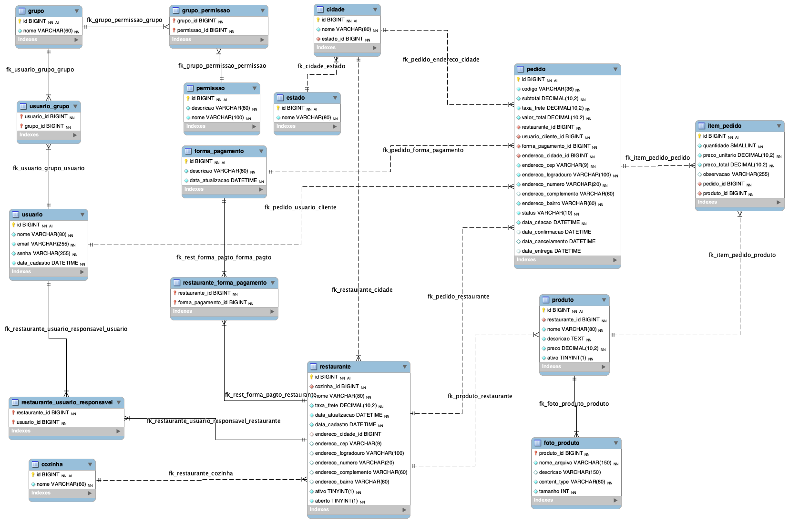
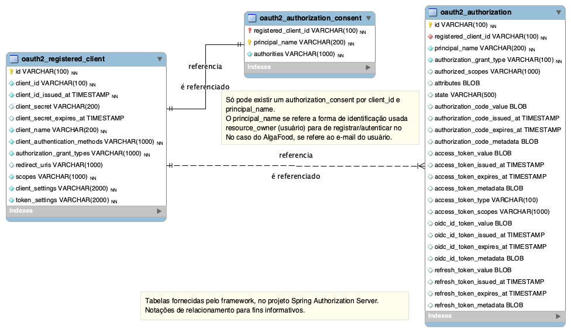
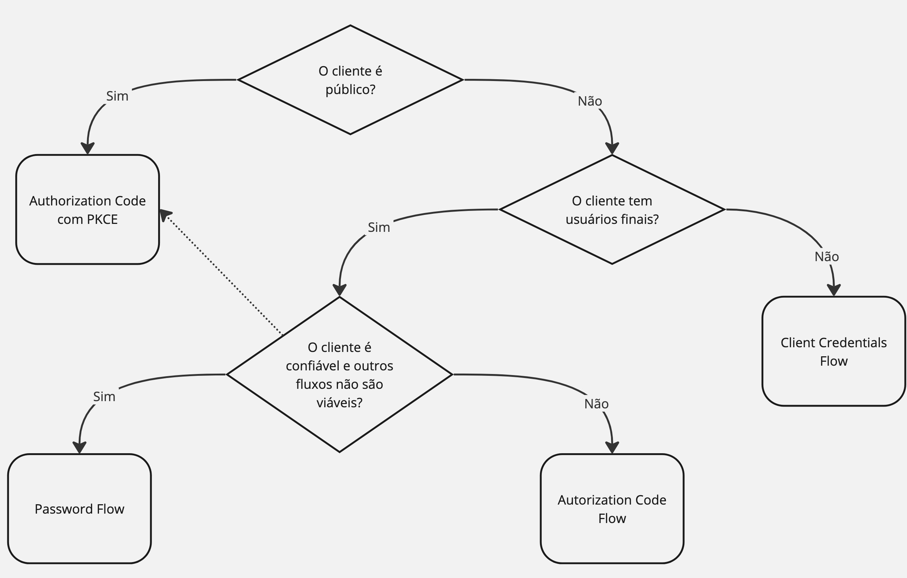

# ESR - Especialista Spring REST (algafood-api)

Projeto MVP de uma API REST para um sistema de *delivery*, baseado no curso ESR, com tópicos avançados de Spring e modelagem de APIs.


## Índice
- [Sobre](#sobre)
- [Modelos EER (Banco de dados)](#modelos-eer-banco-de-dados)
- [Tecnologias e ferramentas utilizadas](#tecnologias-e-ferramentas-utilizadas)
- [Como executar](#como-executar)
    - [Pré-requisitos](#pré-requisitos)
    - [Executar a partir das imagens do *Docker Hub*](#executar-a-partir-das-imagens-do-docker-hub)
    - [Executar a partir de compilação do projeto e construção das imagens *Docker*](#executar-a-partir-de-compilação-do-projeto-e-construção-das-imagens-docker)
	- [Testar e acessar a documentação](#testar-e-acessar-a-documentação)
- [Resumo de tópicos explorados](#resumo-de-tópicos-explorados)
- [Autor](#autor)
- [Agradecimentos](#agradecimentos)
- [Licença](#licença)

## Sobre

Projeto MVP de uma API REST para um sistema de *delivery*, baseado no curso ESR, com tópicos avançados de Spring e modelagem de APIs.

### Objetivos
O objetivo do projeto é explorar a modelagem/implementação de APIs REST, utilizando tecnologias do ecossistema Spring, abordando pontos como criação de
*endpoints* **CRUD**, bem como modelagem de operações **não-CRUD**, operações *não convencionais*, e quais as melhores práticas **(ISOs e RFCs)** que podem
ser aplicadas para se implementar as soluções.

#### Sobre o *Deploy*
Foi realizada a *containerização* da aplicação com a *engine* ***Docker***,
em ambiente de **desenvolvimento** com ***Docker Compose*** e em **produção** com componentes de ***Cloud Computing (AWS)***.

O *deploy* em produção foi realizado no modelo ***container serverless***, utilizando o serviço ***AWS Fargate***,
***AWS ECR (Elastic Container Registry)***, ***AWS ECS (Elastic Container Service)***, ***AWS EC2***.

#### Integrações
- Envio de e-mails transacionais
	- Foi utilizada o serviço **SES** *(Simple Email Service)* da AWS.
- Armazenamento de arquivos
	- Foi utilizado o serviço **S3** *(Simple Storage Service)* da AWS.
- Armazenamento de logs
	- Foi utilizado serviço **Loggly** da SolarWinds.

- Não foram implementadas outras integrações, como *gateways* de pagamento, devido didática do projeto.

#### O que não é o foco deste projeto
Não foram abordadas tecnologias de *frontend*, exceto pela adição de simples *clients* da API com *HTML/CSS/JavaScript* e a simples personalização das páginas de autenticação e autorização do *Authorization Server*.

#### Funcionalidades implementadas

O projeto é um *MVP (Mininum Viable Product)*, mas focado no *backend*, onde foram implementadas funcionalidades básicas para o gerenciamento
de entrega de comida, como as listadas abaixo:

##### Recursos e Sub-recursos

- ***Root Entry Point (/v1)***
	-  - **Listagem dos *endpoints* disponíveis na API**
- ***Host Check (/v1/hostcheck)***
	-  - **Verificação de integridade com retorno de status `200-OK` com endereço IP do host**
- ***Estados (/v1/estados)***
	-  - **Criação**
	-  - **Atualização**
	-  - **Remoção**
	-  - **Busca**
	-  - **Listagem**
- ***Cidades (/v1/cidades)***
	-  - **Criação**
	-  - **Atualização**
	-  - **Remoção**
	-  - **Busca**
	-  - **Listagem**
- ***Permissões (/v1/permissoes)***
	-  - **Listagem**
- ***Grupos (/v1/grupos)***
	-  - **Criação**
	-  - **Atualização**
	-  - **Remoção**
	-  - **Busca**
	-  - **Listagem**
    - ***Grupos - Permissões (/v1/restaurantes/{grupoId}/permissoes)***
		-  - **Associação**
		-  - **Desassociação**
		-  - **Listagem com base no ID do grupo**
- ***Usuários (/v1/usuarios)***
	-  - **Criação**
	-  - **Atualização**
	-  - **Alteração de senha**
	-  - **Busca**
	-  - **Listagem**
    - ***Usuários - Grupos (/v1/restaurantes/{usuarioId}/grupos)***
		-  - **Associação**
		-  - **Desassociação**
		-  - **Listagem com base no ID do usuário**
- ***Cozinhas (/v1/cozinhas)***
	-  - **Criação**
	-  - **Atualização**
	-  - **Remoção**
	-  - **Busca**
	-  - **Listagem**
- ***Formas de pagamento (/v1/formas-pagamento)***
	-  - **Criação**
	-  - **Atualização**
	-  - **Remoção**
	-  - **Busca**
	-  - **Listagem**
- ***Restaurantes (/v1/restaurantes)***
	-  - **Criação**
	-  - **Atualização**
	-  - **Busca**
	-  - **Listagem (Todos e por projeção de nome)**
	-  - **Ativação (Individual/Múltiplos)**
	-  - **Desativação (Individual/Múltiplos)**
	-  - **Abertura**
	-  - **Fechamento**
    - ***Formas de Pagamento (/v1/restaurantes/{restauranteId}/formas-pagamento)***
		-  - **Associação**
		-  - **Desassociação**
		-  - **Listagem com base no ID do restaurante**
    - ***Usuários responsáveis (/v1/restaurantes/{restauranteId}/responsaveis)***
		-  - **Associação**
		-  - **Desassociação**
		-  - **Listagem com base no ID do restaurante**
    - ***Produtos (/v1/restaurantes/{restauranteId}/produtos)***
		-  - **Criação**
		-  - **Atualização**
		-  - **Busca**
		-  - **Listagem com base no ID do restaurante**
        - ***Produtos - Fotos (/v1/restaurantes/{restauranteId}/produtos{produtoId}/foto)***
			-  - **Atualização**
			-  - **Remoção**
			-  - **Busca (representação com link ou download do arquivo)**
- ***Pedidos (/v1/pedidos)***
	-  - **Criação**
	-  - **Busca**
	-  - **Listagem**
	-  - **Confirmação**
	-  - **Cancelamento**
	-  - **Entrega**
- ***OAuth2 - Authorization Server (Autenticação e Autorização)***
    - ***Token (/oauth2/token)***
		-  - **Token via client_credentials**
		-  - **Token via authorization_code PKCE**
		-  - **Token via refresh_token**
    - ***Authorize (/oauth2/authorize)***
		-  - **Pedido autorização para obter um token em nome do usuário**
    - ***Revoke (oauth2/revoke)*** = *[Pedido de revogação de token]*
		-  - **Pedido de revogação de token**
    - ***Instrospect (/oauth2/introspect)***
		-  - **Verificação de informações do token**
    - ***JWKS (JSON Web Key Set) (oauth2/jwks)***
		-  - **Informações de chaves criptográficas do servidor (apenas pública)**

## Modelos EER (Banco de dados)
### AlgaFood API



- Entidades:
	- **estado**
		>Tabela para o armazenamento de informações de UFs (em produção seria uma base padronizada (IBGE)).
	- **cidade**
		>Tabela para o armazenamento de informações de cidades (em produção seria uma base padronizada (IBGE)).<br>
		>Se relaciona com **restaurante** e **pedido**, devido o endereço.
	- **permissao**
		>Tabela para o armazenamento de informações de permissões disponíveis no sistema.
	- **grupo**
		>Tabela para o armazenamento de informações de grupos de permissões.
	- **grupo_permissao**
		>Tabela para o armazenamento das associações entre grupos e permissões.
	- **usuario**
		>Tabela para o armazenamento de informações de usuários.
	- **usuario_grupo**
		>Tabela para o armazenamento das associações entre usuários e grupos.
	- **cozinha**
		>Tabela para o armazenamento de informações de cozinhas (tipo de culinária) relacionadas aos restaurantes.
	- **forma_pagamento**
		>Tabela para o armazenamento de formas de pagamento a serem utilizadas pelos restaurantes.
	- **restaurante**
		>Tabela para o armazenamento de informações de restaurantes.
	- **restaurante_forma_pagamento**
		>Tabela para o armazenamento das associações entre restaurantes e formas de pagamento (para quais formas de pagamento estarão disponíveis para cada restaurante).
	- **restaurante_usuario_responsavel**
		>Tabela para o armazenamento das associações entre restaurantes e usuários (para quais usuários com as devidas permissões poderão gerenciar cada restaurante).
	- **produto**
		>Tabela para o armazenamento de informações de produtos de restaurantes (cada produto só pode existir relacionado a um restaurante, devido natureza do domínio/negócio).
	- **foto_produto**
		>Tabela para o armazenamento de informações sobre foto do produto (apenas meta-dados).<br>
		>Modelado como 1-1, mas em caso de necessidade, pode ser estendido para que um produto possa ter mais de uma foto.
	- **pedido**
		>Tabela para o armazenamento de informações de pedidos.
	- **item_pedido**
		>Tabela para o armazenamento de informações de itens de pedidos.

### *Authorization Server (OAuth2)*



- Entidades:
	- **oauth2_registered_client**
		>Tabela para o armazenamento de informações de clients da API.<br>
		Os clients são outras aplicações *(front-end, back-end)* que acessam a API, diretamente com suas credenciais *(client_credentials)*
		e/ou com autorização obtida em nome de um usuário (tokens via *authorization_code*).
	- **oauth2_authorization_consent**
		>Tabela para o armazenamento de informações referentes às autorizações concedidas (o que o client pode fazer em nome do usuário (escopos)) pelos usuários para determinado client.
	- **oauth2_authorization**
		>Tabela para o armazenamento de informações referentes às autorizações aprovadas (tokens) para acesso a recursos do sistema, juntamente com *claims* personalizadas.

## Tecnologias e ferramentas utilizadas
- Plataforma: Java 17 LTS (*OpenJDK Temurin*)
- Spring:
	- Spring Boot
		- DevTools
    - Spring Framework
		- Spring Web MVC
        - Jakarta Bean Validation
			- Hibernate Validators
		- Spring Mail
	- Spring Data
		- Spring Data JPA
			- Hibernate ORM
		- Spring Data Redis	
    - Spring Security
        - OAuth 2.0 Resource Server
	- Spring Authorization Server
	- Spring HATEOAS
- Suporte a métodos padrão: Lombok
- Versionamento de DB e migrações: Flyway
- Mapeamento DTO: ModelMapper
- Build e empacotamento: Maven
- DB: MySQL Community 8
- IDE: Spring Tool Suite (STS)
- Testes e doc. de API:
	- Postman
	- Spring Doc (Swagger)
- Versionamento: Git
    - Modelo de *braching*: *Git Flow*
- Containerização
	- Docker
- Cache distribuído
	- Redis
- Armazenamento de logs
	- Loggly SolarWinds
- Deploy
	- AWS
		- AWS Fargate/ECR/ECS/EC2/S3/SES

## Como Executar

### Pré-requisitos
Devido ser uma aplicação containerizada, a forma mais fácil de executar este projeto é utilizando o *Docker*.

- Instalar o Docker para o seu sistema operacional
	- https://www.docker.com/products/docker-desktop/
- Dependências
	- As dependências para executar a aplicação são baixadas automaticamente (quando via *docker-compose*), porém seguem listadas abaixo em necessidade de uso isolado
		- Java: 17 LTS
		- DB: MySQL 8.0
		- Cache distribuído: Redis 7.4.0
		- Proxy reverso: Nginx 1.27.1

- Primeiramente, para executar o projeto com imagens prontas do *Docker Hub* ou compilar o projeto localmente, é necessário:
	1. Clonar o repositório
		```console
		git clone https://github.com/leoarj/algaworks-esr.git
		```
	2. Acessar o diretório do projeto da API
		```console
		cd algafood-api
		```
	3. Configurar variáveis de ambiente
		- Variáveis temporárias no *shell* do sistema (a partir de um terminal/cmd)
			- MacOS/Linux
				```bash
				export MYSQL_ROOT_PASSWORD="uma_senha_escolhida"
				export SPRINGDOC_SWAGGER_UI_OAUTH_CLIENT_ID="algafood-web"
				export SPRINGDOC_SWAGGER_UI_OAUTH_CLIENT_SECRET="web123"
				```
			- Windows
				```bat
				set MYSQL_ROOT_PASSWORD="uma_senha_escolhida"
				set SPRINGDOC_SWAGGER_UI_OAUTH_CLIENT_ID="algafood-web"
				set SPRINGDOC_SWAGGER_UI_OAUTH_CLIENT_SECRET="web123"
				```
		- Por meio de um arquivo `.env`
			- Criar um arquivo `.env` na raíz do projeto com o seguinte conteúdo
				```env
				MYSQL_ROOT_PASSWORD="uma_senha_escolhida"
				```
		>Obs.: Para facilidade de execução em ambiente de **testes**.<br>
		Em **produção** não é utilizado o usuário ***root***, mas sim um usuário específico, com permissões apenas para *schema* da aplicação.
	4. Execução por meio de docker-compose, com proxy reverso, será necessário indicar hosts para o SpringDoc/Swagger
		- Variáveis temporárias no *shell* do sistema (a partir de um terminal/cmd)
			- MacOS/Linux
				```bash
				export SPRINGDOC_SWAGGER_UI_BEHIND_PROXY_DEFAULT_HOST="http://127.0.0.1:80"
				```
			- Windows
				```bat
				set SPRINGDOC_SWAGGER_UI_BEHIND_PROXY_DEFAULT_HOST="http://127.0.0.1:80"
				```
		- Por meio de um arquivo `.env`
			- Adicionar no mesmo arquivo `.env` na raíz do projeto o seguinte conteúdo
				```env
				SPRINGDOC_SWAGGER_UI_BEHIND_PROXY_DEFAULT_HOST="http://127.0.0.1:80"
				```
	>Expondo na porta `80` pois em ambiente de desenvolvimento o Nginx atenderá nessa porta<br>
	e os containers do *algafood-api* não estão acessíveis externamente pela porta `8080`.

### Executar a partir das imagens do *Docker Hub*
- Executar via *docker-compose* baixando diretamente as imagens (sem *build* local)
	```console
	 docker compose -f docker-compose-not-build.yml up -d
	```
	>O comando acima vai baixar as imagens ***algafood-api*** e ***algafood-proxy*** prontas.

	- Para executar mais de uma instância do serviço da API, passar o argumento `--scale`
	```console
	docker compose -f docker-compose-not-build.yml up -d --scale algafood-api=2
	```

- Parar execução
	```console
	docker compose -f docker-compose-not-build.yml down
	```

### Executar a partir de compilação do projeto e construção das imagens *Docker*
- Construir o projeto e *build* da imagem
	```console
	./mvnw package -Pdocker
	```
- Executar via *docker-compose*
	```console
	docker-compose up -d
	```
- Parar execução
	```console
	docker-compose down
	```

### Testar e acessar a documentação]
Dependendo da forma que a aplicação foi configurada, a URL para acessar da documentação da API pode mudar.

- Com proxy reverso (Nginx), via docker compose:
```console
http://127.0.0.1/swagger-ui/index.html
```

- Sem proxy reverso (Nginx), ou execução na IDE:
```console
http://127.0.0.1:8080/swagger-ui/index.html
```

## Resumo de tópicos explorados

### APIs
*Application Programming Interface.*

*Conjunto de funções expostas, que intermediam o acesso a um ou vários sistemas.*

- Um resumo desse tópico pode ser visto em:
	- https://github.com/leoarj/algaworks-isr#api

### REST = *Representational State Transfer*

Em resumo é uma especificação que define a forma de comunicação entre sistemas na WEB.

- Um resumo desse tópico pode ser visto em:
	- https://github.com/leoarj/algaworks-isr#rest--representational-state-transfer

### Spring = Ecossistema

*Conjunto de tecnologias de back-end, onde o objetivo é o desenvolvedor poder focar em regras de negócio e padronizar código de infra-estrutura.*

- Um resumo desse tópico pode ser visto em:
	- https://github.com/leoarj/algaworks-isr#spring-rest

- Spring Data JPA:
	- https://github.com/leoarj/algaworks-isr#spring-data-jpa

- Spring Security: Projeto e solução do ecossistema Spring para atender a requisitos de segurança em aplicações, como autenticação e autorização.

#### Spring vs Java EE (Jakarta EE)
- **Jakarta EE** é um conjunto de especificações, seu objetivo é padronizar a tecnologia Java para aplicações Enterprise, não é a implementação final.
	>JPA por exemplo é uma especificação. E existem as implementações dessa especificação como *Hibernate*, *Eclipse Link*.
	
	>Seu foco é a padronização e retrocompatibilidade.

- **Spring** utilizada especificações do JEE, porém incorpora inovações quem venham a surgir, indepedente do JEE.

- Em alguns momentos competem e em outros colaboram.
	>Por exemplo: ***Spring MVC*** utiliza a especificação de ***Servlet***, ***Spring Data JPA*** utiliza a especificação ***JPA***.

#### Injeção de dependências:
- JEE
	>CDI
- Spring
	>Spring Framework *(IoC Container)*

#### REST APIs:
- JEE
	>JAX RS
- Spring
	>Spring MVC

### Criando o projeto inicial no *Spring Tool Suite*
#### Passos:
- *Create a project*
- *Spring Starter project*
- Definição:
	- Nome
	- Gerenciamento de dependências e *build*
	- Empacotamento
	- Versão Java
	- Grupo, artefato, versão, descrição, pacote
- Versão do Spring
- Selecionar o starter *"Web"*

Após isso, é criado um projeto *Maven* e as dependências são baixadas.

### Maven
Ferramenta para gerenciamento de dependências e build da aplicação.

#### Estrutura de diretórios:
- `src.test.java` = classes de teste
- `src.main.java` = código fonte do projeto
- `src.main.resources` = páginas html e outros arquivos de recursos
- raíz = onde fica o `pom.xml`
- `target` = onde ficam os artefatos gerados

#### POM (*Project Object Model*)
Arquivo declarativo de estrutura e dependências do projeto.

**mvnw** = *Maven wrapper* (permite executar o Maven, mesmo não estando instalado).

- Comandos para empacotamento:
	```console
	./mvnw clean
	```
	```console
	./mvnw package
	```

#### Hiearquia de dependências
- Como as dependências se relacionam:
	- Dependências **transitivas**
		>Dependências com dependências em cadeia.
	- Dependências **resolvidas**
		>Distinção final das dependências (onde não se repetem mais).

#### Comandos para exibição de dependências
- Exibir árvore de dependências
	```console
	./mvnw dependency:tree
	```
- Exibir dependências resolvidas
	```console
	./mvnw dependency:resolve
	```
- Exibir o pom efetivo (pom final)
	```console
	./mvnw help:effective-pom
	```

#### Repositório local (Pasta **.m2**)
É onde fica o cache de dependências baixadas.<br>
Quando uma depedência for necessária em um projeto e sua versão já estiver disponível no *cache*, o Maven não efetuará novamente o download.

### Criando um primeiro *Controller*
- Controlador WEB
	>Componente que recebe e responde requisições HTTP.

- `@Controller`
	>Diz que a classe é um controlador Web.
- `@GetMapping("/rota")`
	>Diz que o método corresponde a um mapeamento do verbo GET para a rota em questão.
- `@ResponseBody`
	>Resposta da requisição.

### Spring Boot DevTools
Permite o *restart* rápido da aplicação após build (em ambiente de desenvolvimento).

#### Para habilitar:
- STS: Botão direito no projeto -> *Spring* -> *Add Devtools*
	>É adicionado no `pom.xml` a dependência: `spring-boot-devtools`.

O Spring Boot DevTools consegue fazer isso porque usa 2 *class loaders*:

***Base*** e ***Restart***

- Base
	>O que não muda, bibliotecas.
- Restart
	>O que se desenvolve e é alterado, código-fonte que passará pelo build (reinicia apenas o classloader de restart).

### Injeção de dependências
É a instanciação e repassagem de uma referência que outro objeto necessita para completar sua tarefa,
sem ter que saber detalhes de como a instância será obtida.

Serve para desacoplar das dependências e é uma forma de *inversão de controle*.

### Inversão de controle (IoC)
Delegar como "executar" para algo externo, não é mais responsabilidade da classe em si
*(passa o controle para um agente externo, apenas recebe o que necessita já resolvido)*.

#### Vantagens:
- Baixo acoplamento.
- Nova implementação não requer grande refatoração.
- Classes bastam apenas conhecer o contrato *(interface)*.
- Facilita testes unitários.

### Spring *IoC Container*
Implementação de injeção de dependência do framework.<br>
Também conhecido como ***Spring Context***.

Alguns conceitos presentes no gerenciamento de instâncias no framework:
- *Bean*
	>Objetos gerenciados pelo container (dependency).
- `@ApplicationContext`
	>Representa o container de inversão de controle.
- *Bootstrap*
	>Inicialização da aplicação. O container escaneia as classes e instancia os beans necessários.
- `@Component`
	>Marca uma classe como um Bean (Objeto gerenciado pelo container).
- `@Controller` (Meta anotação)
	>Também é um Bean, com semântica de ser um controlador WEB.
- `@SpringBootApplication`
	>Todas as classes do pacote e sub-pacotes se tornam elegíveis para serem beans. A partir disso o Spring realiza o *Component Scanning* (no bootstrap).

#### Injetando dependências
##### `@Component`
Para definir beans com instanciação simples.
- Injetado via construtor da classe onde tem referência da dependência.
- Só é possível injetar dependências em uma classe que também for gerenciada pelo container (`@Component`).

##### `@Configuration`
Para a *"Definição de beans"*.
- Para definir beans com instanciação mais complexa (dependência com construtor que recebe argumentos por exemplo).
- É criada uma classe de *Config*, para gerenciar a instanciação dos beans complexos.

###### `@Bean`
- Anotado em método que retorna o bean, na classe de configuração.

###### Observações sobre `@Configuration`
- Quando método definidor de um bean necessitar de outro bean (Na mesma classe de Config)?
	>Chamar método de definição do outro bean como **argumento no construtor** do bean que depende dele.

- Quando uma definição de bean depende de outra, mas beans estão em definições diferentes (Classes de Config diferentes) ou o outro bean está anotado como `@Component`?
	>Pode ser injetado outro bean a partir de **argumento adicionado no método gerador** e repassando para o bean que depende disso.

#### Pontos de injeção e `@Autowired`

Pontos de injeção são locais onde podemos injetar objetos dentro dos beans.

- Construtor
	>`@Autowired` no construtor (qual quer definir para injeção de dependência).

- Setter
	>setNomeBean(NomeBean nomeBean) e anotar com `@Autowired`.

- Atributo
	>Anotar com `@Autowired`.

##### Boas práticas
- Construtor como ponto de injeção.
	- Por questão de clareza, de quais dependências são obrigatórias.
	- Facilita os testes, caso queria injetar dependências manualmente.

##### Dependência opcional
- `@Autowired(required = false)`
	>Quando não há obrigatoriedade da dependência e a classe consegue trabalhar sem a dependência. Porém caso esteja disponível, será injetada e utilizada.

##### Ideal
- Usar no construtor.
- Usar no atributo.
	>Por simplicidade, mas pode dificultar testes.

#### Ambiguidade de beans
Quando há dois ou mais beans para mesmo ponto de injeção e classes que utilizam as dependências.<br>
Dessa forma, se não houver uma meio de desambiguação, não tem como o Spring instanciar e injetar os beans corretamente.

##### Opções para resolução
- Utilizar list do tipo da dependência
	>`List<NomeBean(Contrato/interface)> beans`.

- Anotação `@Primary` no bean
	>Diz qual bean tem precedência para injeção.

	>Se anotarmos mais de um candidato com `@Primary`, iremos obter uma `org.springframework.beans.factory.NoUniqueBeanDefinitionException`.

- `@Qualifier("nomebean")`
	> Dizer explicitamente qual bean utilizar na dependência e no `@Component` (Checada em *runtime*).

Ao usar, se possível deixar um nome mais abrangente (mais genérico).

- Anotação customizada *(Checada em tempo de compilação) (preferível)*.
	- Criar **Enum** e **Anotation**.
		>Atributo `value()` é adicionado na anotação, e por padrão com `value` podemos atribuir o valor diretamente na anotação quando formos utilizá-la.

###### Anotações adicionadas na definição da anotação customizada
- `@Rentention`
	- `RententionPolicy.RUNTIME`
		>Tempo que será mantida (lida).
	- `@Qualifier`
		>Diz que a anotação customizada é um qualificador também.

### *Profiles*
Forma de separar componentes e comportamento da aplicação conforme diferentes ambientes.

#### Em tempo de desenvolvimento

##### Definindo ambiente dos componentes via anotação
`@Profile("dev")`
>Conforme o ambiente em que a aplicação inicializa, os componentes definidos para outros ambientes não ficam disponíveis.

- A partir do arquivo `application.properties`:
	- `src.main.resources`
		- `application.properties`
			- `spring.profiles.active=prod`

- Via *Spring Tool Suite*:
	- *Boot dashboard*
		- *Open config*
			- *Profile* (informar o profile)

#### Em tempo de execução
Sobreescreve os ambientes definidos no arquivo de propriedades da aplicação.
- Via linha de comando
	```console
	Java -jar -Dspring.profiles.active=prod projeto.jar
	```

#### Detalhes adicionais
É possível passar mais de um *profile*, separando por vírgulas, como:
```properties
spring.profiles.active=prod,postgres
```

### (Utilidades) Comportamentos inconsistentes em tempo de desenvolvimento

#### Aplicação não respeitando o profile do arquivo após várias reinicializações

- 1ª alternativa:
	- Executar *clean* e *package* do Maven (preferível).

- 2ª alternativa
	- Remover/comentar dependência do *Spring Dev Tools* no `pom.xml`.

#### Erros de build do Maven
Acentos/caracteres especiais nos comentários do `application.properties` podem causar erro ao executar o goal **package** do Maven.

- Remover caracteres especiais que possam estar no arquivo `application.properties` e re-excutar **clean** e **package**.
- Conferir se a codificação do arquivo está em UTF-8.

### Ciclos de vida

São as etapas na existência de um bean (objeto gerenciado pelo container IoC).

- Fases do ciclo de vida de um bean:
	- Inicialização.
	- Uso (duração).
	- Destruição.

#### Métodos de *callback*
São métodos que executam em alguma fase do ciclo de vida.

- Através da anotação de métodos específicos:
	```java
	// Inicialização (após construção do objeto)
	@PostConstruct
	init()
	```
	```java
	// Destruição (antes da destruição do objeto)
	@PreDestroy
	destroy()
	```

- Se for através de uma configuração (`@Configuration`):
	```java
	@Bean(initMethod = "init", destroyMethod = "destroy")
	```

- Ou implementar as interfaces `InitializingBean` e `DisposableBean` (Menos utilizado).

### Eventos customizados *(publicando/consumindo)*
- ***EventHandler***
	>Ouvinte, capturador de eventos lançados no contexto da aplicação por outro componente.

Eventos customizados no Spring são uma forma de dizer para o container que algum evento ocorreu e disparar isso para "ouvintes".

Dessa forma é possível criar um menor acoplamento e maior abstração, em que ações podem ser executadas com base em um "sinal" emitido por outro componente, mas os componentes (publicadores/consumidores) não precisam se conhecer,
bastando conhecer o contrato do evento, que é uma classe autodescritiva sobre o evento, encapsulando os dados necessários a serem consumidos.

- Criar classe com semântica do evento:
	- `ClienteAtivadoEvent`
		>Exemplo de classe, para descrever um evento de ativação de um cliente.<br>
		Deve ter construtor para injetar objeto para ser consumido (entidade produzida, por exemplo).

- Injetar em uma classe de serviço:
	```java
	@Autowired
	ApplicationEventPublisher
	```

- Criar `Listener` *(Vai consumir o event)*:
	```java
	@Component
	NotificacaoService
		@EventListener
		void clienteAtivadoListener(ClienteAtivado event)
	```

### Configurações externalizadas
- Não é boa prática configurações *hard-coded* (dentro do código), mas sim que sejam externalizadas (providas de fora da aplicação).

- Configurações externalizadas evitam comportamentos inesperados da aplicação além de ajudar a prevenir vazamento de dados sensíveis, como senhas e chaves de API.

#### Fontes de configuração
- Através de arquivos de configuração:
	- `.properties`
	- `.yaml`
- Variáveis de ambiente
- Parâmetros de linha de comando

#### Sobreescrevendo algumas propriedades por linha de comando
- Alteração da porta do servidor:
	```console
	--server.port=8082
	```

- Ou por variável de ambiente:
	```console
	export SERVER_PORT=8083
	```

#### Propriedades customizadas com `@Value`
- Criar a propriedade no arquivo de configuração.
- Criar variáveis na classe que dependem da configuração.

	```java
	@Value("${nome.propriedade}") // Expression do Spring
	Atributo
	```

#### `@ConfigurationProperties("prefixo.grupo")` *(Grupo de configurações)*
- `@ConfigurationProperties`
	>Marca uma classe como classe de configuração de propriedades.<br> Utilizando essa anotação é feito o *matching* de **nome-propriedade** para **nomePropriedade**.

#### Configuração do profile conforme ambiente

- Arquivo por ambiente *(development/production)*:
	- Criar arquivo com nome do profile a ser utilizado:
		- development:
			>`application-development.properties`
		- production:
			>`application-production.properties`

E o profile deve ser configurado no arquivo principal `applicaton.properties` ou provido via linha de comando ou variável de ambiente.

#### Ativando profiles
- Por linha de comando:
	```console
	--spring.profiles.active=production
	```
	> Convenção: lower-case separado por ponto.
- Por variável de ambiente:
	```console
	export SPRING_PROFILES_ACTIVE=production
	```
	>Convenção: upper-case separado por underscore.

### Persistência de dados

#### JPA e Hibernate

##### ORM (*Object Relational Mapping*)
Mapeamento Objeto Relacional é uma técnica de co-relação de **objetos da aplicação** e **objetos do banco de dados**, onde pode se dizer que uma classe está para uma tabela, assim como um campo da classe está para uma coluna de uma tabela e vice-versa.

Um dos principais objetivos é tornar a aplicação agnóstica do banco de dados, tem um motor (ORM)
que faz a mediação da comunicação da aplicação com um banco de dados específico.

Além disso, manter o paradigma POO e o desacoplamento e independência
de banco de dados, permitindo uma maior evolução da aplicação.

Em Java, implementações de ORM seguem a especificação *Jarkarta Persistence* bem como faz uso em mais baixo nível de **JDBC**.

##### JPA (*Jakarta Persistence API*)
Antigamente também conhecida como *Java Persistence API*.

É um conjunto de especificações que definem como deve ser a implementação de ORMs na plataforma Java,
mas não é a implementação final.

##### Hibernate
Uma das implementações da JPA, sendo assim, é um ORM para a plataforma Java.

##### Starter Spring Data JPA
Starter do Spring para facilitar a habilitação de dependências para prover persistência na aplicação.

- Um resumo desse tópico pode ser visto em:
	- https://github.com/leoarj/algaworks-isr#jpa---jakarta-persistence

##### Sobre criação de tabelas a partir do ORM
- Em ambiente de **desenvolvimento**
	>Pelo modelo das classes: Permitido, traz produtividade.
- Em ambiente de **produção**
	>Não recomendado, o mais indicado é utilizar migrações.

##### Importar dados para testes
- Criar um arquivo para carga de dados a cada start da aplicação:
	```console
	/src/main/resources/db/testdata/import.sql
	```

### Padrão ***Aggregate*** do **DDD** (*Domain Driven Design*)

*"Grupo de objetos de domínio que podem ser agrupados como uma única unidade."*

#### Algumas definições
##### Agregado
- Delimitação que agrupa as unidades.

##### *Aggregate Root*
- Unidade na delimitação que possui maior força.
	>"Outras entidades não podem existem sem ela ou são gerenciadas por ela, por exemplo".

##### Exemplos
As entidades **pedido** e **item_pedido** estão na mesma *unidade*, mas o **pedido** é o `<<Aggregate Root>>`.

- Refs.:
	- https://martinfowler.com/bliki/DDD_Aggregate.html

### Padrão *Repository*
No padrão *Repository* são criadas classes que encapsulam o acesso a dados
e escondem detalhes de infraestrutura, provendo uma interface para acesso e manipulação de dados.

Por padrão um repositório "imita" uma **coleção**, porém uso mais comum são repositório orientados à **persistência**,
com assinaturas de métodos explícitas orientadas a **CRUD**.

#### Organização nos pacotes
- `domain.repository`
	>Interfaces (contratos de persistência)
- `infraestructure.repository`
	>Implementações específicas (interação com **ORM**, *queries*, etc)

- Recomendações
	- *Não se cria um repositório por tabela/entidade, mas é criado um repositório por **agregado**.*

### REST com Spring
O padrão arquitetural REST baseia-se na tese de doutorado de *Roy Fielding*, e estabelece um modelo de comunicação entre aplicações na WEB.

Com relação à rígigez durante desenvolvimento de APIs REST, os desenvovedores se classificam em dois grupos principais:
- *Puristas*
	>API deve seguir estritamente todos os padrões e nível de maturidade propostos.
- *Pragmáticos*
	>Podem abrir mão de algumas restrições do padrão, em razão da necessidade de alguma entrega ou análise de *esforço-benefício*.

- Um resumo desse tópico pode ser visto em:
	- https://github.com/leoarj/algaworks-isr#rest--representational-state-transfer

#### **HTTP** (*Hyper Text Transfer Protocol*)
HTTP comumente é o protocolo mais utilizado para o modelo REST.

##### Principais Códigos de Status HTTP utilizados nas aplicações
- 100 - Informacional
- 200 -  Sucesso
	- 200 - Ok
	- 201 - Criado
	- 204 - Sem conteúdo
- 300 - Redirecionamento
	- 301 - Movido permanentemente
	- 302 - Encontrado
- 400 - Erro do Cliente
	- 400 - Requisição mal-feita
	- 401 - Não autorizado
	- 403 - Proibido
	- 404 - Não encontrado
	- 405 - Método não permitido
	- 406 - Não aceito
- 500 - Erro do Servidor
	- 500 - Erro interno do servidor
	- 503 - Serviço indisponível

- Um resumo desse tópico pode ser visto em:
	- https://github.com/leoarj/algaworks-isr#protocolo-http

#### Definição de status com `@ResponseStatus`
- `@ResponseStatus(HttpStatus.OK)`
	>Marca um endpoint de um controlador para retornar 200 - OK
	caso a operação ocorra sem problemas.<br>
	>Utilizado quando não se necessita manipular o status de resposta, conteúdo e headers.

- `@ResponseEntity<T>`
	>Controle mais fino da resposta (Definição de *headers* e *status* HTTP).

	>Classe `HttpHeaders` pode ser utilizada pada definição de cabeçalhos na resposta.

#### Boas práticas (Retorno para *collection* vazia)
- Endpoint existe, retorna dados, mas no caso em específico está sem dados para retornar
	>`200 - OK`
- Endpoint não existe
	>`404 - NOT FOUND`
- Operação no endpoint realmente não retorna nenhum dado (semânticamente)
	> `204 - NO CONTENT`

#### Atualização parcial de recursos com *PATCH*
- Mapeamento para verbo PATCH (atualização parcial de recurso). 

- O verbo PATCH é utilizado quando queremos atualizar um recurso parcialmente,
ou seja, não alterando todas as propriedades na requisição.

- Não é uma atualização convencional como no verbo *PUT*, onde transferimos a representação completa do recurso,
mas necessita de um tratamento específico para identificar as propriedades que foram alteradas.

- No caso, pode ser passado um `Map<String,Object>` como argumento no método do enpoint, onde o corpo da requisição será serializado,
e posteriormente aplicado na atualização do recurso.

- *Reflection* pode ser utilizada para conseguir manipular somente as propriedades alteradas.

>Sua implementação é bem específica, e a necessidade deve ser analisada, além de que há outras formas para substituir o uso de PATCH.

### *Domain Services*
Serviços de domínio definem e encapsulam comportamentos relacionados às **regras de negócio**.

#### Boas práticas
- Classes de serviço não tem conhecimento nenhum do protocolo HTTP.
- Podem ser usados para tratar exceções de *infraestrutura*.
	>"Evitar tratar tais exceções no controlador".
	- "Traduzir" exceção específica em outra exceção que possa ser tratada pelo controlador *(Exceção de negócio)*.

### Modelo de Maturidade de Richardson (RMM)
O *Modelo de Maturidade de Richardson* define restrições para classificar
a maturidade de uma API RESTful, ou seja, o quanto ela atende à especificação do modelo REST.

#### Nível 0: POX (*Plain Old XML*)
- Usa o protocolo HTTP apenas como meio de transporte,
não fazendo uso adequado dos verbos e códigos de status.

- A definição da operação é inclusa no corpo da requisição
e geralmente a URL é única para todas as operações.

Nesse nível, não é considerada uma API REST.

#### Nível 1: Recursos
- Tipo da operação ainda informada no corpo da requisição,
porém nesse caso possui diferentes recursos (Diferentes URIs).

Nesse nível ainda não é considerada uma API REST.

#### Nível 2: Verbos HTTP
- Utiliza corretamente os verbos e status do protocolo HTTP,
além do corpo da requisição/resposta tratar apenas de dados.

- A operação sobre recursos é feita baseando-se na semântica dos verbos HTTP
e a resposta para os clientes é baseada nos códigos de status do HTTP para definir o resultado do processamento.

Nesse nível, partindo-se de uma análise pragmática, uma API já é considerada *RESTful*.

#### Nível 3: *HATEOAS (Hypertext As The Engine of Application State)*.
- Também chamada de *Hypermedia*.

- Nesse nível temos recursos interlingando uns com os outros,
onde dependendo do resultado da solicitação, são recebidos *URIs*
para acessar outros recursos relacionados.

- O objetivo é de ajudar os clientes da API a descobrirem as funcionalidades e o fluxo de navegação.

Nesse nível há o *Root Entry Point* (`/`), que basicamente é o ponto de entrada da aplicação.

E a partir disso, podemos ter recursos que apontam para outros confore o resultado das solicitações,
com por exemplo:

```console
/ -> /produtos -> /produto/{id} -> /fornecedor{id} -> /fornecedores
```

No exemplo acima:
- A partir de uma *collection resource* de **produtos**
temos a possibilidade de acessar um *singleton resouce* de **produto**.

- A partir de um *singleton resource* de **produto** temos a possibilidade de acessar
um *singleton resource* de **fornecedor** associado ao **produto**.

- A partir do *singleton resource* de **fornecedor** temos a possibilidade
de acessar uma *collection resource* de **fornecedores**.

Ou seja, além dos dados retorna os links (URIs) na resposta:

```json
HTTP/1.1 200 OK

{
	"id": 73,
	"nome": "Macbook Pro 13",
	"preco": 15000,
	"_links": {
		"inativar": "/pagamentos/73",
		"fornecedor": "/fornecedores/34"
	}
}
```

*Algumas operações só podem ser executadas dependendo do contexto.*

Exemplo: Produto **inativado**, não tem porque informar o link de **inativação** mas sim o de **ativação**.

>Esse nível é conhecido como *"a glória do REST"*, é uma boa prática implementá-lo,
contudo deve-se avaliar **esforço/benefício** na entrega das funcionalidades aos clientes da API.

### JPA com Spring (Spring Data JPA) - Detalhes adicionais

#### Externalização de consultas JPQL para arquivo XML
É possível remover strings de JPQL nas classes transferindo-as para um arquivo XML.

Esse é um dos meios de deixar o código mais limpo caso existam muitas consultas em JPQL.

- Deve se criar um arquivo `orm.xml`
	>Arquivo para externalizar querys JPQL.

- Contido na pasta `resources/META-INF`
	>Pasta para arquivos de meta-informações.

- No arquivo deve ser descrita a query nomeada
com base no nome da `entidade.metodoDoRepositorio`, por exemplo:
	 - Método no repositório referente a entidade Restaurante:
	```java
	//	@Query("from Restaurante where nome like %:nome% and cozinha.id = :id")
 	List<Restaurante> consultarPorNome(String nome, @Param("id") Long cozinha);
	```
	- Código xml da consulta externalizada (consultarPorNome):
	```xml
	<?xml version="1.0" encoding="UTF-8"?>
	<entity-mappings
		xmlns="http://xmlns.jcp.org/xml/ns/persistence/orm"
		xmlns:xsi="http://www.w3.org/2001/XMLSchema-instance"
		xsi:schemaLocation="http://xmlns.jcp.org/xml/ns/persistence http://xmlns.jcp.org/xml/ns/persistence/orm_2_2.xsd"
		version="2.2">

		<named-query name="Restaurante.consultarPorNome">
			<query>
			from Restaurante
			where nome like concat('%', :nome, '%')
			and cozinha.id = :id
			</query>
		</named-query>

	</entity-mappings>
	```

#### *Criteria API*
*Criteria API* do JPA é uma especificação para se poder definir consultas dinâmicas de forma programática.

Com Spring Data JPA também é possível utilizar essa especificação.

#### Padrão *Especifications* (DDD)
O padrão *Specification* (*Spec*) do **DDD** (*Domain Driven Design*) é um padrão onde se encapsula uma restrição ou regra (Specs),
a fim de abstrair uma função de **predicado** (*teste para dizer se estado atende a determinada condição*).

Spring Data JPA também já implementa esse padrão e é possível utilizarmos ele em conjunto para deixar
as consultas mais dinâmicas, expansíveis, seguras em tempo de compilação e com melhor manutenibilidade.

- `org.springframework.data.jpa.domain.Specification`
	>Cada classe que representar uma spec deve implementar essa interface.
- `org.springframework.data.jpa.repository.JpaSpecificationExecutor`
	>Cada repositório em que se deseja o suporte
	a specifications deve extender essa interface.


##### Referência circular em repositórios (`@Lazy`)
>*"Em alguns casos, para atender a composição de consultas, se faz necessário que a implementação customizada do respositório tenha acesso ao repositório padrão,
tendo que injetar um bean do repositório padrão
na implementação customizada."*

Essa situação causa erro de **referência-circular**, onde o container **IoC** tenta
***instanciar um bean que depende de outro/tem relação, e esse mesmo depende do bean anterior***, causando um *loop* infinito.

Para resolver esse problema, a dependência deve ser anotada com `@Lazy`, dessa forma uma referência só será injetada no momento do uso e quando o bean sem
a dependência *lazy* estiver instanciado. 

##### CustomJpaRepository
O Spring Data JPA fornece extensos mecanismos prontos para a maioria das cosultas,
porém também é possível criar repositórios base customizados a fim de termos comportamentos padrão específicos que possam ser herdados por todos os repositórios.

Para atender a essa necessidade, deve-se:
- Criar uma interface chamada `CustomJpaRepository<T, ID>` que herde de `JpaRepository<T, ID>`.
- Criar uma classe chamada `CustomJpaRepositoryImpl<T, ID>` que estenda `SimpleJpaRepository<T, ID>` e implemente `CustomJpaRepository<T, ID>`.
- Nos respositórios estender de `CustomJpaRepository<T, ID>`.
- Por fim, para habilitar o uso de repositórios customizados, habilitar na classe da aplicação com a anotação `@EnableJpaRepositories(repositoryBaseClass = CustomJpaRepositoryImpl.class)`, passando a classe de implementação customizada.

##### Observações adicionais ***(N+1 Problem)***

- `@ManyToOne` = Utiliza estratégia *Eager* por padrão.
- `@OneToMany` = Utiliza estratégia *Lazy* por padrão.

Usar um ORM sem os devidos cuidados, pode ocasionar o "N+1 Problem".

- 1ª Situação: Quando **uma** consulta **inicial** precisa de mais **N** consultas para **cada entidade associada** (mapeadas com `@ManyToOne`)
para trazer os dados das mesmas, de forma que em vez existir uma única consulta com ***JOINS***, existem **N** consultas subsequentes para cada dependência.

Exemplo:

- Recuperar uma coleção de **Pedidos** do banco de dados,
porém a entidade **Pedido** está relacionada com as entidades **Restaurante** e **Usuário (Cliente)**, ou seja 2 dependências.

	- Dessa forma haverá:
		- 1 consulta para recuperar os pedidos.
		- Para cada pedido haverão mais 2 consultas,
		1 para trazer informações do restaurante e 1 para trazer informações do cliente.
			>**No pior dos casos:** Onde cada pedido possuir restaurante e cliente exclusivamente diferentes.
	
			>**No melhor dos casos:** Considerando o cache do ORM,
			que não realiza novas consultas no DB caso o objeto (com base em sua identidade) já esteja em memória,
			existe a possibilidade das consultas adicionais para cada entidade relacionada serem reduzidas,
			ainda assim, estaremos trabalhando de forma incerta.

- 2ª Situação: Quando buscamos uma coleção de objetos de uma entidade **principal**, mas ela possui um mapeamento
para uma coleção de uma entidade **filha** (mapeado com `@OneToMany`).
	>Como `@OneToMany` é ***LAZY*** por padrão, os objetos dependentes não serão carregados na mesma consulta
	(o que de fato é performático dependendo do contexto),
	mas se posteriormente precisarmos acessar a coleção de objetos dependentes,
	será executada uma consulta para recuperar cada coleção dos dependentes de cada entidade principal.

Exemplo:

- Recuperamos uma coleção de **Pedido**, porém essa entidade possui uma coleção de **ItemPedido**, a qual queremos consumir (como imprimir os dados).
	>Essa coleção está mapeada com `@OneToMany`.

- Ao consumir os dados como abaixo, teremos o Problema de N+1:
	```java
	for (Pedido pedido : pedidos) {
		List<ItemPedido> itens = pedido.getItens();  // Aqui dispara consulta
		//... outras operações
	}
	```

- Então se tivermos em uma base de dados `100.000` pedidos, ao recuperar esses pedidos e por ventura resolvermos acessar os itens, haverão:
	- **1** consulta para recuperar os pedidos.
	- Para cada pedido acessado, pedindo seus itens com um `getItens()`,
	mais **1** consulta adicional, ou seja, `100.000 + 1 = 100.001` consultas,
	onde **100.000** é o número de pedidos (para recuperar os itens de cada pedido é feita uma consulta)
	e **1** é a consulta inicial que trás os pedidos (entidade principal).

- Sendo assim, existem algumas soluções:
	- Usar `join fecth` na consulta JPQL.
	- Alterar a estratégia da `@ManyToOne` para `FetchType.LAZY` nos mapeamentos para as entidades relacionadas,
	no caso de consulta com uma **entidade principal com outras entidades relacionadas**.

>Referente a coleções dependentes, não é uma boa ideia carregá-las sempre que consultarmos a entidade principal,
como no exemplo do **Pedido**, nem sempre precisamos dos dados dos itens, em outras situações podemos precisar.

- Então, uma opção é criar uma consulta separada no repositório do agregado,
**explicitando** o caregamento dos itens na assinatura do método, por exemplo:

	```java
	//... PedidoRepository

	// Quando precisar recuperar pedidos com itens (de uma vez),
	// pode por exemplo usar um método específico em vez de findAll()
	@Query("from Pedido p join fetch p.itens")
	List<Pedido> findAllComItens();
	```

- Outro exemplo, a saída de consulta uma SQL gerada pelo ORM com entidade **Restaurante** (mapeando **Cozinha** com `@ManyToOne`):

	```sql
	-- Com N+1 (Várias consultas adicionais, sem join fetch)
	Hibernate: 
	-- Dados dos restaurantes
		select
			r1_0.id,
			r1_0.aberto,
			r1_0.ativo,
			r1_0.cozinha_id,
			r1_0.data_atualizacao,
			r1_0.data_cadastro,
			r1_0.endereco_bairro,
			r1_0.endereco_cep,
			r1_0.endereco_cidade_id,
			r1_0.endereco_complemento,
			r1_0.endereco_logradouro,
			r1_0.endereco_numero,
			r1_0.nome,
			r1_0.taxa_frete 
		from
			restaurante r1_0
	-- Dados das cozinhas
	Hibernate: 
		select
			c1_0.id,
			c1_0.nome 
		from
			cozinha c1_0 
		where
			c1_0.id=?
	Hibernate: 
		select
			c1_0.id,
			c1_0.nome 
		from
			cozinha c1_0 
		where
			c1_0.id=?
	Hibernate: 
		select
			c1_0.id,
			c1_0.nome 
		from
			cozinha c1_0 
		where
			c1_0.id=?
	Hibernate: 
		select
			c1_0.id,
			c1_0.nome 
		from
			cozinha c1_0 
		where
			c1_0.id=?
	```
	```sql
	-- Sem N+1 (Consulta única com joins)
	-- Correção via JPQL = "from Restaurante r join fetch r.cozinha"
	Hibernate: 
	-- Dados dos restaurantes e cozinhas
		select
			r1_0.id,
			r1_0.aberto,
			r1_0.ativo,
			c1_0.id,
			c1_0.nome,
			r1_0.data_atualizacao,
			r1_0.data_cadastro,
			r1_0.endereco_bairro,
			r1_0.endereco_cep,
			r1_0.endereco_cidade_id,
			r1_0.endereco_complemento,
			r1_0.endereco_logradouro,
			r1_0.endereco_numero,
			r1_0.nome,
			r1_0.taxa_frete 
		from
			restaurante r1_0 
		join
			cozinha c1_0 
				on c1_0.id=r1_0.cozinha_id
	```

Em fim, essas são uma das situações onde esse problema pode acontecer, mas existem outras formas de ocorrência e solução.<br>
Por isso é importante observar os logs gerados pelo ORM e mitigar isso antes da aplicação ir para produção, pois é uma situação que pode degradar a performance do sistema.

- Refs.:
	- https://blog.algaworks.com/o-problema-do-n-mais-um/
	- https://www.baeldung.com/cs/orm-n-plus-one-select-problem
	- https://vladmihalcea.com/n-plus-1-query-problem/

##### **Pool de conexões**

Um pool de conexões é um mecanismo que fornece um gerenciamento eficiente de conexões de banco de dados
para sistemas, principalmente aqueles precisam trabalhar com conexões simultâneas.

- ***HikariCP***
	>Uma implementação de *connection pool* para a camada JDBC, conhecido pela robustez e alto desempenho.

	- É possível configurar as propriedades do HikariCP (que vem como uma dependência do starter JPA),
	com as seguintes propriedades abaixo:
		```properties
		# Exemplo de configuracao do pool de conexoes (HikariCP)
		# Numero maximo de conexoes a serem criadas caso necessario
		# Numero minimo de conexoes iniciais
		# Tempo limite para retencao de conexoes excedentes que nao estejam sendo utilizadas
		spring.datasource.hikari.maximum-pool-size=5
		spring.datasource.hikari.minimum-idle=3
		spring.datasource.hikari.idle-timeout=10000
		```

- Refs.:
	- https://github.com/brettwooldridge/HikariCP

##### **Migrações de DB com Flyway**

*Flyway é um projeto que permite o gerenciamento dos objetos do banco de dados, como o versionamento e manutenção de migrações (Migrations), controlando a execução de scripts.*

- Refs.:
	- https://github.com/leoarj/algaworks-isr?tab=readme-ov-file#flyway

- Criando migração:
	```md
	- resources
		- db.migration
			- nome arquivo: V00X__descricao-migracao.sql
	```

- Erro de *checksum* (Reparação de migrações com erro):
	- Deletar linha de histórico.
	- Executar reparação pelo Maven:
		```console
		./mvnw flyway:repair -Dflyway.configFiles=src/main/resources/flyway.properties
		```
	>Obs.: Somente em ambiente de desenvolvimento.

#### *Exceptions* - Captura e tratamento com `@ControllerAdvice` e **RFC 7807 *(Problem Details for HTTP APIs)***

Neste projeto foi implementada a captura e tratameto de exceptions, de modo a processar os erros de forma correta
*(logging, reversão de transações etc)*, retornar um resposta adequada para os consumidores da API *(Status HTTP e body)*,
bem como evitar expor informações sensíveis/específicas do ambiente *(rastramento de erros)* para aplicações externas.

- Podemos ter captura e tratamento de exceçoes a nível das camadas (infraestructure, service, domain, controller, entre outras),
traduzindo essas exceções em algo mais adequado para a classe `ApiExceptionHandler` apresentar.

	```java
	@ControllerAdvice // Para capturar globalmente as exceptions dos controllers
	public class ApiExceptionHandler extends ResponseEntityExceptionHandler {
		//...
	}
	```

- Um resumo desse tópico pode ser visto em:
	- https://github.com/leoarj/algaworks-isr?tab=readme-ov-file#captura-de-erros-do-controlador-com-exceptionhandler

### Validação com *Jakarta Bean Validation*

- Um resumo desse tópico pode ser visto em:
	- https://github.com/leoarj/algaworks-isr?tab=readme-ov-file#jarkarta-bean-validation

Além do uso das anotações padrão do *Bean Validation*, foram aplicadas neste projeto
a criação de anotações personalizadas com implementação de `ConstraintValidator` para a validação de propriedades.

#### Exemplo: Anotação para validar *content-type* permitido para upload de foto de produto.

1. Criar a *annotation*:
	```java
	/*
	https://github.com/leoarj/algaworks-esr/files/main/algafood-api/src/main/java/com/algaworks/algafood/core/validation/FileContentType.java
	*/

	package com.algaworks.algafood.core.validation;

	import static java.lang.annotation.ElementType.ANNOTATION_TYPE;
	import static java.lang.annotation.ElementType.CONSTRUCTOR;
	import static java.lang.annotation.ElementType.FIELD;
	import static java.lang.annotation.ElementType.METHOD;
	import static java.lang.annotation.ElementType.PARAMETER;
	import static java.lang.annotation.ElementType.TYPE_USE;
	import static java.lang.annotation.RetentionPolicy.RUNTIME;

	import java.lang.annotation.Retention;
	import java.lang.annotation.Target;

	import jakarta.validation.Constraint;
	import jakarta.validation.Payload;

	/**
	* O elemento anotado deve respeitar os formatos de arquivo informados.<b></b>
	* @implNote Chave <b>FileContentType.message</b> para personalizar mensagem de validação no arquivo de mensagens.
	* @implNote Expressão <b>${allowedValues}</b> para interpolar as extensões de arquivos permitidos na mensagem de validação.
	* @implSpec Mais detalhes na implementação {@link FileContentTypeValidator}
	*/
	@Target({ METHOD, FIELD, ANNOTATION_TYPE, CONSTRUCTOR, PARAMETER, TYPE_USE })
	@Retention(RUNTIME)
	@Constraint(validatedBy = { FileContentTypeValidator.class })
	public @interface FileContentType {
		
		public static final String ALLOWED_CONTENT_TYPES_EXPRESSION_VARIABLE = "allowedValues";
		
		String message() default "{FileContentType.message}";

		Class<?>[] groups() default { };

		Class<? extends Payload>[] payload() default { };
		
		String[] allowed();	
	}
	```

2. Implementar a lógica de validação:
	```java
	/*
	https://github.com/leoarj/algaworks-esr/files/main/algafood-api/src/main/java/com/algaworks/algafood/core/validation/FileContentTypeValidator.java
	*/

	package com.algaworks.algafood.core.validation;

	import java.util.Set;

	import jakarta.validation.ConstraintValidator;
	import jakarta.validation.ConstraintValidatorContext;

	import org.hibernate.validator.constraintvalidation.HibernateConstraintValidatorContext;
	import org.springframework.web.multipart.MultipartFile;

	/**
	* Implementação para validar elemento anotado com {@link FileContentType}
	* @implNote Utiliza customização do contexto de validação para personalizar mensagens.
	* @see {@linkplain https://docs.jboss.org/hibernate/validator/6.2/reference/en-US/html_single/#_custom_contexts}
	*/
	public class FileContentTypeValidator implements
		ConstraintValidator<FileContentType, MultipartFile> {

		private Set<String> allowedContentTypes;
		
		@Override
		public void initialize(FileContentType constraintAnnotation) {
			allowedContentTypes = Set.of(constraintAnnotation.allowed());
		}
		
		@Override
		public boolean isValid(MultipartFile value, ConstraintValidatorContext context) {
			// Retorna instância do provedor de contexto de validação para acesso a APIs específicas (Hibernate Validator)
			context
				.unwrap(HibernateConstraintValidatorContext.class)
				.addExpressionVariable(FileContentType.ALLOWED_CONTENT_TYPES_EXPRESSION_VARIABLE, allowedContentTypes.toString()); //${}
				// ou
				//.addMessageParameter(ALLOWED_MEDIA_TYPES_EXPRESSION_VARIABLE_NAME, allowedMediaTypes.toString()); //{}
			
			return value == null || allowedContentTypes.contains(value.getContentType());
		}
	}
	```

3. Anotar propriedade no modelo de representação de entrada:
	```java
	/*
	https://github.com/leoarj/algaworks-esr/files/main/algafood-api/src/main/java/com/algaworks/algafood/api/v1/model/input/FotoProdutoInput.java
	*/

	//...
	@FileContentType(allowed = {MediaType.IMAGE_JPEG_VALUE, MediaType.IMAGE_PNG_VALUE})
	private MultipartFile arquivo;
	//...
	```

4. Definir mensagem personalizada, utilizando *expression variable* definida:
	```properties
	# https://github.com/leoarj/algaworks-esr/files/main/algafood-api/src/main/resources/messages.properties
	# ...
	FileContentType.message={0} deve ser de um dos tipos ${allowedValues}
	# ...
	```

#### *Resource bundle* padrão para mensagens de validação

O *resource bundle* específico do *Bean Validation (Hibernate Validator)*
`/org/hibernate/validator/ValidationMessages.properties`
é resolvido primeiro que o resource bundle do Spring.

- Dessa forma, um dos modos de personalizar as mensagens de validação, é criar uma configuração
com um *bean* para que o `messages.properties` se torne o padrão, por exemplo:

	```java
	/*
	* https://github.com/leoarj/algaworks-esr/files/main/algafood-api/src/main/java/com/algaworks/algafood/core/validation/ValidationConfig.java
	*/

	package com.algaworks.algafood.core.validation;

	import org.springframework.context.MessageSource;
	import org.springframework.context.annotation.Bean;
	import org.springframework.context.annotation.Configuration;
	import org.springframework.validation.beanvalidation.LocalValidatorFactoryBean;

	/**
	* Personaliza a fonte de mensagens para a fábrica de validadores.
	*/
	@Configuration
	public class ValidationConfig {

		@Bean
		public LocalValidatorFactoryBean validator(MessageSource messageSource) {
			LocalValidatorFactoryBean bean = new LocalValidatorFactoryBean();
			// resource bundle do Spring (message.properties) se torna o recurso padrão
			bean.setValidationMessageSource(messageSource);
			return bean;
		}
	}
	```

### Testes de integração e testes de API

*Escrever testes são um importante ponto de apoio para a evolução segura do sistema, onde poderão ser adicionadas novas funcionalidades, refatorações e correções
sem "quebrar" funcionalidades existentes ou gerar alterações dos contratos que possam afetar os clientes da API, tornando essas mudanças transparentes aos mesmos.*

- Neste projeto foram implementados exemplos de testes de integração e API, com mais foco nos testes de API.

#### Diferenças básicas entre testes de integração e testes de API:

- Teste integração
	- Testa a integração de todos os componentes (*controllers, services, repositorys...*), como interagem, aguardando respostas e/ou exceções esperadas.
- Teste de API
	- Chamadas para endpoints do sistema, verificando retornos de status HTTP e reponse-body esperados.
	>Testa se cumpre o contrato de API, sem efeitos colaterais, sendo assim, se houverem mudanças na implementação,
	desde que o contrato da API permaneça o mesmo, é entendido que os testes de API não devem falhar.

#### *JUnit*

*JUnit é um framework para testes unitários em Java, permitindo testar classes e métodos de forma isolada,
verificando a execução e retorno de métodos.
Os testes podem ser executados automaticamente durante o ciclo de desenvolvimento,
possibilitando a identificação de erros rapidamente.*

##### Configuração
- É autoconfigurado pelo starter `spring-boot-starter-test`.

##### Algumas anotações
- @Test
	>Anota método a ser executado como teste.

- @RunWith
	>Para acessar recursos como injeção de dependência, recursos do framework (Um contexto do Spring).

- @SpringBootTest
	>Habilita na classe funcionalidades do Spring Boot para testes.

- Refs.:
	- https://junit.org/junit4/
	- https://junit.org/junit5/

#### AssertJ

*AssertJ é uma biblioteca que permite escrever asserções de forma mais declarativa, utilizando encadeamento de métodos,
com uso de interface fluente, de modo que a escrita das asserções fiquem mais próximas a linguagem natural.
Além disso, o AssertJ fornece um suporte mais estendido para asserções que o fornecido pelo JUnit.*

- Refs.:
	- https://assertj.github.io/doc/

#### Conceitos de escopos de testes

##### Ambiente
Em testes de sistemas, temos os seguintes conceitos que fazem parte do ambiente necessário:
- **Cenário**
	>O contexto do teste, é relacionado a algum sub-domínio do sistema, como por exemplo gerenciamento de cozinhas.
	No contexto estão os **atores (objetos)** relacionados no teste,
	os atores podem ser objetos de classes relacionadas as funcionalidades de gerenciamento de determinada parte.
- **Ação**
	>Interação entre os objetos que deverá produzir os resultados a serem validados. Como os **atores (objetos)** conversam entre si e quais resposta pedem e geram.
- **Validação**
	>Verificação dos resultados obtidos a partir da ação, onde os resultados já são esperados em um determinado estado.

#### Nomes de testes

*Os testes seguem um padrão de nomenclatura, que deve dizer o sentido do teste.*

##### Padrão ***given_When_Then***
- `givenCondicao_WhenCondicao_ThenResultado`
	- Onde:
		- **dado (given)** uma condição **onde (when)** condição, então deve realizar ação.
	- Exemplo:
		- `jaExisteCozinhaChinesa_QuandoCadastrarCozinhaChinesa_EntaoDeveFalhar()`

##### Padrão ***shoud_When***
- `shoudResultado_WhenAcao`
	- Onde:
		- **deve (shoud)** retornar um resultado esperado **quando (when)** executar determinada ação.
	- Exemplo:
		- `devedeveRetornarStatus400_QuandoCadastrarRestauranteComCozinhaInexistente()`.

#### Testes pelo Maven

*Com o Maven, conseguimos executar de forma integrada os testes, devido a integração com os plugins de testes.*

- Comando para executar testes Unitários/API
	```console
	./mvnw test
	```

*"Testes de integração podem se tornar caros (em termos de re-boot da aplicação para build)..."*

>Uma vez adicionado o *starter* do Spring Boot referente a testes, e criados os testes,
eles sempre serão executados a cada *build* da aplicação.<br>
Nesse sentido, pode se dizer que os testes podem se tornar caros,
devido ao fato de que alguns podem demorar para serem executados, principalmente os de API.

##### Plugin ***Failsafe***

O plugin *Failsafe* do Maven é um plugin para a execução de testes de integração.<br>
Ele é uma opção para configurar testes de integração para não executar a cada build, mas poderem ser executados na fase `verify`.

- Comando para executar testes de integração pelo *Failsafe Plugin*
	```console
	./mvnw verify
	```

- Deve haver o sufixo `IT` no nome das classes de testes, por exemplo:
	```java
	public class CadastroRestauranteIT {
		//...
	}
	```

- Refs.:
	- https://maven.apache.org/surefire/maven-failsafe-plugin/

#### Testes de API

*Um "hit" na api = Chamada de API HTTP*

##### REST-Assured

O ***REST_Assured*** é uma biblioteca para testes automatizados de APIs REST com o protocolo HTTP.

- Ele permite uma linguagem declarativa, em que se pode encadear definições e chamadas para testar um endpoint de uma API,
permitando validar seus retornos (status HTTP) e conteúdo (*request-body, response-body*).

- Com ele, é possível testar os diveros verbos do protocolo HTTP *(GET, POST, PUT, DELETE, PATCH, HEAD, OPTIONS)*.

- Container (servidor HTTP) de teste
	>Anotando a classe de teste com `@SpringBootTest(webEnvironment = SpringBootTest.WebEnvironment.RANDOM_PORT)`,
	a própria deve levantar um container com porta aleatória para execução dos testes.

##### Biblioteca ***hamcrest***

A biblioteca ***hamcrest*** é utilizada para abstração de lógica de combinações (***matchers***) e validação do corpo da requisição/resposta.

Nos métodos de testes do REST-Assured, são esperados *matchers* (`org.hamcrest.Matcher`),
a biblioteca fornece esses combinadores para construção dos testes.

- Exemplo, na classe `io.restassured.response.ValidatableResponseOptions`, no método `body` é pedido um *matcher*:
	```java
	T body(String path, Matcher<?> matcher, Object... additionalKeyMatcherPairs);
	```

- Podemos fornecer um `containsStringIgnoringCase`, por exemplo:
	```java
	public void deveRetornar201_QuandoCadastrarRestauranteComTaxaFreteGratisComDescricaoObrigatoria() {
		given()
			.body(jsonRestauranteFreteGratisCorreto)
			.contentType(ContentType.JSON)
			.accept(ContentType.JSON)
		.when()
			.post()
		.then()
			.statusCode(HttpStatus.CREATED.value())
			// -> Testa ignorando o case-sensitve, se novo restaurante criado tem determinado texto na descrição
			.body("nome", containsStringIgnoringCase(RESTAURANTE_FRETE_GRATIS_DESCRICAO))
			.body("taxaFrete", equalTo(BigDecimal.ZERO.floatValue()));
	}
	```

##### Métodos de *callback*

```java
@BeforeEach
setup()
```

Na classe de teste, anotando um método com `@BeforeEach`, estamos definindo o *callback* para preparar o ambiente de execução de cada teste.

- Nesse método de *callback*, podemos por exemplo:
	 - Configurar log para caso de falha das requisições/respostas.
	 - Configurar porta.
	 - Configurar rotas.
	 - Preparar base de dados de teste (carga de dados).
	 - Carregar outros arquivos necessários.
	>Existe também a possibilidade de usar callback do *Flyway* para voltar estado do DB a cada teste,
	*(porém, além da carga de dados, também a re-criação da estrutura do banco)*.

##### Base de testes separada com `@TestPropertySource`

Uma boa prática é termos um *properties* separado para a execução dos testes,
porque por padrão o contexto irá utilizar nosso `application.properties`,
então é recomendado que algumas configurações como url do banco e dados,
entre outras propriedades, devem ser sobreescritas por um *profile*
diferente, afim de que tenhamos a execução separada do banco de produção e desenvolvimento.

1. Criamos nosso `application-test.properties` em `src/test/resources`:
	```properties
	# Arquivo de propriedades para usar DB separado nos testes
	spring.datasource.url=jdbc:mysql://localhost/algafood_test?createDatabaseIfNotExist=true&serverTimezone=UTC
	spring.datasource.username=${DB_USER}
	spring.datasource.password=${DB_PASSWORD}
	#
	# ... demais configurações separadas do ambiente de produção e inclusive desenvolvimento
	```

2. Anotamos a classe de testes:
	```java
	@TestPropertySource("/application-test.properties") // Para utilizar propriedades personalizadas de teste
	//...
	class CadastroCozinhaIT {
		//...
	}
	```

##### Observações adicionais
- *Procurar testar o que agrega valor, criar testes que ajudam a evoluir o projeto, de modo que não se quebre alguma coisa.*
- *Seguir observado foco no contrato da API (Códigos de status por exemplo).*
- *Seguir observado foco na funcionalidade de um endpoint (X coisa deve ser executada com resultados esperado e conhecidos, por exemplo).*
- *Testar caminhos "infelizes" (exceções de casos de uso), criando roteiros de modo a prevenir comportamentos inesperados
de clients da APIs e de usuários finais.*

- Refs.:
	- https://rest-assured.io/
	- https://hamcrest.org/

### Boas práticas para APIs

#### Controle do nível de transações (`@Transactional`)
>*Anotar métodos públicos de serviços *(services)* que interagem com banco de dados (com uso de repositórios) com `@Transactional`,
para que uma única transação seja utilizada *(na verdade repassa o escopo da transação para um nível superior)*, pois caso haja mais processamentos em um método
e alguma coisa falhar, tudo possa ser revertido e possa ser evitado estado inconsistente no banco de dados.*

#### *Flush*
O JPA posterga alterações para o banco de dados até que o escopo/verificação de atualizações pendentes mude.

>No caso de quando anotamos os métodos de exclusão nos *services* com `@Transactional`,
como é postergado para uma fila *(para execução posterior)*, pode acontecer de não capturar a exceção no momento que desejamos,
no caso, uma chamada a `repository.flush()` é necessária.

#### Respostas para o consumidor em fluxos não definidos ou previstos
>*Não ignorar uma intenção do consumidor, mas retornar um erro para uma operação
que ele tente realizar mas que não retorna um erro explícito.*

#### Classes *Mixin*
São uma forma de separar anotações relacionadas à serialização e questões voltadas a API das classes de modelo do domínio.

- Sua maior utilidade é podermos **personalizar a serialização/deserialização de classes de bibliotecas que não tenhamos acesso,
ou código-fonte que por motivos técnicos ou de negócio não podemos alterar diretamente**.

Em caso de uso:
- Criar a classe no pacote `api/model`.
- Criar o componente para associação entre a classe de modelo do domínio e a classe de mixin na camada da API
`core/jackson/JacksonMixinModule.java`.
- Remover as anotações relacionadas a serialização da classe de domíno do modelo/bibliotexa, pois a serialização/deserialização
será pela classe mixin.

#### ISO 8601 *(Boas práticas com Data e Hora)*

- Usar **ISO 8601** para formatar data/hora.
- Aceite qualquer fuso horário (como entrada e converter sem problemas).
- Armazenar data/hora em UTC (para pode calcular o deslocamento de tempo referente ao UTC).
- Retorne em UTC (Para que o consumidor da API consiga representá-la como desejar em seu fuso horário local).
- Não incluir horário se não necessário (Pode acabar mudando a data final sem necessidade).

- Mais detalhes em:
	- https://github.com/leoarj/algaworks-isr?tab=readme-ov-file#iso-8601-boas-pr%C3%A1ticas-com-data-e-hora<br>
	- https://www.iso.org/iso-8601-date-and-time-format.html

#### Padrão DTO *(Data Transfer Object)*

*"Nem sempre o que devolvemos como resposta pode ser aceito como entrada de dados em uma API..."*

>O padrão **DTO** é utilizado para separação do modelo de domínio (camada *domain*) para o modelo de representação (*api.model*).
Com ele, criamos classes específicas para transferência de dados (serialização/deserialização), representação de projeções do banco de dados etc.

- Não é uma boa prática usar as entidades diremente para exposição, pois:
	- Podermos expor informações desnecessariamente.
	- Possibilidade de trabalhar indevidamente com uma entidade que está anexada no contexto de persistência do JPA.

- Detalhes adicionais em:
	- https://github.com/leoarj/algaworks-isr?tab=readme-ov-file#resource-representation-model
	- https://martinfowler.com/eaaCatalog/dataTransferObject.html

##### ModelMapper

Biblioteca para automatizar o mapeamento do *domain model* para o *representation model* e vice-versa.

- Refs.:
	- https://github.com/leoarj/algaworks-isr?tab=readme-ov-file#modelmapper
	- https://modelmapper.org/
	- https://mapstruct.org/

### Modelagem avançada e implementação da API

Na modelagem e implementação de API, temos alguns conceitos que ditam como ficará o seu desenho final.

#### Modelamento de sub-recursos para relacionamentos
- Granularidade **grossa (baixa)**
	> Um *collecion resource* ou um *singleton resource* tem poucos sub-recursos para operações específicas,
	e geralmente essas outras operações são mais genéricas, tendo poucos endpoints (daí o nome).
- Granularidade **fina (alta)**
	> Um *collecion resource* ou um *singleton resource* tem muitps sub-recursos para operações específicas,
	e geralmente essas outras operações são mais especialistas, tendo muitos endpoints (daí o nome), para pequenas operações de preferência.

- Sub-recurso de singleton resource
	>`/restaurantes/1/endereco`

- Sub-recurso de collection resource
	>`/restaurantes/1/produtos`
	>`/restaurantes/1/produtos/100`

##### Chatty vs Chunky

- ***Chatty*** = Granularidade fina.
	>Mais de uma chamada para operações comuns.

- ***Chunky*** = Granularidade grossa.
	>Operações feitas em uma única requisição

- Para escolher o modelo de granularidade deve-se:
	- Pensar nos consumidores da API (quais tipos de clients e o que necessitam).
	- Tomar cuidado com inconsistência (endoints repetidos para mesma operação ou que poderiam ser eliminados, visando simplicidade).

- ***Trade-offs***
	- Se houver risco de inconsistência, então escolher *chunky*.
	- Se precisa executar coisas específicas, desde que não deixe o estado inconsistente, então escolher *chatty*.

#### Conceitos abstratos de negócio e ações não-CRUD

- Conceitos abstratos de negócio e ações **não-CRUD**, são requisitos de negócio que não se encaixam no padrão de manipulação de registros diretamente,
como **criação, leitura, atualização e deleção**, o famoso **CRUD**.
	>É importante salientar que sim, são executadas operações de persistência, porém dependem de determinadas condições e um fluxo estabelecido,
	de forma que um registro no banco de dados pode ser criado ou atualizado por exemplo,
	dado uma ação que pode não ser primariamente a de criação ou atualização do registro.*

##### Exemplos

- Ativação/inativação
	- No *payload*
		>Não tão recomendado, pode se perder a semântica de ser uma API RESTful.
	- Com **PATH**
		>Atualização parcial de recursos, implementação pode ficar mais complexa do lado do servidor.
	- Com **PUT**
		>Endpoints separados (`/ativacao` e/ou `/inativação`) de algum recurso.
	- Com **PUT** + *payload*
		>Endpoint única passando *true/false* no corpo da requisição por exemplo.
	- Com PUT e DELETE
		>Recurso único `/ativacao`, mudando a ação conforme o verbo.

#### Boas práticas
- Nome do processo de negócio = Nomear o conceito.
	>Com base no mundo real e
	se possível ser mais abrangente, e mantendo a regra de substantivo e não verbo,
	onde pode ser mantido no plural ou singular, dependendo do contexto, por exemplo:

- `/alteracoes-status`
	>Dá a ideia de que podem ser feitas operações referentes a status de algum recurso ou coleção de recursos.
- `/compras/1/pagamentos`
	>Dá a ideia de que podem ser feitas operações referentes às formas de pagamento de alguma compra, sendo uma operação com sub-recurso (mais indicado).
- `/notificacoes-restaurantes`
	>Dá a ideia de que podem ser feitas operações referentes a notificações em lote para um grupo de restaurantes, processado via *request-body*.

>Criar quando apenas necessário e fizer sentido, para não causar confusão ou ambiguidade para os consumidores da API.

### Um pouco mais sobre JPA
- *Objeto alterado fora da transação é sincronizado com o banco de dados
por causa da anotação `@Transactional` (método transacionado).*
	- *Um objeto obtido do contexto de persistência pode ser alterado e sincronizado no DB, mesmo esse objeto estando fora do escopo do método.*
	- *`@Transactional` aplica um ***"start/commit transaction"***.*
	>É feito *rollback* caso aconteça uma exceção no método transacionado.

#### `detach()` do `EntityManager`
*Útil para tirar um objeto do gerenciamento do JPA,
caso tenha que implementar alguma lógica mais específica em que o objeto a ser
comparado com alguma busca já possa ter sido alterado antes,
causando um erro ao buscar um dado que deveria ser único em uma consulta.*

#### Erro do Lombok com JPA
- `Lombok annotation handler class lombok.eclipse.handlers.HandleEqualsAndHashCode failed`

	- Verificar a versão instalada no STS e a versão provida pelo Spring Boot.
	- Reinstalar o Lombok.

#### Otimização de consultas
- *Collection resource* (Listagem)
	>Resumir dados, apresentar apenas os necessários (DTO resumido e consulta no repository otimizada), de forma a otimizar a serialização e requisições no DB.<br>
	Observar também se existem projeções que podem ser passadas pelo endpoint e também processar isso para aplicar dinamicamente nas querys.
- *Singleton resource* (Busca)
	>Para obter mais detalhes de um recurso, a exposição de dados adicionais fica bem implementada na sua busca individual.

#### ID vs UUID na URI de recursos
- *É recomendado utilizar UUIDs na identificação da URI de recursos
para não expormos o ID interno sequencial do sistema, de forma a proteger
a exposição de dados que não devem ser acessados indevidamente.*
	>O ID interno continua sendo utilizado na identificação dos registros e na integridade do banco de dados,
	mas para busca e exposição do modelo de representação é retornado o UUID referente ao recurso.

#### `@PrePersist`
- Anotação `@PrePersist` do Hibernate executa ações na entidade antes de persistir os dados (conforme o ciclo de vida).
	>Por exemplo, dados que não podem ser nulos na base de dados podem ser tratados antes com esse *callback*.

- Geração de UUIDs e outros códigos randômicos, quando controlado a **nível da aplicação**, também podem ser gerados, anotando métodos com essa anotação.

- Refs.:
	- https://hibernate.org/

### Modelagem de projeções, pesquisas e relatórios

#### Projeção de recursos com *JasonView* (`@JsonView`):
JasonView é ama alternativa para representação de recursos, onde se cria uma *view* (interface)
e dentro dela outras interfaces que representam a projeção daquele recurso.

- No **modelo de representação** (`api/model`) devem ser anotadas as propriedades que
desejamos que façam parte de determinada projeção (resumos por exemplo).

- No **controlador**, anotamos o método correpondente com a mesma projeção,
ou uma outra opção é utilizar o *wrapper* e pegar a projeção de um parâmetro da requisição
e com isso, programaticamente definir a projeção de forma dinâmica.

#### DTO vs JsonView
- Com DTO temos uma flexibilidade maior, além de configurações personalizadas na *config* do *ModelMapper*.
Única questão é que temos que criar DTOs diferentes para outras representações.

- Com JsonView temos um só *model*, e nele associamos as propriedades com as respectivas projeções.
Pode fornecer facilidade ao definir métodos no controlador, porém trás uma poluição maior no código,
além de mais acoplamento, já que as classes de outros models devem também ter as mesmas anotações do model principal.

- A aplicação do JsonView depende de uma análise das necessidades.

- O padrão DTO torna-se o preferível.

#### Filtro de campos retornados pela API com `@JsonFilter`
Usar `@JsonFilter` é uma forma de ter um controle fino de quais campos serão retornados pela API.

Lembrando que esse controle é repassado ao cliente da API, onde ele pode escolher na requisição o que quer receber como retorno,
como clients móveis e/ou limitação de hardware e rede.

Existem discussões se é uma abordagem válida ou não.<br>
No caso, é uma alternativa, podendo ser implementada em casos muito específicos de necessidade.

### Modelagem de pesquisas complexas
Existem algumas formas de se aplicar consultas complexas (filtros e projeções), seguindo algumas observações:
- Passando parâmetros na URL (*query-params*).
- Passando como recurso (`/pedidos/filtro`) com **POST**.
	>Onde no corpo da requisição vão ter os filtros e como resposta um **200 - OK** com o resultado do filtro
	(não recomendado, pois quebra a constraint de *cache*).
- Considerar a própria pesquisa como um recurso (criar e retornar 201).
	- Filtro cadastrado é utilizado em pesquisa (`/pedidos/filtro/234`) com **GET**, que retorna os resultados.
 	- Passagem do ID do filtro criado como parâmetro na requisição (**GET** `/pedidos?filtro=234`).
 	>Quando os filtros são realmente complexos (Com condições, critérios e operadores ou utilizam alguma linguagem específica de domínio).

#### Parâmetros opcionais de pesquisa (**DTO** e *Specification*)
Uma forma de usar filtros opcionais, é com um *filter DTO* e processar em uma *specification*.

- Criar DTO `NomeModeloFilter`.
- Criar uma *Spec (Specification)*, que é a classe que contém as lógicas de construção da query, geralmente utilizado *Criteria API*.
- Estender o repository herdar `org.springframework.data.jpa.repository.JpaSpecificationExecutor`.
- Adicionar *Filter DTO* e chamada da Spec (via `service` ou `repository`) no controlador.
>Spring já trata o DTO de filtro automaticamente, caso os parâmetros (nomes) coincidam com os atributos.

- Refs.:
	- https://jakarta.ee/learn/docs/jakartaee-tutorial/current/persist/persistence-criteria/persistence-criteria.html

### Paginação e ordenação de resultados da API
Para implementar paginação em um endpoint, deve ser adicionado um `Pageable`
como parâmetro do método e repassar esse `Pageable` para o método `findAll` do `repository`,
de modo que já será feita a paginação a nível de banco de dados.

- Para paginação, os parâmetros na URL devem ser:
	- **size**
		>Tamanho da página.
	- **page**
		>Posição da página (começando de zero).

- Para ordenação:
	- **sort** = `campo,ordenacao` (opcional)
		>É possível fazer o **sort** por mais de um campo.

#### Observações:
- *Na paginação é uma boa prática retornar as informações de página.*

- *No método do controlador que responde pelo **GET** de listagem, deve ser retornado um `Page<DTO>`.*
	>A conversão da lista deve ser realizada, colocando a lista de resultados dentro de um `Page`.

- *Tamanho padrão de página é 20.*
	>É possível específicar o tamanho com `@PageableDefault(size = 10)`.

#### Customização da representação de paginação (`JsonSerializer`)
Podemos resumir a representação de meta-dados da paginação, afim de que o retorno não seja poluído ou contenha informações duplicadas.

- Criar classe no pacote `core.jackson`.
- Anotar com `@JsonComponent`.
- Estender de `JsonSerializer`.
- Implementar método `serialize`.

#### Endpoints de consultas com dados agregados *(para gráficos e dashboards)*
*Recursos estatísticos (com agregação), onde o recurso mediante um filtro ou não, vai retornar
dados agregados de várias entidades e totalizadores por exemplo.*

- Algumas alternativas de URIs:
	- `/restaurantes/1/estatisticas/vendas-diarias`
	- `/pedidos/estatisticas/vendas-diarias`
	- `/relatorios/vendas-diarias`
	- `/insights/vendas-diarias`

- Ao se implementar as consultas *(queries)* para as estatísticas, uma boa prática é criar uma
*interface* no pacote `domain.service`, e por fim colocar a implementação em uma classe no pacote de **infra-estrutura**.
	>O motivo disso é de que como a implementação pode possuir muito código específico, **relacionado ao núcleo de acesso a dados (JPA/Hibernate)**, o ideal é separar essa implementação, para possíveis mudanças e evoluções do código,
	além de separar código de **infra-estutura** do código de **negócio**.

- Implementações feitas neste projeto:
	- Endpoint com a transformação dos dados consultados, com cálculos e representação no formato `JSON`.
	- Endpoint de emissão de relatório em *PDF* com os mesmos dados de projeção da consulta que retorna `JSON`.
>Dessa forma, basta o *client* passar o `Accept` (`application/json` ou `application/pdf`) que deseja na requisição, para o mesmo endpoint.

### *Upload* e *download* de arquivos

*Existem algumas opções para upload de arquivos para um servidor.*

#### Upload de *payload JSON* com arquivo encodado em **Base64**.
- Não muito preferível, em alguns casos arquivo pode ficar 30% maior.
- Dependendo do fluxo de dados pode consumir muita memória do *container (servidor Web)*.
>É uma alternativa, porém não é a forma nativa para transferência de arquivos, porém pode ser usada para fluxos pequenos de dados.

#### Opção nativa do protoloco HTTP (`multipart/form-data`)

```http
PUT /restaurantes/1/produtos/10/foto
Content-Type: multipart/form-data; boundary=XXX

--XXX
Content-Disposition: form-data; name="arquivo"; filename="Prime Rib.jpg"
Content-Type: image/jpeg
dados...
--XXX
Content-Disposition: form-data; name="descricao"

Prime Rib ao ponto
--XXX--
```

No bloco acima, podemos ver a requisição **PUT**, com a opção de `Content-Type: multipart/form-data`<br>
onde a chave `boundary=XXX` representa o delimitador, que separa as múltiplas partes dos dados da requisição.

##### Vantagens
- Como é uma forma nativa do **HTTP**, geralmente maior parte dos servidores (containers Web)
estão preparados para esse fluxo, não ocupando a memória do servidor,
geralmente utilizando uma implementação onde um arquivo temporário é criado.
- Não aumenta o tamanho do arquivo.
- Menor custo de processamento sem o processo de encodar/decodar em base64.

##### Desvantagens
- Para o consumidor da API pode se tornar um pouco mais verboso montar a requisição.

#### Abstração serviço de armazenamento (`StorageService`)
Neste projeto, o service relacionado a armazenamento de arquivos foi abstraído para `Local` e `S3` (`pacote domain.service` e `infrastructure`),
de forma que se possa escolhar a imprementação *(útil em ambientes de desenvolvimento e produção)*.

- Exemplo de dependência do SDK declarada no `pom.xml`:
	```xml
	<dependency>
		<groupId>com.amazonaws</groupId>
		<artifactId>aws-java-sdk-s3</artifactId>
		<version>${aws-java-sdk-s3.version}</version>
	</dependency>
	```

##### Criação de *bucket* no AWS S3
- Criar bucket no S3, com pasta `catalogo`.
- Criar usuário para acesso ao S3.
- Definir política de acesso ao S3 com:
	- Gravação: ***put objetc***, ***delete object***.
- Gerenciamento de permissões: ***PutObjectAcl***, ***PutObjectVersionAcl***.
- Criar **chave** para acesso a API do S3.

##### Definição das ACLs
- Importante definir as *ACLs* como citado acima, para evitar erros como o abaixo:
 ```console
 com.amazonaws.services.s3.model.AmazonS3Exception: The bucket does not allow ACLs (Service: Amazon S3; Status Code: 400; Error Code: AccessControlListNotSupported; ...
 ```
#### Resumo
Neste projeto foi:
- Utilizado o SDK da Amazon para acesso ao serviço S3.
- Implementada configuração para abstrair e escolher tipo de armazenamento.
- Implementado endpoint para servir arquivos:
	- **Localmente**, retornando o *stream* de dados.
	- No caso de armazenamento por **terceiros (S3)**, retornando a **URL** do arquivo.
	>Não devemos atuar como "ponte" provendo o arquivo, pois que o consumidor da API pode
	acessar o arquivo diretamente do S3 com mais performance *(CDN, geolocalizaçao)*, deixando nossa aplicação livre.

- Refs.:
	- https://aws.amazon.com/pt/s3/?nc2=type_a
	- https://docs.aws.amazon.com/sdk-for-java/v1/developer-guide/examples-s3.html

### Emails transacionais e *Domain Events*
Para este projeto, foi aplicada a ideia de envio de e-mails quando acontece algum evento na aplicação,
no caso, transações referentes a **pedidos** de **restaurantes**.

- Para isso é necessário **um serviço SMTP**, e a serviço escohido foi o *Amazon Simple Email Service (SES)*,
utilizando o suporte a *Java Mail* facilitado pelo Spring.

#### *Apache FreeMarker*
Utilizados templates para email com *Apache FreeMarker*,
uma *template engine* para geração dinâmica de arquivos HTML, e-mails entre outros,
por meio de substituição de dados via linguagem de expressão.

- Os arquivos de templates ficam no diretório:
	`/resources/templates`

- Refs.:
	- https://freemarker.apache.org/

#### Implementações de *services* de e-mail
Foram implementados os seguintes tipos de envio:
- **Smtp** (Produção - envio via SMTP - Na AWS com o SES)
- **Fake** (Desenvolvimento - log console)
- **Sandbox** (Desenvolvimento - envio via SMPT para destinatário fixo)
>No pacote `com.algaworks.algafood.infrastructure.service.email`.

#### Padrão *Domain Events* do **DDD**

Com o padrão de *Domain Events*, um componente da aplicação deve apenas *"dizer"* que um evento do domínio ocorreu,
e outras partes do sistema que ficam ouvindo os eventos *"reagem"* a esses eventos,
executando suas resposabilidades específicas.

>Com Domain Events, temos a aplicação de princípios do **SOLID** como **SRP** e *aberto para extensão, fechado para modificação (Open-closed Principle)*.

##### Vantangens
- Extensibilidade do código, sem ter que alterar o componente original.
	>Sendo assim, caso algum componente seja responsável por uma tarefa, ele apenas deve dizer que sua tarefa foi concluída,
	não tendo mais nenhuma responsabilidade além dessa, tendo que conhecer outras partes.
	Com isso deixamos cada parte com responsabilidade única, em vez de colocar várias responsabilidades e processos espalhados em várias partes.

##### Boas práticas
- Deve-se publicar eventos apenas a partir do ***agregate root***.
- Nomear evento no passado *(como algo que aconteceu)*.

##### Anotação `@TransactionalEventListener`
- Para controlar a fase em que os eventos serão executados (por padrão é antes do *commit* da transação).
	>Deve ser pensando em que cenário será usada, para escolher se o evento pode falhar ou não, caso a transação seja concluída.

	>No caso do e-mail, o evento pode falhar, mesmo que a transação seja concluída com sucesso,
	porém uma exceção de email não pode impedir a transação, por isso é passado para executar após o *commit*.

### **CORS** e consumo da API com JavaScript e Java

*Protocolo + domínio + porta = Origem*

#### Testes
- Iniciar um servidor Web HTTP comum, usando do Python por exemplo:
	```console
	python3 -m http.server 8000
	```
- Erro ao testar URL pelo navegador:
	```console
	Access to XMLHttpRequest at 'http://api.algafood.local:8080/restaurantes' from origin 'http://www.algafood.local:8000' has been blocked by CORS policy: No 'Access-Control-Allow-Origin' header is present on the requested resource.
	```

### *Same Origin Policy* (Política de Mesma Origem)
Uma política de segurança que impede que uma página ou script acesse recursos
de outra origem, de forma a previnir que scripts maliciosos acessem dados de diferentes origens
(que não sejam da mesma origem do documento/script), para que uma origem acesse outra,
é necessário habilitar e utilizar configurações do **CORS**, que é o mecanismo que resolve essa questão de forma padronizada.

#### ***CORS - Cross-Origin Resource Sharing*** (Compartilhamento de recursos entre origens)
- É o mecanismo que define se o acesso de uma origem para outra **(origens cruzadas)** pode ser realizado.
	>A configuração é realizada no servidor e este informa por meio de um *header* na resposta para o navegador
	se o mesmo precisa ou não bloquear o acesso.
 
#### `@CrossOrigin`
- Anotação do Spring para configurar o **CORS** em um único endpoint ou em todo o controlador.
	>Quando adicionado, a implementação do Spring vai além, retornando status **403**, validando e nem permitando a execução
	da requisição.<br>
	O *browser* envia na requisição um cabeçalho ***origin***, e o servidor verifica esse cabeçalho e já faz a validação da requisição, bloqueando e retornando **403**.

#### *Preflight* do CORS
Pode ser considerada uma **"pré-requisição"** que o *browser* realiza ao servidor
utilizando o verbo **OPTIONS**, para verificar se pode ou não realizar a posterior chamada de fato.

- O *preflight* é executado sempre que uma requisição não for considerada **"simples"**.
	>Requisições simples são definidas com verbos **GET, HEAD ou POST**, e os cabeçalhos da requisição
	devem ser de um grupo estabelecido ***(Accept, Accept-Language, Content-Language, Content-Type, Range)***.<br>
	Caso a requisição não respeite um desses critérios ela passa a ser condiderada uma requisão **não-simples**,
	mesmo que utilize os verbos **GET, HEAD ou POST**.

Para esses testes, foi implementado o consumo da API com simples clients *JavaScript* e *Java* com *RestTemplate*.

- Refs.:
	- https://developer.mozilla.org/en-US/docs/Web/HTTP/CORS#simple_requests

### Cache de HTTP
*Basicamente, o conceito de cache se refere a formas de acessar de forma eficiente dados que são
consultados frequentemente, de forma a verificar a validade e integridade
desses dados, com o objetivo de reduzir chamadas diretas ao *Origin Server (Servidor de Origem)*,
onde os *clients* e/ou servidores intermediários (proxys reversos por exemplo) podem manter
uma representação do recurso original por determinado tempo, antes de fato requisitar
uma representação atualizada do recurso.*

#### *Origin Server*
*O Origin Server (Servidor de Origem) é o servidor onde as informações são servidas e armazenadas de forma definitiva.<br>
No conceito de cache HTTP, a ideia é que o Origin Server seja somente requisitado quando realmente necessário,
no que diz respeito a informações solicitadas com muita frequência.*

#### Tipos de cache

##### Cache local (privado)
*O cache local ou privado é o cache mantido por um client da API (browser, aplicativo móvel etc), um armazenamento local (em disco ou memória por exemplo),
onde ele mantém uma representação do recurso original recuperado a partir do Origin Server ou *cache compartilhado*.<br>
Essa representação local deve ter algum mecanismo (tempo de vida do cache) para verificar a validade, de modo que o client possa reutilizá-la,
antes de requisitar uma nova representação.*

- Tipos de representação:
	- Representação ***fresh***
		>Representação "fresca" - Dados estão dentro de um parâmetro de validade e podem ser reutilizados.
	- Representação ***stale***
		>Representação "velha" - Dados estão fora de um parâmetro de validade e devem ser requisitados da origem novamente.

##### Cache compartilhado
*O cache compartilhado é o cache mantido por um servidor intermediário *(proxy reverso, CDN)*,
onde o mesmo faz a intermediação entre os clients e o Origin Server,
de modo que ele fornece as atualizadas quando dentro dos parâmetros, e quando seu cache estiver invalidado, requisita ao Origin Server ou redireciona
a requisição do client diretamente para o Origin Server.*
- Exemplos:
	- *NGINX*
	- *CloudFlare CDN*
>No conceito de proxy HTTP, dizemos que os caches compartilhados/intermediários ficam *"na frente"* do Origin Server.

- Refs.:
	- https://nginx.org/en/
	- https://www.cloudflare.com/application-services/products/cdn/

#### Benefícios
- Reduz uso de banda.
- Reduz lantência.
- Reduz carga nos servidores.
- Esconde problemas de rede.

>O cache HTTP já utiliza infra-estrutura e especificações da Web,
onde servidores e clients seguem ou devem seguir essas especificações, criando mecanismos que atendam a esses requisitos.

#### Quando não usar
- Quando clients não toleram diferenças na representação do estado (não deve haver incerteza).
- Quando os dados mudam com muita frequência.

#### *Talend API*
Pode ser utilizada a ferramenta *Talend API tester* para testar a API utilizando os recursos de cache do navegador e observar os resultados.<br>
https://www.talend.com/products/application-integration/cloud-api-services/

#### ETags *(Entity Tags)*
*ETags ou Entity Tags são identificadores baseados em um hash da representação (versão do recurso), o qual é calculado pelo Origin Server e fornecido como um
header na resposta da requisição.*

##### Validações e requisições condicionais
- *ETags permitem validações e requisições condicionais.*
	- Os clients utilizam esse idenficador nas próximas requisições, adicionando o cabeçalho `If-None-Match`,
	o qual o servidor irá comparar e decidir se envia novamente o conteúdo ou responde com status `304 - NOT MODIFIED`.

- Exemplos:
	- ETag: `51as54as` -> *Hash* (versão) da representação.
		>Será diferente caso os dados mudem no servidor de origem.
	- Status `304` - Caso representação não modificada.
		>Resposta do servidor em caso de mesma versão do recurso.

##### **Shallow ETags = ETags simples**
- ETags simples, são tags que são calculadas de forma mais genérica e simples, geralmente com auxílio do framework,
como no caso de `org.springframework.web.filter.ShallowEtagHeaderFilter` por exemplo.

- É criado um bean para um filtro *HTTP Servlet* (`jakarta.servlet`) na aplicação,
que intercepta as requisições e gera o hash.

>*Essa implementação tem mais benefícios a nível de otimização de **rede**,
já que do lado do servidor, as consultas ao **banco de dados** são realizadas de qualquer maneira para recalcular as ETags.*

- Exemplo de bean para habilitar *Shallow ETags*:
	```java
	package com.algaworks.algafood.core.web;

	import org.springframework.context.annotation.Bean;
	import org.springframework.context.annotation.Configuration;
	import org.springframework.web.filter.ShallowEtagHeaderFilter;
	import org.springframework.web.servlet.config.annotation.WebMvcConfigurer;

	import jakarta.servlet.Filter;

	/**
	 * Deve implementar {@link WebMvcConfigurer} para configurar métodos de callback do Spring MVC.
	 */
	@Configuration
	public class WebConfig implements WebMvcConfigurer {
			
		/**
		 * Bean para Shallow ETag (ETag simples), utilizando implementação do Spring.
		 */
		@Bean
		public Filter shallowEtagFilter() {
			return new ShallowEtagHeaderFilter();
		}
	}
	```

##### Definido *headers* de controle de *cache* na resposta
- É possível definir cabeçalhos de controle de cache na resposta, a partir do `ResponseEntity` nos controladores.
	- Exemplo (`Cache-Control: max-age=10, public`):
		```java
		public ResponseEntity<CollectionModel<FormaPagamentoModel>> listar(ServletWebRequest request) {
			Optional<String> optEtag = calcularEtag(request,
					formaPagamentoRepository.getDataUltimaAtualizacao());
			
			if (optEtag.isPresent()) {
				CollectionModel<FormaPagamentoModel> formasPagamentoModel = formaPagamentoModelAssembler
						.toCollectionModel(formaPagamentoRepository.findAll());
				
				return ResponseEntity.ok()
						// -> adiciona o cabeçalho descrito acima, onde o cache terá duração de 10 segundos e será público
						.cacheControl(CacheControl.maxAge(10, TimeUnit.SECONDS).cachePublic())
						.eTag(optEtag.get())
						.body(formasPagamentoModel);
			}
			
			return null;
		}
		```

- Tipos de definição de headers de controle de cache a partir do `ResponseEntity`:
	- `cachePrivate()`
		>Cache individual, não deve ser armazenado para cache público.
	- `cachePublic()`
		>Cache público, qualquer proxy pode armazenar a reposta para cache.
	- `noCache()`
		>Não desativa, apenas obriga a sempre validar o cache antes.
	- `noStore()`
		>Desativa, pois informa para não armazenar o cache.

##### ***Deep ETags*** = ETags complexas
- *São um tipo de ETags em que o cálculo do hash não é genérico, mas deve seguir uma regra mais específica,
podendo a implementação mudar para cada entidade ou consulta.*

- Com esse modelo, podemos fornecer uma implementação mais elaborada, a fim de
além de economizar recursos de **rede**, também economizar recursos de **processamento** do servidor.

- Para utilizar esse recurso, deve-se informar ao *filter servlet* de ETag para não calcular para determinada requisição,
e passarmos a ter o controle de geração da ETag com base em alguma lógica específica.

- Observando o código anterior, além do controle de cache, está sendo passado a ETag manualmente na resposta:
	```java
	public ResponseEntity<CollectionModel<FormaPagamentoModel>> listar(ServletWebRequest request) {
		// -> Calculando ETag com base na última data de atualização (max()) pelo repositório
		Optional<String> optEtag = calcularEtag(request,
				formaPagamentoRepository.getDataUltimaAtualizacao());
		
			//...	
			return ResponseEntity.ok()
					//...
					// -> Informando Deep ETag calculada
					.eTag(optEtag.get())
					.body(formasPagamentoModel);
		//...
	```

- Exemplo de geração de Deep ETag com base em uma propriedade de entidade *(Data de atualização)*:
	```java
	/**
	 * Desabilita controle de cache do ShallowEtagHeaderFilter.
	 * Verifica se a etag da requisição corresponde com a etag atual,
	 * com base na última data de atualização.
	 */
	private Optional<String> calcularEtag(ServletWebRequest request,
			OffsetDateTime dataUltimaAtualizacao) {
		ShallowEtagHeaderFilter.disableContentCaching(request.getRequest());
		
		String eTag = "0";
		
		if (dataUltimaAtualizacao != null) {
			eTag = String.valueOf(dataUltimaAtualizacao.toEpochSecond());
		}
		
		eTag = request.checkNotModified(eTag) ? null : eTag;
		
		return Optional.ofNullable(eTag);
	}
	```

>Obviamente existem controles mais finos para geração de *Deep ETags*,
porém a verificação por alguma propriedade temporal já é uma boa opção.

>Pode haver complexidade adicional para consultas com *joins*, onde deve-se considerar a implementação de *Deep ETags*,
ou utilizar de abstrações e bibliotecas prontas que possam prover algum auxílio nesse caso.

### Documentação de APIs
#### *Open API Specification (OAS)*
A *Open API Specification (OAS)* define um padrão, como linguagem agnóstica como interface para APIs HTTP,
para que humanos e computadores possam descobrir e entender as funcionalidades de um serviço,
e por ser uma interface agnóstica, sem ter que saber detalhes de implementação, acesso ao código-fonte e demais tipos de tecnicidades.

Uma definição Open API (especificação gerada a partir de um serviço), pode ser usada para gerar uma interface gráfica para **documentação** e **testes** de API.
Sendo isso possível através do *Swagger-UI* para uma interface Web.

- Refs.:
	- https://swagger.io/specification/

##### Observações
- *Swagger até a versão 2 era uma especificação proprietária.*
- *Em 2015 foi doada para a comunidade Open API Initiative.*
- *Swagger continua sendo usado como nome pois existem diversas ferramentas em torno da especificação.*
- *Swagger Editor = Editor visual no navegador.*
- *Spring Fox = Ferramenta gratuita que escaneia o código e gera a documentação.*
	>Obs.: Substituído posteriormente por *Spring Doc*.
- *SwaggerUI = Documentação HTML.*
*Swagger Codegen = Ferramenta para gerar código esqueleto dos clients.*

##### Testes
- Acessando a estrutura JSON da documentação gerada
	```console
	http://localhost:8080/v3/api-docs
	```

- Gerando a UI da documentação *(Swagger UI)*
	- Adicionar dependência que gerencia o *Swagger UI*.
	- Acessar a URL para visualizar a interface
		```console
		http://localhost:8080/swagger-ui/index.html
		```

##### Registro de tags (No *Spring Fox* e também na especificação *OpenAPI*)
As seguintes anotações definem elementos a serem gerados na documentação
- `@Api` -> controller
- `@ApiOperation` -> endpoint
- `@ApiParam` -> parâmetros de entrada
- `@ApiModel` -> modelo de representação
- `@ApiModelProperty` -> propriedade do modelo de representação
- `@ApiResponses` -> descrição de status a nível do endpoint

>Implementação com Spring Fox foi trocada pelo Spring Doc ao final desse projeto, devido depreciamento do Spring Fox.

### *Discoverability* e HATEOAS

*"Nível 3 do modelo de Richardson..."*

#### *Discoverability*
Conceito de que os consumidores podem conhecer (descobrir) sua API sem conhecer previamente suas URIs.<br>
Em resumo, a capacidade de ser descoberta se torna uma propriedade da API, por meio de um endpoint principal, chamado ***Root Entry Point***.

#### HATEOAS *(Hypermedia as the Engine of Application State)*
*HATEOAS* é o componente do modelo REST que torna isso possível, através da inclusão de *Hypermedia* nas respostas.
>Em resumo, *Hypermedia* são links (dentro de um contexto) entre os recursos, e esses links são navegáveis do ponto de vista do consumidor da API,
onde podem ser o próximo passo após a requisição em um recurso.

#### Quando implementar
- Quando agrega valor, e quando os clientes da API vão usar.
- Vantagens
	- Consegue evoluir mais a API sem quebrar.
- Desvantagens
	- Mais esforço e complexidade para implementar.

#### Boas práticas
- URI do recurso criado no header da resposta
	>Boa prática incluir o header location com a uri do recurso,
	independente de usar HATEOAS ou não.

- No caso, vamos incluir o *header* ***location*** nos cabeçalhos da resposta.
	>Este cabeçalho conterá a URI do recurso recém criado.

#### Spring HATEOAS
Projeto do ecossistema Spring que ajuda a configurar e implementar HETEOAS em APIs REST.

- É configurado pelo starter: `spring-boot-starter-hateoas`.
	- Dependência
		```xml
		<dependency>
			<groupId>org.springframework.boot</groupId>
			<artifactId>spring-boot-starter-hateoas</artifactId>
		</dependency>
		```

#### Especificações para formatos de *Hypermedia*

##### HAL - *Hypertext Application Language* (primeira especificação adotada pelo Spring HATEOAS)
HAL é padrão e mais utilizado para se implementar HATEOAS em APIs REST.

- Exemplo corpo resposta
	```json
	"__links": {
		"self": uri próprio recurso,
		"estados": uri para outro recurso associado
	}
	```
>Links podem ser condicionais, dessa forma eles só são retornados se atenderem ao estado da representação do recurso conforme condições estabelecidadas.

##### Alguns outros formatos de *Hypermedia*

- UBER - *Uniform Basis of Exchanging Representations*
- JSON:API
- JSON-LD - *Json for Linking Data*
- Collection+JSON
- Siren

#### Spring HATEOAS e HAL na representação de recursos
Adicionamos nos modelos da camada de api a estensão da classe `RepresentationModel<? extends T>`, do pacote `org.springframework.hateoas`,
que é um *container* para coleção de links, com métodos para adicionar os links ao modelo.

```java
model.Add(new Link(...)); // -> Aqui no modelo adicionamos os links que serão adicionados na representação.
```

##### Tipos de relação de links
- ***Link relation***
	>Tipo de relação do link adicionado *(recurso destino)* com o recurso atual, sendo o padrão ***self*** (definido pela *IANA*), se referindo ao próprio recurso.

- ***IanaLinkRelations***
	>Constantes com algumas *link relations* registradas e pré-definidas.

#### Links dinâmicos com `WebMvcBuilder`

Com a classe `WebMvcBuilder` do pacote `org.springframework.hateoas.server.mvc` podemos criar os links entre recursos dinamicamente,
onde esse classe já abstrai **protocolo, url, parâmetros e porta**.

##### Forma clássica
- Podemos usar da forma clássica par adicionar links em modelos de representação:
	```java
	cidadeModel.add(WebMvcLinkBuilder.linkTo(CidadeController.class)
					.slash(cidadeModel.getId())
					.withSelfRel());
	```

- Onde:
	- `linkTo()`
		>Cria o link tomando a rota do controllador (*request mapping*).
	- `slash()`
		>Barra, separando no caso de *singleton resource*.
	- `withSelfRel()`
		>Conveniência para adicionar o link relation como self.

##### Forma dinâmica
- Podemos usar de forma ainda mais dinâmica, deixando também a cargo do framework **a interpretação do método
com mapeamento de verbo**, para que os links possam ser construídos:
	```java
	cidadeModel.add(WebMvcLinkBuilder.linkTo(
					WebMvcLinkBuilder.methodOn(CidadeController.class)
					.buscar(cidadeModel.getId()))
					.withSelfRel());
	```

- Onde:
	- `methodOn()`
		>Cria um *proxy* do controlador, onde a chamada do método "buscar" na verdade está sendo um registro do método, passando o id do recurso criado.<br>
		Com isso, no final ao construir o link, é levado em conta o mapeamento do método, juntamente com as variáveis de caminho.

#### `CollectionModel`
- *Wrapper* para objetos `RepresentationModel`.
	>Necessário utilizá-lo para que seja possível configurar os links corretamente quando estamos trabalhando com coleções.

##### No HAL
- Para coleções é utilizado o ***_embedded*** para representar coleções.

#### `@Relation`
- Personaliza a relação de link, referente a representação.
	>Essa anotação é adiciona no modelo de representação de resposta.

#### `RepresentationModelAssembler`
- Classe de suporte para automatizar a geração de representações com links e suas relações.
- O assembler referente ao modelo de representação deve estender essa classe, e no método `toModel` realizar a inclusão dos links.
>Dessa forma os controladores ficam desacoplados dessa responsabilidade.

#### `createModelWithId`
- Método que já cria um modelo de representação com o link de relação ***_self*** incluso.
	>Usado no próprio *model* ou *assembler* do referido recurso.

#### `PagedModel`
- *Wrapper* para objetos pagináveis.
- Necessário utilizá-lo para que seja possível configurar os links corretamente quando estamos trabalhando com coleções paginadas.<br>
- Ele já resolve os links para busca de próximas páginas ***(first, self, next, last)***.

#### Links de HyperMedia com *Template Variables*
São a forma de dizer que um link aceita parâmetros de requisicão, sendo o útil para o *client* saber se o recurso é paginado e/ou se aceita filtros.
É adicionada a informação `templated: true` no corpo da resposta, no grupo referente ao link.

- Exemplo de URL com *template variables*:
	```json
	{
		"href": "http://api.algafood.local:8080/pedidos{?page,size,sort,clienteId,restauranteId,dataCriacaoInicio,dataCriacaoFim}",
		"templated": true
	}
	```

##### Variável de caminho ***(path variable)*** como ***template variable*** no link de *HyperMedia*
Quando usamos o `methodOn` de `WebMvcLinkBuilder` e passamos `null` para algum argumento que é necessário
para formacão da URL, o Spring HATEOAS gera a URL com o nome da ***path variable*** como uma ***template variable***.

- Exemplo:
	```json
	"associar": {
				"href": "http://api.algafood.local:8080/restaurantes/1/formas-pagamento/{formaPagamentoId}",
				"templated": true
			}
	```

- Onde:
	- `{formaPagamentoId}` é o nome da *path variable* esperada para o método `associar(Long restauranteId, Long formaPagamentoId)`,
	onde foi passado `null` como segundo argumento.
		```java
		public Link linkTolinkToRestauranteFormaPagamentoAssociacao(
				Long restauranteId, String rel) {
			return WebMvcLinkBuilder.linkTo(
					WebMvcLinkBuilder.methodOn(RestauranteFormaPagamentoController.class)
					.associar(restauranteId, null)) // passando null para gerar como template variable
					.withRel(rel);
		}
		```

#### Controlador *RootEntryPoint*
É o controlador base onde a partir dele vão ser listados os outros recursos da API.
Basta os consumidores conhecerem o *RootEntryPoint* da API e seguir os links dos recursos conforme precisarem.

```console
http://api.algafood.local:8080/v1
```

#### Boas práticas
- Uma boa prática é retornar links condicionais de acordo com algum status do recurso (exemplo: status de um pedido).
	>Todas geração de link entre recursos deve seguir verificações de segurança,
	como autenticação e autorização, não sendo retornados determinados links caso o usuário/client não possua nível de acesso necessário.

- Refs.:
	- https://spring.io/projects/spring-hateoas
	- https://www.iana.org/assignments/link-relations/link-relations.xhtml

### Compressão de resposta com *Gzip*
- Adicionando a configuração `server.compression.enabled=true` em `application.properties`, ativamos a compressão da resposta pelo servidor.
	>Temos a vantegem de reduzir o tráfego de rede, como *tradeoff* de adicionar um custo de processamento para compressão das respostas.

### Evolução e Versionamento da API (Gestão de mudanças)

*A evolução de uma API é inevitável. Correções e novas funcionalidades serão implementadas,
porém se, sempre que implementá-las conseguirmos manter a retrocompatibilidade, essa será a melhor escolha.*

#### Efeitos na evolução de uma API 
- Retrocompatibilidade
	>Mudanças não afetam os clientes da API de forma que não precisam mudar suas implementações de consumo.
Nesse modelo, migrações de dados e mudanças de funcionalidades e propriedades, são feitas de forma transparente aos consumidores.
- Quebra de compatibilidade
	>Mudanças afetam os clientes da API, de forma que precisam mudar suas implementações de consumo para acessar novos recursos.<br>
	Nesse modelo, as mudanças são passadas para uma nova versão da API (v2...vN).

#### Boa práticas
- Se possível, evitar quebrar clientes.
	- Exemplos:
		- **Mudança em modelo de representação (Entrada/Saída)**
			>Inclusão de propriedade em modelo de entrada, desde que nova opção não seja obrigatória.
		- **Uma alternativa:**
			>Implementar inicialmente como opcional, informar que vai passar a ser obrigatório depois de um tempo.
		- **Exclusão de propriedades do modelo de saída.**
			>Deixar a propriedade por mais tempo, alterar o valor e depreciar.
		- **Exclusão de propriedades do modelo de entrada.**
			>Remover da documentação, mas mantém no modelo, removendo validações vai ignorar o valor que vem na propriedade.

##### Modelos de representação de Saída
- **Alteração de propriedades** *(tipo amplo para específico (String para Inteiro))* (Não quebra contrato).
- **Alteração de propriedades** *(tipo específico para amplo (Inteiro para String))* (Quebra contrato)
>Solução: Adicionar nova propriedade, com novo tipo (e semântica), e depreciar propriedade antiga.

##### Modeos de representação de Entrada
- *Amplo para específico* (Quebra contrato).
- *Específico para amplo* (Não quebra contrato).

##### Alteração na estrutura do modelo *(propriedades de objeto aninhado para propriedades diretas, por exempplo)*
- **Saída** (Quebra contrato)
>Solução: Manter momentaneamente as duas.
- **Entrada** (Quebra contrato)
>Solução: permitir das duas formas, obrigando um ou outro e depreciar antiga.

##### Alteração de URL de recurso
- Evitar alterar URL.
- Aceitar mais de uma URL no controlador.
- Com uso de *HATEOAS* (mas cuidar para não alterar o *link relation*, podendo adicionar o novo, no *root entry point*).

##### Quando versionar uma API?
- Quando há quebra de compatibilidade.
- Boas práticas: Sempre pensar nos consumidores da API.
- Sempre que possível, evitar a quebra.
- Alteração muito grande, design, API criada inicialmente com conceitos errados.
- Ter um número de versão para a API *(v1, v2...)*
	>Não é bom ter muitas alterações nas versões da API, pois isso não é bem visto.
- Deve manter as duas rodando simultaneamente, e desligar a antiga somente após um certo prazo.
- Evitar ao máximo versionar.
	>Dá mais trabalho para o provedor da API e consumidores.

#### Técnicas de versionamento
- Ter duas aplicações, cada uma executando uma versão da API.
- Ou ter uma aplicação, com *controllers* para cada versão da API.

##### Versionamento por *MediaType*
- ***vnd***
	>Padrão para *MediaType* customizado *(vendor)*.
	- Exemplo
		- Passando o *header* `Accept: application/vnd.algafood.v2+json`.

##### Versão na URI
```console
/v1/cozinhas
```

#### Abordagens para manter código de API versionada
- 1 - Projeto separado para cada versão *(aqui talvez precise de um proxy reverso)*.
	- Desvantagens
		- Duplicação de código.
- 2 - Mesmo projeto com reaproveitamento de código da **camada de API**.
	- API Base -> Padrão.
	- API (v2) Para atender requisições da **/v2**.
		>Camada de **domínio** e **infraestrutura** são compartilhadas.
	- Desvantagens
		- Uma alteração em uma ou outra é quebrar uma versão.
		- Stack e versão de tecnologias devem ser as mesmas.
3 - Mesmo projeto, mas camada de API totalmente separada.
	- API (v1)
	- API (v2)

##### Versão padrão da API caso *client* não especifique o `Accept`
- Adicionar sobreescrita do método `configureContentNegotiation()` de `WebMvcConfigurer` na classe
de configuração `core.WebConfig`, passando o *media type* padrão:
	```java
	@Override
		public void configureContentNegotiation(ContentNegotiationConfigurer configurer) {
			configurer.defaultContentType(AlgaMediaTypes.V2_APPLICATION_JSON);
		}
	```

##### Versionamento da API por URI
É adicionado o prefixo da versão **/v1** no *path* do controlador.
>Nesse caso o versionamento não é escolhido pelo *header* `Accept` na requisição do client.

#### Depreciação de versão de API
O recomendado é manter no máximo até duas versões ao mesmo tempo.
>**Nunca** encerrar o suporte abrruptamente, mas avisar com um certo prazo de antecedência
(ciclo de vida até que todos os clients migrem para a nova versão).

##### Ações para depreciamento de API
- Anotação `@Deprecated` em método do controlador
	>Utilizar essa anotação para aparecer como depreciado na documentação (Open API).
- Colocar mais informações no `apiInfo()` no *bean* de `Docket`.
- Colocar cabeçalho personalizado na resposta (`X-AlgaFood-Deprecated`).

#### Desligamento de versão
- Uma forma é retornar no interceptador (implementando `org.springframework.web.servlet.HandlerInterceptor`) um retorno `410 - GONE`.
- E na classe de configuração da documentação, desabilitar o docket referente a versão desligada.

### *Logging*

*Logging* é o mecanismo de registrar informações de comportamento de aplicações,
que vão desde informações de depuração em ambiente de desenvolvimento até informações de erro em ambiente de produção.
Os logs podem ser armazenado de diversas formas, local ou remotamente (como em serviços de monitoramento).
Eles ajudam desenvolvedores e adminstradores de sistemas a rastrear erros e sua causa, possibilitando a correção mitigação de problemas futuros.

#### Implementação
- *LogBack* = Sucessor do *Log4J* (implementaçãp).
- *SLF4J* = Especificação, abstração, interfaces de logging para Java.
	>De forma que a aplicação fique desacoplada da implementação de *logging*.

#### Níveis de *logging*
- ***trace***
	>Mais detalhado e abrangente.
- ***debug***
	>Informações de depuração (ambiente de desenvolvimento).
- ***info***
	>Eventos da aplicação (início/término de uma tarefa por exemplo).
- ***warn***
	>Avisos sobre problemas que podem causar erros futuramente.
- ***error***
	>Informações de erros (exceções não tratadas por exemplo) e/ou outros que prejudicam a execução do sistema.

#### *Logger* do pacote `slf4j` ou `@Slf4j` do *lombok*
O uso de um *logger* pode ser facilitado com anotando uma classe com `@Slf4j`,
bastando chamar `log.()` nos locais onde precisar fazer o log de informações.
>O nome do logger como `log` já é definido pelo *lombok*.

```java
@Slf4j // Para habilitar um logger já configurado para a classe
@ControllerAdvice
public class ApiExceptionHandler extends ResponseEntityExceptionHandler {
	//...
	// Para fins de desenvolvimento (poderia ser usado debug também)
	log.error(ex.getMessage(), ex);
	//...
}
```

#### Interpolação de valores nas mensagem de *log*
`{}` = *palceholder* para substituir valores na mensagem de log.

#### Boas práticas
- Não armazenar os logs na mesma máquina de execução da aplicação.

#### Serviço de log na nuvem:
- Neste projeto foi utilizado o serviço de log na nuvem *Loggly* para armazenar os logs gerados pela aplicação.

- Refs.:
	- https://www.loggly.com/

#### Configuração do *Appender*
- ***Appender***
	>Componente que tem a função de escrever os logs em algum lugar (localmente/remotamente).
- `src/main/resources/logback-spring.xml`
	>Arquivo de configuração, para o Spring identificar o *appender*.

##### Boas práticas
- Registar logs de modo assíncrono (não deve ser bloqueante para a aplicação).

##### Configurando o token para logging no serviço
```console
source setup -> customer tokens
```

##### Configurar appender do *Loggly* apenas para *profile* de **produção**
- É configurado no arquivo `"logback-spring.xml"`.

### Segurança de APIs REST *(Spring Security e OAuth2)*

A implementação de segurança em APIs REST é complexa e possui diversos mecanismos e fluxos para garantir a segurança das aplicações.

#### Conceitos
- Mecanismo de **autenticação** *(Identificação)*.
- Mecanismo de **autorização** *(Execução)*.

#### *HTTP Basic Auth*
- Utiliza *Header* = `Authorization: Basic`, com dados do usuário no formado `usuario:senha` encodados em ***Base64***.
	>Há risco de segurança, que é minimizado com uso de *HTTPS*.

- Casos de uso
	- APIs internas, corporativas, *intranet*.
	- *Backend* para *backend* com *firewall*.

#### Interação de APIs REST e clients diversos
Para interação com APIs REST e clients diversos (front-end por exemplo), é necesária uma opção mais robusta.

- Obter um token de acesso com um servidor de autorização.
	>Tipo da autorização pode ser tornar *Authorization Bearer* por exemplo, e quando token expira se torna inválido.
- Vantagens
	- Permissões bem específicas/granulares.

##### Cookie *JSessionID*
- Se atentar para o *cookie* que guarda estado/sessão na aplicação *(Tem como desativar essa configuração)*.
	>*"Respeitar a *constraint* ***stateless*** do REST."*

##### Observções
- `@EnableWebSecurity`
	>Anotação que habilita segurança no componente de configuração de segurança.
- `HttpSecurity`
	>Objeto recebido como argumento, para configurar a cadeia de segurança.

#### OAuth 2.0

##### Método de autenticação tradicional
O método de Tradicional passa para a API as credenciais do *resource-owner* (usuário geralmente).

- Desvantagens
	- Repassar credenciais para API terceira.
	- Não pode limitar acesso a recursos, pois ganha acesso a tudo que o usuário final pode acessar.

- Exemplo de limitação
	- Desejar que a aplicação tenha apenas acesso de leitura em nome do usuáiro.
		>Nesse modelo usuário final não consegue revogar acesso.

##### O modelo OAuth2 *(Open Authorization 2.0)*
É um *framework (conjunto de regras)* em que a base é a **RFC6749**,
para permitir o acesso de aplicações terceiras a recursos, de forma mais específica, com permissões definidas e sem expor credenciais de usuário.

- ***Roles*** (Papeis)
	- ***Resource Server***
		>Hospeda os recursos protegidos - Rest API.
	- ***Resource owner***
		>Dono dos recursos (usuário final).
	- ***Client***
		>Aplicação Web, outro backend etc.
	- ***Authorization server***
		>Autentica o *owner*, para que em nome dele um *client* possa acessar o *Resource server*.

- Refs.:
	- https://datatracker.ietf.org/doc/html/rfc6749

Obs.: Existe também *authorization server* como serviço,
onde se delega o componente de *Authorization Server* para um serviço terceirizado, como o https://auth0.com.

- **Fluxos**
	>São as formas de obtenção ***(grant type)*** da autenticação a autorização.
- Exemplos
	- ***Grant Types***:
	- *Authorization Code Grant, Authorization Code Flow*.
	```console
	[Resource Owner] -> Acessa aplicaçao -> [Client]

	[Client] -> Solicita autorização (redirect) -> [Authorization Server]

	[Authorization Server] -> Gera código de autorização (redirect) -> [Client]

	[Client] -> Solicita access token -> [Authorization Server]

	[Authorization Server] -> Retorna access token -> [Client]

	[Client] -> Faz requisição em recurso da API usando access token -> [Resource Server]

	[Resource Server] -> Consulta access token -> [Authorization Server]

	[Authorization Server] -> Retorna se token válido -> [Resource Server]

	[Resource Server] -> Retorna recurso solicitado -> [Client]

	[Client] -> Apresenta recurso solicitado -> [Resource Owner]
	```

>Nesse fluxo, o *client* não é habilitado para acesso ao *Authorization Server*,
então no caso ele redireciona o *Owner* para o *Authorization Server*, para autenticação e posterior obtenção das autorizações em nome do usuário.

#### Spring Security OAuth
Portado (reescrito) para Spring Security (foi incorporado).
Não vai ter suporte para *Authorization Server*, mas foi reavaliada a opção para colocar *Authorization Server* no *Spring Security*.

##### *Resource Server* e *Authorization Server* com *Spring Security OAuth*
Spring Security OAuth2 foi depreciado, e não mais recomendado em ambiente de produção.<br>
Neste projeto, para fins didáticos foi testado, mas depois foi realizada migração para nova solução.

#### Fluxo *Resource Owner Password Credentials (Password grant type)*
- Nesse fluxo, o usuário e senha será informado para o *client*, e ele que obterá o token de acesso.
- Nesse caso, além da senha fornecida pelo usuário, o *client* tem um **id** próprio no *authorization server*.
- Fluxo vai depender do tipo do client.
- Forma de obter um access token por meio de um usuario/senha.

- Porque existe esse fluxo?
	- Porque o client não deve armazenar o usuário e senha.
- Qual o tipo de client?
	- Aplicação confiável (de preferência não terceiros).

>Fluxo com uso desencorajado.

#### Criando o *Authorization Server*
- Pode ser embutido ou separado do projeto do *Resource Server*.

#### Fluxo *Authorization Server com Password Credentials* e *Opaque Tokens*
Nesse fluxo, o client se autentica via *Basic HTTP Authentication* no *Authorization Server*,
e envia as credenciais do *Owner* via `x-www-form-urlencoded`, com as chaves:
- ***username***
- ***password***
- ***grant_type*** (que deve ter o valor ***password***)

##### *Authentication manager*
- Através dele que o *Authorization server* valida o usuário/senha final.

##### Tipos de token
- Token opaco
	>Não consegue "enxergar" o que tem dentro dele (sem informações encodadas, é apenas um hash calculado).
- Token transparente
	>Consegue "ver" o que é embutido no token (com informações encodadas, como as *claims*).

##### RFC 7662 - Checagem de token *(Token instrospection)*

- Nesse fluxo a aplicação *(Resource Server)* verifica no *Authorization Server* os tokens recebidos.
- Na requisição do client, deve ser adicionado o header `Authorization: Bearer token`.

- Refs.:
	- https://datatracker.ietf.org/doc/html/rfc7662

#### *Fluxo Refresh Token Grant Type*
- Nesse fluxo, além do token para acesso aos recursos, o client recebe um token específico para
obtenção de um novo token de acesso quando o anterior expira.

- É válido salientar que o *refresh token* não server para acessar recursos, se não apenas para obter um novo *access token*.
	- Via `x-www-form-urlencoded`, com as chaves:
		- `refresh_token=token`
		- `grant_type=refresh_token`

##### Observações
- O *refresh_token* é uma informação sensível e crítica, deve se ter o cuidado ao trafegá-lo,
bem como o *client* vai armazenar e utilizar essa informação.
- O tempo padrão de validade é de 30 dias.
- Recomenda-se desabilitar o re-uso do refresh token, de modo que quando for utilizado, ele seja revogado.

#### Fluxo *Client Credentials Grant Type*
- Fluxo em que o *client* obtém o token com base em suas *próprias credenciais*, via ***HTTP Basic Authentication***.

- Casos de uso:
	- Aplicações backend consumindo outras aplicações
		>Onde não há interação/necessidade de credenciais do *Resource owner*.

- Detalhes:
	- Recebe um token *(bearer)* com permissões mais específicas.
	- Nesse fluxo não há possibilidade de utilizar *refres_token*
	- `grant_type=client_credentials`

#### Fluxo *Authorization Code Grant*
- `response_type=code`
	>Está pedindo um código de autorização
- `client_id=id`
	>ID do *client* no *Authorization Server*.
- `state=...`
	>Informação aleatória (para previnir ataque de *CSRF*).
- `redirect_uri=...`
	>Depois de autorizar o acesso com o código, volta para a URL informada
	(não pode ser qualquer URL, deve estar previamente cadastrada no Authorization Server).

##### Observações
- Código de autorização ainda não é o token de acesso.
- Retornado junto com *state* passando anteriormente.
- `grant_type=authorization_code`.
- Exemplo (`code=803096e2559f5de8cc923b14ab84d2da4bae8d1fbf363e20b128ea34e2a74ec5...`)
- Após o uso o *code* é invalidado.
- É possível utilizar com *refresh_code*.

- Exemplo de URL de solicitação:
	```console
	http://auth.algafood.local:8081/oauth/authorize?response_type=code&client_id=foodnanalytics&state=abc&redirect_uri=http://aplicacao-cliente
	```

- Exemplo de URL retornada pelo servidor de autorização:
	```console
	http://aplicacao-cliente/?code=lUXyO7&state=abc
	```

##### Testes do fluxo *Authorization Code* com clients e navegador
- Quando adicionamos segurança na API com Spring, devemos também configurar o **CORS** de modo que
requisições com o verbo **OPTIONS** não sejam impedidas.
	>Todos os outros métodos permanecem protegidos).

- **CORS** em nível de segurança do Spring:
	- Deve ser configurado um *servlet filter* no *Authorization Server*, e no *Resource Server* deve ser adicionanada a chamada `cors()` em `ResourceServerConfig`.

#### Fluxo *Implicit Grant*
- Parecido com o *Authorization Code*, porém mais simplificado, já retornando um token de acesso.
- Não utiliza código de autorização.
- Pouco recomendado (legado).
- `response_type=token`

- Exemplo de URL de solicitação:
	```console
	http://aplicacao-cliente/#access_token=RmMPKyJI0IJqu2beJ_W2oWvcmC4&token_type=bearer&state=abc&expires_in=43200&scope=read%20write
	```

#### **PKCE** e *Authorization Code Grant* **(RFC7636)**

- *Authorization Code Grant com PKCE é baseado na RFC7636.*
- ***PKCE*** = *Proof Key for Code Exchange* (Chave de Prova para Troca de Código).

RFC7636:<br>
https://datatracker.ietf.org/doc/html/rfc7636

##### Problemas que resolve
- Quando se usa um client público (não desenvolvido pelos mesmos provedores da API), mantém confidencialidade das credenciais.
- Reduz risco de ataque de interceptação do *authorization code* e credenciais do *client*.

- Client antes de solicitar um *authorization code* gera um:
	- ***Code verifier***
		>String alfanumérica (mínimo de `43` caracteres e máximo de `128`).
	- ***Code challenge*** em **SHA-256** e **Base64Url**
		>*Code verifier* calculado final.

- Exemplo de URL de solicitação:
	```console
	http://auth.algafood.local:8081/oauth/authorize?response_type=code&client_id=foodnanalytics&redirect_uri=http://aplicacao-cliente&code_challenge=6a5s656xw&code_challenge_method=s256
	```

- *Code challenge* será repassado para o *Authorization server* para verificação futura.
- *Resource Owner* autoriza o acesso.
- *Client* após obter o *authorization code*, ao pedir o *access token*,
será repassado o *code verifier* para que o *authorization server* verifique se corresponde ao *code challenge final*.
	- Via `x-www-form-urlencoded`, com as chaves:
		- `code`
		- `grant_type=authorization_code`
		- `redirect_uri`
		- `client_id`
		- `code_verifier`
			>No *authorization server* será transformado no *code challenge*.

>Aqui não há necessidade de autorizar o client *(Basic HTTP auth)*, mas o Spring OAuth2 exige.

- Métodos
	- S256
		>SHA-256
	- Plain
		>Somente quando tecnologia do *client* não possibilitar hash/SHA-256.

##### Testes de PKCE com *Plain Method*
- ***Code Verifier*** = `3cf1da7a-cc48-4e81-a718-d11cc7aa9c71`
- ***Code Challenge*** = `3cf1da7a-cc48-4e81-a718-d11cc7aa9c71`

- Exemplo de URL para solicitação:
	```console
	http://auth.algafood.local:8081/oauth/authorize?response_type=code&client_id=foodanalytics-pkce&redirect_uri=http://www.foodanalytics.local:8082&code_challenge=3cf1da7a-cc48-4e81-a718-d11cc7aa9c71&code_challenge_method=plain
	```

- Exemplo de URL de resposta:
	```console
	http://www.foodanalytics.local:8082/?code=8mMmyv
	```

##### Testes de PKCE com *SHA256 Method*
- ***Code Verifier*** = `F8PAJHv0NZrHRmN1Cjl80wxxZNpqcYG2miGM0URBLWY`
- ***Code Challenge*** = `rqwJSHbr-79Mx7MMxROGq_Xmvis6AavGJYpwKXo3SvM`

- Exemplo de URL para solicitação:
	```console
	http://auth.algafood.local:8081/oauth/authorize?response_type=code&client_id=foodanalytics-pkce&redirect_uri=http://www.foodanalytics.local:8082&code_challenge=rqwJSHbr-79Mx7MMxROGq_Xmvis6AavGJYpwKXo3SvM&code_challenge_method=s256
	```

- Exemplo de URL de resposta:
	```console
	http://www.foodanalytics.local:8082/?code=rTCbqG
	```

##### Utilitário para gerar PKCE
https://tonyxu-io.github.io/pkce-generator/

#### Qual fluxo OAuth2 usar?


- Tipos do cliente:
	- Público
		>Quando o usuário de alguma maneira puder acessar/modificar o código (aplicações JS por exemplo no browser) e encontrar o *client_secret*.
	- Nativas
		>Mesmo que compiladas, pode ser descompiladas.
	- Confidencial
		>Quando o código não puder ser acessado pelo usuário (aplicação *server-side/back-end*).

- Clientes confiáveis
	>Desenvolvimento próprio.
- Clientes não confiáveis
	>Terceiros (não se tem certeza o que a aplicação vai fazer, quais são suas intenções).

### OAuth2 avançado com JWT e controle de acesso

#### *Token Store* no Redis
*"Devido ter mais de uma aplicação rodando, com um balanceador de carga distruibuindo as requisições,
os tokens devem ser armazenados em um local comum, e não na memória das aplicações que estão executando,
de modo que os tokens não percam a validade caso alguma das instâncias caia."*

##### Instalando o Redis no Docker:
```shell
# Executa um container a partir da imagem redis
docker run --name redis -p 6379:6379 -d redis

# Lista os containers em execição
docker ps

# Passa container para execução interativa, chamando o shell
docker exec -it redis sh

# Chama a cli do Redis dentro do container
redis-cli
```

##### Configuração do Token Store com Redis

- Adicionar a dependência do starter do Redis no `pom.xml`
	```xml
	<dependency>
		<groupId>org.springframework.boot</groupId>
		<artifactId>spring-boot-starter-data-redis</artifactId>
	</dependency>
	```

- Configurar no *Authorization Server* as configurações de conexão do *Redis*:
	```properties
	spring.redis.host=localhost
	spring.redis.password=
	spring.redis.port=6379
	```
	```java
	// Para ter acesso as configurações de conexão do Redis (no `application.properties`).
	@Autowired
	private RedisConnectionFactory redisConnectionFactory;

	//...
	// Retornar um bean TokenStore com implementação do Redis

	// TokenStore = interface
	// RedisTokenStore = implementação
	```

#### Autenticação *Stateful* e *Stateless*

- *Application State*
	>Se refere nesse caso, onde o estado da aplicação é o mesmo que o estado da sessão do usuário.
- *Resource State*
	>Estado dos recursos, dados do negócio.

##### *Stateful authentication*
Tipo de autenticação que "guarda" estado referente a autenticação.<br>
Usa *opaque tokens* (tipo de token sem informações, o resource server não consegue enxergar o que há nele).

- *Resourcer Server* deve sempre validar o *token* junto ao *Authorization Server*

- Vantagens:
	- Revogação - Basta invalidar o token no *token store*.
	- Dados relacionados ao token podem ser alterados a qualquer tempo.
- Desvantagens:
	- Mais infraestrutura do lado do servidor.
	- Dependência entre todos os *resource server* e o *authorization server*.
	- *Authorization Server* se torna um *single point of failure* (minimizado com mais de uma instância de *authorization server*).

##### *Stateless authentication*
- Os dados da seção do usuário são armazenados no cliente.
- Authorization server não mantém os tokens que ele gera.

Utiliza *Transparent Tokens*, que são tokens com informações autocontidas, assinados, para que o resource server possa verificar a autenticidade.

- É gerado um hash e adicionado ao token.
- Token com tamanho maior.
- Token não é armazenado.
- Resource server não precisa do authorization server para verificação de autenticidade.

- Vantagens:
	- Não precisa de infra para armazenar token.
	- *Resource server* não precisa do *authorization server* uma vez obtido o token.
- Destavangens:
	- Não tem como revogar (a não ser que se implement *blacklists*).
	- Mais dados trafegados.
	- Uma vez que é emitido, não é mais possível alterar os dados (por exemplo o usuário mudar alguma informação dele).

##### Qual escolher
- ***Stateful***
	>Gerenciar os tokens emitidos.
- ***Stateless***
	>Muitos serviços espalhados, que não precisam ficar verificando junto a um *authorization server*.

>De qualquer forma, vai depender da análise de cada caso.

#### *Transparent Tokens JWT* (*Json Web Tokens*) **RFC7519**

- Possui 3 partes:
	>`header.payload.signature`

- ***Header***
	- ***alg***
		>Algoritmo para gerar o hash (exemplo HS256 = HMac SHA-256).
	- ***typ***
		>Tipo do token (exemplo JWT).

- ***Payload***
	- Corpo com os dados.
	- Nele ficam as *claims* (afirmações)
		>Algumas são registradas/pré-definidas como (*exp, jti*), mas também podemos ter customizados.
	- Não se deve armazenar informações sensíveis.

- ***Signature***
	- Cálculo de *hash*, a partir de uma chave secreta (no caso, com algoritimo **simétrico**)
		- Passos
			- 1 - Codifica o ***header*** em ***base64***.
			- 2 - Codifica o ***payload*** em ***base64***.
			- 3 - Passa os dois alteriores concatenados por ponto para função *HMACSHA256*.

- Refs.:
	- https://datatracker.ietf.org/doc/html/rfc7519
	- https://jwt.io/

##### JWT com chave **simétrica** no *Authorization Server*
- ***MAC*** *(Message Authentication Code)*
	>É o código que permite verificar a autenticidade de um token, é o mesmo que ***signature***.
- Com chave **simétrica**, os *resource servers* devem compartilhar da mesma chave secreta com o *authorization server* para verificarem os tokens gerados.
- A chave simétrica deve ter pelo menos **256** *bits (32 bytes)*.

	- Assinatura com chave **simétrica** e **assimétrica**

	- Na assinatura com chave **simétrica**:
		- Como emissor e receptor compartilham da mesma chave,
		o receptor deve ser de confiança, para que a chave não venha a ser exposta.

	- Na assinatura **assimétrica**:
		- Usa-se o **RS256 (RSA-SHA256)**
		- Usam um parte de chaves **(privava-pública)**
			- Privada para assinar/gerar.
			- Pública para validar.

- Gerando par de chaves
	>No ***JDK*** já vem uma ferramenta chamada ***"keytool"*** *(Key and Certificate Management Tool)*,
	com ela podemos gerar arquivos ***JKS*** *(Java Key Store)*,
	que é um arquivo para armazenar conjuntos de chaves em formato binário.

- Exemplo de comando para geração:
	```console
	keytool -genkeypair -alias algafood -keyalg RSA -keypass 123456 -keystore algafood.jks -storepass 123456 -validity 3650
	```

- Exemplo de comando para listagem:
	```console
	keytool -list -keystore algafood.jks
	```

- Extraindo a chave pública do JKS
- Extraindo o certificado
	>Informações do par e chave pública incluídas.
>O formato textual de saída segue o padrão = **RFC1421**

- Exemplo de comando *(Geração certificado)*:
	```console
	keytool -export -rfc -alias algafood -keystore algafood.jks -file algafood-cert.pem
	```

- Exemplo de comando *(Geração chave pública)*:
	```console
	openssl x509 -pubkey -noout -in algafood-cert.pem > algafood-pkey.pem
	```

- ***.pem*** = *Privacy Enhacend Mail*
	>Arquivo que vai ser usado no Resource Server para validação de tokens, exemplo: `algafood-pkey.pem`.
- Ou habilitando o *endpoint* **GET** `/auth.algafood.local:8081/oauth/token_key`

- Configurando validação de **JWT** no *resource server* com chave **pública**:
	- Desabiliar o *bean* `JwtTokenDecoder` no `ResourceServerConfig`.
	- Incluir a configuração no `application.properties`:
		- `spring.security.oauth2.resourceserver.jwt.public-key-location`

- Integrando a autenticação com usuários do banco de dados:
	- Implementamos a interface `UserDetailsService` no *authorization server* e na implementação dizemos como devem ser buscadas as informações do usuário.
	
	- Caso quisermos adicionar mais informações nos detalhes do usuário, podemos estender a classe `User`,
	em uma nova classe referente aos dados do usuário.
		>Obs.: A classe `User` do pacote `org.springframework.security.core.userdetails`.

	- Senha no banco de dados devem estar encriptadas com ***Bcrypt***.
	- Devem ser removidas as configurações de usuários em memória na classe `WebSecurityConfig`.
	- Também deve ser removido o *bean* padrão de `UserDetailsService`.

- Utilitário para gerar dados encriptados com *Bcrypt*:<br>
https://bcrypt-generator.com/

- *Claims* customizadas no ***payload*** do JWT
	- Não devem ser colocadas informações sensíveis.
		>*Claim* = alegação/reinvidicação/afirmação.

	- Recuperando informações de autenticação do contexto atual
		>`SecurityContextHolder` é a classe que associa o contexto de segurança atual.<br>
		Quando precisamos recuperar alguma informação *(claim)* do objeto/token da autenticação atual,
		podemos recuperar um objeto `Authentication` a partir dela.

	- Definição de restrições de permissões
		- *Granularidade das permissões, depende do domínio do negócio.*

	- Carregando permissões do banco de dados para a autenticação
		>A interface `GrantedAuthority` representa uma permissão.
		- 1 - Recuperamos o *stream* de **grupos-permissoes** do usuário.
		- 2 - O transformamos em uma coleção de `SimpleGrantedAuthority`.
		- 3 - O repassamos para o `AuthUser`.
		- 4 - Que por fim será incluído no token pelo ***enhancer*** de *claims*.

		- Com isso, é adicionada uma *claim* chamada ***"authorities"*** no token JWT
			```json
			authorities": [
				"CONSULTAR_COZINHAS",
				"CONSULTAR_RESTAURANTES",
				"CONSULTAR_CIDADES",
				"CONSULTAR_ESTADOS",
				"CONSULTAR_FORMAS_PAGAMENTO",
				"CONSULTAR_USUARIOS",
				"CONSULTAR_PEDIDOS",
				"CONSULTAR_PRODUTOS"
			],
			```

	- Carregar as *Granted Authorities* e restringir o acesso a endpoints
		>Deve se criar um método que retorna um `JwtAuthenticationConverter`, que por sua vez terá uma instância
		de `Converter`, que diz como se deve **extrair/acessar** as ***authorities*** da autenticação,
		com isso a configuração de segurança consegue restringir o acesso aos endpoints conforme configurado.

#### Controle de acesso a métodos
- `@EnableGlobalMethodSecurity`
	>Habilita controle de segurança os métodos dos controladores.
- `@PreAuthorize("springExpression (SpEL)")`
		>Anotação de verificação de segurança, que usa *Spring Expression Language* para definição das verificações.

- Meta-anotações com *namespaces* para simplificar a difinição do controle de segurança nos métodos
	>Podemos criar uma anotação dentro da outra, e na que especifica a autorização, colocar a anotação `@PreAuthorize`.
	- Exemplo
	```java
	public @interface Estatisticas {
	
		@PreAuthorize("@algaSecurity.podeConsultarEstatisticas()")
		@Retention(RetentionPolicy.RUNTIME)
		@Target(ElementType.METHOD)
		public @interface PodeConsultar {}
	}
	```

#### Escopos do ***OAuth2***
- *Limita o escopo de aplicações ***client***.

	>Onde é limitado o que uma aplicação pode fazer em nome de um usuário, mesmo que esse usuário tenha permissões máximas.

	>É importante observar que escopos **não aumentam/devem aumentar** as permissões do usuário.*

- Escopos devem ser adicionados na meta-anotação.

##### Restrição de acesso de forma **contextual**
- Podemos registar métodos de verificação no bean, e chamar atrás de *linguagem de expressão*, por exemplo:
	- `@algaSecurity.gerenciaRestaurante(#restauranteId)`, onde:
		- `@algaSecurity`
			>Nome do *bean* (quando é registrado).
		- `gerenciaRestaurante`
			>Método que retorna *boolean*, dizendo se atendo ou não à condição.
		- `#restauranteId`
			>Acesso à variável de caminho, que foi passada no *endpoint*.

- @PostAuthorize
	- Com essa anotação, deixamos executar o método, porém antes de retornar a requisição,
	são verificadas as restrições de segurança.
	- Diferente de `@PreAuthorize` que verifica antes da execução.
	- Deve-se tomar o cuidado de não anotar métodos que **alterem o estado** da aplicação,
	no caso, essa anotação se torna útil para métodos de **consulta** e **somente leitura**.

	- Exemplo:
		```java
		/*
		* Neste caso:
		* - um usuário administrativo que tenha a permissão de consulta de pedidos.
		* - ou um usuário que for o cliente do pedido.
		* - ou um usuário que gerencia o restaurante do pedido.
		* podem buscar e visualizar dados do pedido.
		*/
		@PostAuthorize("hasAuthority('CONSULTAR_PEDIDOS') or "
					+ "@algaSecurity.getUsuarioId() == returnObject.cliente.id or "
					+ "@algaSecurity.gerenciaRestaurante(returnObject.restaurante.id)")
		```
	- Onde:
		- `returnObject`
			>Objeto de retorno do método **(representation model no caso)**, acessado via linguagem de expressão.

#### Configurando os clientes ***OAuth2*** em um banco de dados
- `JdbcClientDetailsService`
	>Classe com implementação dos detalhes para leitura dos dados dos clients da API.

##### ***DDL*** da tabela de clientes ***OAuth2*** da implementação **JDBC** padrão do *Spring Security OAuth2*:<br>
https://gist.github.com/thiagofa/7b1792745d4de64bd86b230d0e3a381d

- Necessário criar uma *migration* para incluir a tabela.
- Configurar no `AuthorizationServerConfig` para carregar via *JDBC*
	>*(Consegue acessar pois já tem JPA configurado no projeto)*.

#### Unindo *Resource Server* com *Authorization Server*
*Pode se manter aplicações separadas, **servidor de autorização** do **servidor de recursos**, porém, em alguns casos,
pode ser necessário adicionar a funcionalidade de ***authorization server*** no próprio ***resource server***.*

- Com algumas vantagens relacionadas ao deploy de um único artefato e redução de custos de nuvem.
- Para pequenos projetos, iniciais, pode ser uma boa opção.

#### Customização página de login
Neste projeto foi feita uma pequena personalização da tela padrão de login, com *template engine *Thymeleaf*.

#### JWK-S (RFC7517) *JSON Web Key Set*

*É uma especificação para representação de chaves criptográficas e seus algoritmos ***(JWA - JSON Web Algorithms)***,
onde um endpoint é chamado, retornando um conjunto de chaves públicas.*

- Nesse caso, uma das vantagens seria:
	- Remover arquivos de chaves **(.jks, .pem)** de dentro do projeto, reduzindo risco de vazamento de dados sensíveis.
	- *Resouce server* consulta a **URI** referente a **JWKS**, para validar o token das requisições.
>Isso facilita o **rotacionamento de chaves criptográficas**, de modo que alterações de chaves não necessitam de **re-implatanção de artefatos**.

- Para a configuração:
	- Exclusão do arquivo **.pem** da pasta de ***resources***.
	- Definição de um bean do tipo `com.nimbusds.jose.jwkJWKSet`
		>Que representará a definição das chaves criptográficas disponíveis e suas propriedades,conforme a especificação **JWKS**.
	- Configuração da URI do endpoint de obtenção das chaves, no `application.properties` com a propriedade
	`spring.security.oauth2.resourceserver.jwt.jwk-set-uri`.

- RFC 7517: https://datatracker.ietf.org/doc/html/rfc7517
- Exemplo de serviço de autenticação: auth0.com
- Endpoint: `/.well-know/jwks.json

##### Externalização do *KeyStore*
- Implementar uma ***SPI*** = *Service Provider Interface*, no caso a `org.springframework.lang.Nullable.ProtocolResolver`.
	- No caso, criar uma classe para carregar o recurso a partir de um conteúdo em **Base64**.
		>Dessa forma o arquivo **.jsk** pode ser removido do projeto, e isso facilita a configuração
		do recurso como **variável de ambiente**, já que o mesmo está em **Base64**.
	- O *resolvedor para Base64* também deve implementar a interface `org.springframework.context.ApplicationContextInitializer<ConfigurableApplicationContext>`,
	para que possa ser registrado com um *listener* na aplicação.
- Criar um arquivo `spring.factories` em `resources/META-INF`.
	- Adicionar configuração:
		```properties
		org.springframework.context.ApplicationContextInitializer=com.algaworks.algafood.core.io.Base64ProtocolResolver
		```

- Exemplo de comando para gerar Base64 do arquivo *(Unix)*:
	```shell
	cat algafood.jks | base64
	```

### *Conteinerizando* aplicação

*O processo de containerizar uma aplicação envolve embutir seus artefatos *(jars, exes, bin etc)* em uma imagem de container,
que é por sua vez a definição de um container, contendo todas as bibliotecas de sistema operacional (exceto kernel) e outras dependências necessárias para sua execução.<br>
Uma vez containerizada, a aplicação se torna portável para ambientes que executam um motor de containerização.*

#### *Matrix from Hell*
*Ambientes, um diferente do outro em vários níveis, desde dependências, sistemas operacionais até infraestrutura,
que podem causar poblemas de compatibilidade ou desafios para executar a aplicação em diferentes cenários.*<br>
Um termo comum que muitos conhecem como: *"na minha máquina funciona..."*

#### Containers
*Containers são instâncias/processos que executam sobre um motor de containerização, mais comum sendo o Docker.*
- Em resumo são:
	- Um pacote com bibliotecas/dependências necessárias para execução da aplicação.
	- Totalmente portáveis e isolados.
	- Imagem do container é o que define um container e a partir dela que são instanciados os containers.
		>Uma imagem é composta por várias camadas *(layers)*.

#### *Matrix of Containers*
*Cada container pode ir para diferentes ambientes, por exemplo,
o ambiente de desenvolvimeto usado em uma máquina Windows pode ir para para outros desenvoldores utilizando MacOS,
com poucos ou nenhum ajuste posterior.*

#### Docker
*"Separando aplicação de infraestrutura..."*

- Engine/motor para execução de containers.
- Ele compartilha o kernel do hospedeiro para execução dos containeres.

- Vantagens:
	- Portabilidade.
	- Compatilbildade entre OS.
	- Velocidade maior no desenvolvimento.

- Quando usar:
	- Sempre que possível.
	- Teste de novas ferramentas.
	- Executar aplicações terceiras.
	- Elasticidade de aplicação.
	- Não-dependência de provedor/ambiente.
	- Aproveitar melhor recursos do servidor.

- Exemplo de comando para executar um container:
	```shell
	docker container run -p 80:80 nginx
	# Onde -p = publish, porta do host para porta do container na sua rede interna.
	```
	
##### Gerenciamento de containers
*Docker CLI* é a interface de linha de comando para executar ações.
	
- Exemplos de comandos da *Docker CLI*:
	- Ajuda
		```shell
		docker help
		```
	- Ajuda sobre *docker container*
		```shell
		docker container help
		docker container run --help
		```
	- Listar os containers (lista apenas os que estão em execução)
		```shell
		docker container ls
		```
	- Listar todos os containers
		```shell
		docker container ls --all
		```
	- Exemplo de saída
		```console
		CONTAINER ID   IMAGE       COMMAND                  CREATED         STATUS         PORTS                NAMES
		4cd9de4577b4   wordpress   "docker-entrypoint.s…"   7 seconds ago   Up 6 seconds   0.0.0.0:80->80/tcp   relaxed_gauss
		```

	- Executar container desanexado do terminal
		```shell
		docker container run -p 80:80 -d wordpress

		# onde -d = detach (para desanexar do fluxo (stream) do terminal, retorna o id do container iniciado)
		```
	- Ver os logs do container
		```shell
		docker container logs -f id_container

		# onde -f = follow, para ir seguindo os logs
		# neste caso, se executar Ctrl+C não para a execução do container, apenas o follow dos logs
		```

	- Parar a execução do container
		```shell
		docker container stop id_container
		```
		
	- Iniciar a execução do container
		```shell
		docker container start id_container
		```
		
	- Remoção de container
		```shell
		docker container rm id_container
		```
	>Não pode tentar remover um container em execução, caso contrário é obtida uma mensagem de erro.

	- Para remover de qualquer forma, deve ser passado um parâmetro `--force`:
		```shell
		docker container rm id_container --force
		```

	- Remoção de todos os containers parados *(limpeza)*
		```shell
		docker container prune
		```

	- Nomeia o container com um nome de nossa escolha, devedo passar o parâmetro `--name nome_escolhido nome_imagem`
		```shell
		docker container run -p 80:80 -d --name blogalgafood wordpress
		```
	- Resultado:
		```console
		CONTAINER ID   IMAGE       COMMAND                  CREATED         STATUS        PORTS                NAMES
		ba05a3df6803   wordpress   "docker-entrypoint.s…"   2 seconds ago   Up 1 second   0.0.0.0:80->80/tcp   blogalgafood
		```

	- Podemos trabalhar também com o **nome**, em vez do **id**
		```console
		docker container stop blogalgafood
		docker container rm blogalgafood
		```

	- Executar um container, com **auto-remoção* após parada:
		```console
		docker container run -p 80:80 -d --rm --name blogalgafood wordpress

		# Onde o parâmetro --rm diz que o container deve ser removido após para a execução
		```

- Refs.:
	- https://docs.docker.com/reference/cli/docker/

##### Arquitetura do Docker
- Usa uma arquitetura *cliente-servidor*
	- ***Client -> Docker Host -> Registry***

	- ***Docker host***
		>Máquina onde vai executar os containers.
	- ***Docker daemon***
		>Serviço que executa em *background* *(client se comunica com ele por meio de uma API)*.
	>No ***Docker host*** existem as imagens *(definição/template)* e os containers espeficicamente.
	- ***Registry***
		>Armazena e registra imagens do Docker.
		- ***Docker Hub***
			>Um *registry* padrão.
		>É possível ter também um próprio *registry*.

#### Imagens e *Docker Hub*
*O Docker Hub é um registry para imagens de container, onde podemos baixar e publicar imagens.*

##### Repositórios públicos/privados
No *Docker Hub* existem os repositórios **públicos** que podem ser acessados por qualquer um,
já os privados precisam de permissão de acesso, e envolvem custo para mantê-los.

- Para melhor entendimento sobre *tags* *(necessário para publicação de imagens)*
	```console
	docker container run --rm -it ubuntu bash
	```
	- Onde:
		`-it`
		>*interactive* (para abrir um terminal interativo, para interagir com o container).
		`bash`
		>Comando que vai ser executado (no caso o *shell* do Linux)..
	`Ctrl+D` = sai do container

	- *Tags* da imagem
		- `nome_imagem:nome_tag`
		>Por padrão é *latest*.
		- Exemplo `ubuntu:14.04`.

- Padrão de comandos *Unix* em relação aos hífens
	- `-` *(Um hífem)* comando de **uma** letra, onde podem ser unidos, por exemplo `-it`, onde `-i` e `-t` são cada um comando.
	- `--` *(Dois hífens)* comando com mais de uma letra.
>Também pode se referir a comando com sintaxe curta `-t` e sintaxe longa `--publish`.

##### Gerenciando imagens

*Conhecer o gerenciamento de imagens Docker é essencial para poder gerenciar o ambiente de desenvolvimento
e trabalhar com download e publicação de imagens no registry Docker Hub.*

- Gerenciar imagens
	```console
	docker image
	```

- Listar as imagens
	```console
	docker image ls
	```

- Baixar imagem `docker image pull nome_imagem:tag`
	```console
	docker imagem pull openjdk:8-jre-slim
	```

- Executar container a partir de *image/tag* (com auto-remoção, interação pelo terminal via shell *Bash*)
	```console
	docker container run --rm -it openjdk:8-jre-slim bash
	```
- Remover a imagem do armazenamento
	```console
	docker image rm openjdk:8-jre-slim
	```

- Exemplo, executando um container do MySQL com *environment variables* (variáveis de ambiente)
	```console
	docker container run -d -p 3306:3306 -e MYSQL_ALLOW_EMPTY_PASSWORD=yes --name algafood-mysql mysql:8.0
	```
	- Se quiser iniciar um container com usuario root sem senha, deve passar variável de ambiente.
		- Onde:
		- `-e` = *environment* (ambiente).
			- Espeficicando a variável de ambiente `MYSQL_ALLOW_EMPTY_PASSWORD`.
			- Ou especificando a senha: `MYSQL_ROOT_PASSWORD=senha`.
	```console
	docker container run -d -p 3306:3306 -e MYSQL_ROOT_PASSWORD=senha --name algafood-mysql mysql:8.0
	```

- Construindo imagem da aplicação com *Dockerfile*

	- ***Dockerfile*** é o arquivo com definições/instruções para criação da imagem (build da imagem).

	- `FROM`
		>Define a imagem base *(deve ser a primeira instrução em um dockerfile)*.
	- `WORKDIR /diretorio`
		>Diretório de trabalho, a partir de onde os comando vão executados.
	- `COPY origem destino`
		>Comando para cópia de arquivos do sistema local para imagem.
		- Exemplo:
		```console
		COPY target/*.jar /app/api.jar
		```
	- `EXPOSE`
		>Informa qual porta o container vai "escutar".
		- Exemplo:
		```console
		EXPOSE 8080
		```
	- `CMD`
		>Comando padrão quando o container iniciar (Recomendado colocar como um *array*).
		- Exemplo:
		```console
		CMD ["java", "-jar", "api.jar"]
		```
	- Exemplo de comando para *build* da imagem a partir do *Dockerfile*
		```console
		docker image build -t algafood-api .
		```
		- Onde:
			- `-t`
			>`nome:tag_da_imagem` (padrão *latest* se não informar nada).
			- `.` *(Ponto)*
			>Diretório do *Dockerfile*, no caso passando `.`, é o diretório atual onde o mesmo se encontra.

	- Executando container a partir da imagem construída
		```console
		docker container run --rm -p 8080:8080 algafood-api
		```

- Adicionar ***tag*** a imagem

	>***Tags*** são formas de referenciar uma imagem com mais de um identificador (etiqueta/rótulo).<br>
	Onde podemos realizar o controle de versão das imagens, e principalmente distinção de imagens para serem publicadas no Docker Hub ou outro registry.<br>
	Além disso, como podemos ter vários identificadores apontando para a mesma imagem, espaço de armazenamento é economizado.

	```console
	docker image tag nome_imagem:tag_origem host/nome_imagem:tag_destino
	```
	- Exemplo
		```console
		docker image tag algafood-api:latest docker_id/algafood-api:latest
		```
	- Onde:
		- `docker image tag` ou `docker tag`
			>Comando para "taguear" imagem, referenciando imagem de origem.
		- `algafood-api:latest`
			>Imagem de origem com tag *latest*.
		- `docker_id/algafood-api:latest`
			>Tag de destino, referenciando imagem original.
			- `docker_id`
				>ID do usuário no *Docker Hub*, para fins de publicação.

- Refs.:
	- https://docs.docker.com/get-started/docker-concepts/building-images/build-tag-and-publish-an-image/

- Criando uma *network* e conectando redes
	- Listar redes
		```console
		docker network ls
		```
	- Exemplo de comando para remover imagem e volumes associados
		```console
		docker container rm algafood-mysql --force --volumes
		```
		>Útil em alguns casos de conflito de porta/rede. Deve ser utilizado com cuidado.

	- Criar rede
		```console
		docker network create --driver bridge algafood-network
		```
	- Onde:
		- `--driver bridge` = Driver de rede padrão (mantém a rede do *host* isolada).

	- Exemplo de comando iniciar container vinculando a rede existente
		```console
		docker container run -d -p 3306:3306 -e MYSQL_ROOT_PASSWORD=root123456 \
		--network algafood-network --name algafood-mysql mysql:8.0
		```
		- Onde:
			- `--network nome` = Rede onde o container vai se vincular.

- Substituir *host* de conexão no `application.properties`
	- Exemplo: `${DB_HOST:localhost}`
	- Onde:
		- `DB_HOST` = Host do banco de dados, passado via variável de ambiente.
		- `localhost` = *fallback* em caso de não ter passado a variável.

- Limpar apenas imagens penduradas (`<none>`)
	```console
	docker image prune
	```

- Conectando containers pelo nome, na rede interna
	>*O docker host tem um DNS próprio, e se os containers estiverem na mesma rede, podemos usar o nome, que vai ser resolvido em um IP interno.*
	```console
	docker container run --rm -p 8080:8080 -e DB_HOST=algafood-mysql --network algafood-network \
	--name algafood-api algafood-api
	```

- Construindo imagem Docker pelo *Maven*
	- Dar *build* nos artefatos da aplicação e imagem do container
	```console
	./mvnw clean package
	docker image build -t algafood-api .
	```

	- Gerando a imagem pelo Maven com *plugin*
		- Adicionar um *build profile* no `pom.xml`
			```xml
			<profiles>
			<profile>
				<id>docker</id>
				
				<build>
					<plugins>
						<plugin>
						<!-- https://github.com/spotify/dockerfile-maven/tags -->
						<groupId>com.spotify</groupId>
						<artifactId>dockerfile-maven-plugin</artifactId>
						<version>${dockerfile-maven-version}</version>
						<executions>
							<execution>
							<id>default</id>
							<goals>
								<goal>build</goal>
								<goal>push</goal>
							</goals>
							</execution>
						</executions>
						<configuration>
							<repository>algafood-api</repository>
							<!-- <tag>${project.version}</tag> -->
							<buildArgs>
								<!-- Passa nome do artefato para variável de build -->
							<JAR_FILE>${project.build.finalName}.jar</JAR_FILE>
							</buildArgs>
						</configuration>
						</plugin>
					</plugins>
				</build>
				
			</profile>
			</profiles>
			```
	- Ativando *profile* passando um argumento
		```console
		./mvnw package -Pdocker
		```
		- Onde:
			- `-P` = Parâmetro passando o **id** do *profile*.
	>Obs.: O plugin já não é mais mantido.<br>
	No projeto há a pretensão de substituir pelo **JIB** do Google ou outro similiar.
		
- Enviar imagem para o Docker Hub
	- Para enviar a imagem, é necessário primeiro *"tageala"*:
		```console
		docker image tag algafood-api:latest docker_id/algafood-api:latest
		```
	
		```console
		docker push docker_id/algafood-api:latest
		```

		```console
		docker container run --rm -p 8080:8080 -e DB_HOST=algafood-mysql --network algafood-network \
		--name algafood-api leoarj/algafood-api
		```

#### Usando ***Docker Compose***
*Docker Compose é uma ferramenta para definir e executar diversos containeres,
podendo ser definida uma estrutura vinculando os serviços e sua ordem de execução.<br>
Isso é muito útil quando se precisa subir uma cadeira de serviços que interagem entre si.*

- Necessário criar um arquivo `.yml` ***(YAML)***
	- Nessa estrutura defininos:
		- A rede ***(networks)***.
		- Os containers ***(services)***.
			- Em cada *service* podemos ter difinições específicas, como:
				- Imagem base (`image`).
				- Comando `build .` para construir imagem com base no *Dockerfile* na raiz,
				- Variáveis de ambiente ()`environment`).
				- Portas (`ports`).
				- Dependências entre serviços (`depends-on`).

	- Para executar:
		```console
		docker-compose up
		```
		>Passando `-d` junto, desanexa do terminal, roda em *background*.
	- Para parar:
		```console
		docker-compose down
		```
		>Passando `--volumes` remove também os volumes.
	- Para acompanhar logs:
		```console
		docker-compose logs -f
		```

- Refs.:
	- https://docs.docker.com/compose/install/
	- https://docs.docker.com/reference/compose-file/
	- https://docs.docker.com/reference/compose-file/version-and-name/

##### Controlando ordem de execução

*Para o ***depends-on*** o Docker apenas aguarda a **inicialização** de um container para já passar para
a **inicialização** do próximo, ou seja, ele não aguarda a **inicialização completa**, apenas o ***"start"****.<br>
Devido a isso, se faz necessário um controle mais fino da ordem de execução dos serviços relacionados no Docker Compose.*

- Com *Shell Script*
	>É possível o uso de uma ferramenta externa para controlar melhor a ordem de execução dos container.

	- ***wait-for-it.sh***
		>Ferramenta sugerida pela documentação do Docker.
		Um script que observa o processo *(container)* no Docker, verificando quando a **porta** está disponivel,
		dessa forma, sabendo se a **inicialização completa** de um container está pronta ou não.
	- Copiamos o arquivo para dentro da imagem, através do Dockerfile,
		mas a execução fica a cargo da inicialização via *docker-compose*,
		adicionando a chave `command` no grupo do *container* **dependente**.

- Refs.:
	- https://github.com/vishnubob/wait-for-it

- Solução nativa, com `condition` e `healthcheck`

	- A solução nativa do Docker, para poder organizar a ordem de execução dos serviços adequadamente
	consiste em:
		- Adicionar a configuração `condition: service_healthy` no grupo `depends_on` do serviço **dependente**.
		- No serviço que **provê a dependência**, colocar o grupo `healthcheck`,
		com o comando de verificação informado em `test` e as configurações de tempo de inicialização, intervalos e *timeout*.

	- Exemplo:
		```yml
		services:
		#.... serviço que provê dependência
		algafood-mysql:
		  image: mysql:8.0
		  # ... outras propriedades
		  healthcheck:
		    test: ["CMD", "mysql", "-u", "root", "-p${MYSQL_ROOT_PASSWORD}", "--execute", "SHOW DATABASES;"]
			interval: 5s
			retries: 3
			start_period: 30s
			timeout: 10s
		
		#.... serviço dependente
		algafood-api:
          image: algafood-api
		  # ... outras propriedades
	      depends_on:
            algafood-mysql:
              condition: service_healthy
		```

>Dessa forma, o container dependente só vai iniciar caso o status do outro container atenda adequadamente as condições.

- Refs.:
	- https://docs.docker.com/compose/startup-order/
	- https://docs.docker.com/reference/dockerfile/#healthcheck
	- https://www.baeldung.com/ops/docker-compose-mysql-connection-ready-wait

##### Escalando serviços com *Docker Compose*
- *Uma prática em produção é ter pelo menos duas instâncias da aplicação rodando,
de forma que caso uma caia, outra estará em execução.
	
- Outro ponto é que ao realizar atualização, um container pode "segurar" as requisições, enquanto outro é atualizado.*

- Em produção é utilizado o componente *"Load Balancer"*.
	>As requisições são distribuídas entre os containers, conforme um critério.

- Em relação as migrações de DB:
	- A biblioteca *Flyway* já controla o *lock* das migrações.
- Em relação a outros scripts (como massa de dados de teste):
	- Deve ser feito o *lock* no script, para que o primeiro container que chegar a executar, realizar o *lock* das tabelas envolvidas.

- Exemplo com `docker-compose` adicionando grupo para réplicas do container
	```yml
	deploy
  	replicas: 2
	```
	>Obs.: Para testes de desenvolvimento.

- Exemplo com `docker-compose` via linha de comando
	```shell
	docker-compose up --scale algafood-api=2
	```
	>Obs.: Necessário remover a configuração de portas no .yml

- *Poor Man's load balancer* (DNS *Roud Robin*)

	- Servidor DNS realiza um balanceamento, distribuindo as requisições.
	- `HostCheckController`
		>Controlador na aplicação, para saber qual host está sendo acessado e/ou testar saúde do container.
	- Exemplo de teste com container a partir da imagem ***alpine***
		```shell
		docker container run --rm -it --network algafood-api_algafood-network alpine sh

		nslookup

		apk add curl
		curl http://algafood-api:8080/hostcheck
		```

- Configurando *proxy* reverso com ***Nginx***

	- Um container com servidor ***HTTP***, recebendo as requisições e encaminhando as requisições para o devido serviço.
		>Obs.: Será feito somente em tempo de desenvolvimento.
	- Criar um diretório `nginx` na raíz do sistema e um arquivo `nginx.conf`, que vai pra dentro do container que vai rodar o ***Nginx***
		```txt
		server {
			location / {
				proxy_pass http://algafood-api:8080;
			}
		}
		```
		- Onde:
			- `server` = Configurações referentes ao servidor.
			- `location` = Define as configurações para todas requições recebidas em determinado caminho, no caso `/`.
			- `proxy_pass` = *Host* pra onde o servidor vai encaminhar.

	- Incluir um arquivo *Dockerfile* na pasta `nginx`.
	- Substituir o arquivo `.conf` padrão.
	- Adicionar o serviço no *docker-compose*, na mesma rede.
		>Obs.: nginx escuta na porta 80

- Problema da ***HTTP Session*** no *Authorization Server*
	>Quando o *Authorization Server* está debaixo de um balanceador de carga,
	no fluxo ***Authorization Code Flow***, ele usa *HTTP Session*,
	no caso se "perdendo" entre as distribuições de requisições no que diz respeito a sesssão.

	>A sessão fica em um container, e na próxima requisição, cai em outro,
	porque é um detalhe de implementação do *Authorization Server (Spring oAuth2)*.

	- No caso, essa memória deve ser compartilhada em um *cache* *(Servidor Redis)*
		- Incluir o container do ***Redis*** no `docker-compose`.
		- Subir outro container de teste para acessar como *client*:
			```shell
			docker container run --rm -it --network algafood-api_algafood-network redis:7.4.0-alpine sh
			```
		- Comandos no *client*:
			```shell
			ping algafood-redis
			redis-cli -h algafood-redis -p 6379

			# Onde = -h = host
			# Obs.: porta padrão Redis = 6379

			# Manipulação de chaves/valores
			keys *
			set nome valor
			keys *
			get nome
			del nome
			keys *
			```

- Configuração do *Spring Session Data Redis*
	- ***Spring Session***
		>Projeto do ecossistema Spring, que fornece uma API e implementações para gerenciamento de informações de usuários.
	- ***Spring Data Redis***
		>Projeto do ecossistema Spring para prover conectividade com o Redis.
	- Adicionar dependências no `pom.xml`.
	- Desativar no `application.properties`.
		>Para não usar em tempo de desenvolvimento.<br>
		Mas sobreescrever no *docker-compose* (grupo ***environment***), passando a mesma chave porém em *UPPER_SNAKE_CASE*.

- Exemplo de saída de chaves armazenadas no *Redis*, após configuração do *Spring Session*:
	```console
	algafood-redis:6379> keys *
	1) "spring:session:sessions:expires:814f4d53-ee5f-4cb3-b2df-a4e30723e842"
	2) "spring:session:expirations:1726880880000"
	3) "spring:session:expirations:1726880820000"
	4) "spring:session:index:org.springframework.session.FindByIndexNameSessionRepository.PRINCIPAL_NAME_INDEX_NAME:develop.test.leandro@gmail.com"
	5) "spring:session:sessions:814f4d53-ee5f-4cb3-b2df-a4e30723e842"
	```

- Problema de armazenamento do *Authorization Code*
	- Uma solução é compartilhar o armazenamento dos *Authorization Codes* gerados por cada aplicação.
		- Modificar a classe `AuthorizationServerConfig`, substituindo a implementação padrão em memória.
		- Adicionar migração com *schema* da tabela de armazenamento de *codes*.

### *Deploy* em containers Docker na *Amazon* (AWS)

- *Deploy (Implantar/implantação)*, é o ato de colocar artefatos de aplicações em algum local (ambiente de execução),
onde as aplicações serão executadas e poderão ser acessadas pelos devidos consumidores.

- Os artefatos podem ser um ou mais arquivos necessários para funcionamento e integração de um sistema,
por exemplo, arquivos .jar sozinhos ou containerizados em uma imagem de container.

- Os ambientes de execução podem ser um ou mais servidores, virtuais ou físicos, onde as aplicações serão "servidas".

#### Possibilidades de *deploy*
- Servidor *on-premisse (intranet)*
	>Implantação em servidor local, em ambiente da empresa.
- *Cloud-server* VPS
	>Implantação em um computador remoto *(Virtual Private Server)*.
- *PASS*
	>Plataforma como serviço, para implantar com várias integrações prontas.
	- CloundFoundry
	- Heroku
- Serviço de orquestração de container
	>Implantação nativamente orientada para containersl
	- Kubernetes
- Cloud
	>Implantação em ambientes que fornecem vários serviços,
	com configurações e integrações que devem ser feitas diretamente.
	- *Digital Ocean*
	- *Microsoft Azure*
	- *Google Cloud*
	- *Alibaba Cloud*
	- *Amazon AWS*

##### *Gartner report - Quadrante Mágico*
Relatório que avalia diferentes provedores de tecnologia.<br>
No caso de provedores de computação em nuvem a *AWS* aparece como líder no setor.

- Os serviços que preciso estão no fornecedor?
	- https://www.cloudfoundry.org/
	- https://www.heroku.com/
	- https://www.digitalocean.com/
	- https://azure.microsoft.com/pt-br/
	- https://cloud.google.com/
	- https://www.alibabacloud.com/en?_p_lc=1
	- https://aws.amazon.com/pt/

#### Spring Profiles
*Separar as configurações de produção/desenvolvimento, para iniciar a aplicação com as configurações para cada ambiente.*

- ***development***
	>Profile para ambiente de desenvolvimento.
- ***production***
	>Profile para ambiente de produção.

- Iniciando, indicando qual o *profile*, via ***docker-compose***
	```yml
	SPRING_PROFILES_ACTIVE: nome_perfil
	```

#### Infraestrutura da AWS

- https://aws.amazon.com/pt/
- https://aws.amazon.com/pt/about-aws/global-infrastructure/
- https://aws.amazon.com/pt/free/

##### Conceitos fundamentais da AWS
- **Região**
	>Localização geográfica totalmente separada.
	- Motivos
		- Menor latência.
		- Questões de valores.
		- Prevenção de desastres.
	>Obs.: Não são todas as regiões que possem todos os serviços.

- **Zonas (AZ)** de disponibilidade
	>*Datacenters* dentro de uma **região**, isolados, porém com interconetividade.<br>
	Quando se faz *deploy* em **produção**, distribuir a aplicação em pelo menos **2** zonas de disponibilidade.

- Nuvem AWS
	- Região
		- Zona de disponibiliadade **1**
		- Zona de disponibiliadade **n**
	- VPC
		>*Rede virtual isolada* (logicamente) dentro da nuvem da Amazon.
		- Uma **VPC** em cada **região**.
		- Intervalos de endereço.
		- Abrange todas as **AZ**.
			- Subnet 1
			- Subnet n
				- Uma **subnet** está ligada a uma **AZ**.
				- Serviços rodam em uma *subnet* especificada.
				- ***Multi-AZ*** *(multi-zona de disponibilidade)*.

- Criar **alerta de orçamento** na AWS
	>*Sempre que possível, parar serviços após o uso.*
	- Exemplo de acesso no console AWS:
		```markdown
		- My billing dashboard
			- preferences
				- receive billings alerts
		- Budgets
			- create budgets
			- criar um alerta, quando o valor chegar a 85% do fixado, receberá um e-mail com alerta.
		```

#### *Bucket S3*, Habilitar **ACLs**
- Exemplo de acesso no console AWS:
	```md
	- IAM = *Identity and Access Management
		- criar uma política (policy)
			- para permitir salvar novos objetos
			- adicionar o arn referente ao bucket
				- nome da política: AlgaFoodProductionPhotosWriteS3
		- criar um usuário para a aplicação poder usar a API do S3
	```

#### Criando uma instância do **MySQL** no serviço **RDS**
- *algafood-mysql-sg*
	>Grupo de segurança.
- Boas práticas: 
	- Criar usuário de DB específico para a aplicação,
	dando permissões apenas para os *schemas* necessários.

#### Utilizando *Redis* na nuvem
- Serviços
	- *Redis Labs* (Na AWS, mesma região)
	- *Amazon Elastic Cache*
		>Só pode ser acessado dentro da mesma VPC.

- No *Redis*, usar *Multi-AZ* em produção.

- Política para limpeza de dados
	- *Data Eviction Policy = last-lru (last recently used)*

- Exemplo de comando para testar Redis na nuvem:
	>Criar um container no docker (localmente), para usar apenas a ***redis-cli***.
	```console
	docker container run --rm -it redis:7.4.0-alpine redis-cli -h \
	redis-10945.c281.us-east-1-2.ec2.redns.redis-cloud.com -p 10945
	```
	- Para autenticar:
		```console
		auth senha
		```

#### *Amazon Elastic Container Service* ***(ECS)*** e *AWS Fargate*

Como estamos trabalhando com containers, poderíamos utilizar uma VM e instalar o Docker em uma instância **EC2**, por exemplo (mas não é uma das melhores opções), sendo melhor usar um serviço com orquestração de containers (*Amazon EKS* por exemplo).

>Neste projeto foi escolhido o *Amazon ECS* para gerenciamento dos containers.

##### ***Cluster***
*Agrupamento lógico de recursos, onde os containers vão executar*

- Existem **2** tipos:
	- *Clusters* de instâncias do **ECS**
		>Cria servidores no EC2 e nós quem administramos esses servidores *(paga apenas pelas instâncias)*
			porém, com um pouco mais de complexidade.
	- *Clusters* de instâncias do ***Fargate*** *(Serverless containers)*
		>Mecanismo de execução de container sem servidor.<br>
		Basicamente instancia containers, sem ter que ficar administrando servidores
		*(remove complexidade de infraestrutura)*.
		- Funciona com o **ECS** e o **EKS**.
		- É *Multi-AZ*.
		- Paga apenas pelos recursos usados.

- Refs.:
	- https://aws.amazon.com/pt/ec2/
	- https://aws.amazon.com/pt/eks/
	- https://aws.amazon.com/pt/ecs/
	- https://aws.amazon.com/pt/fargate/

- Publicar container no **ECS**
	- ***Task definitions***
		>Descreve as configurações de um ou mais containers.
		- *Add container*.
	- Criar *cluster*.
	- Diferença entre ***task*** e ***service***
		- ***Task***
			>Vai executar as definições configuraradas.
		- ***Service***
			>Serviço que vai sempre manter uma *task* rodando.

#### *Amazon Elastic Container Registry* ***(ECR)***
Poderia ser utilizado o **Docker Hub** como *registry&, porém foi escolhido o **ECR**, devido ser um serviço da própria AWS, ter mais facilidade de integração (com **IAM** por exemplo), e redução de custos.

- Criar **repositório** no **ECR**
	>Visualizar os comandos de *push* (Obs.: Ter o *AWS-CLI* instalado antes).
	- 1 - Criar usuário no **IAM**
		- Anexar política: **AmazonEC2ContainerRegistryPowerUser**.
	- 2 - Configurar
		```console
		aws configure
		```
	- 3 - Autenticar
		```console
		aws ecr get-login-password --region us-east-1 | docker login --username AWS --password-stdin 585768149875.dkr.ecr.us-east-1.amazonaws.com
		```
	- 4 - Realizar o *build* da imagem
	- 5 - Tagear a imagem
		```console
		docker tag algafood-api:latest 585768149875.dkr.ecr.us-east-1.amazonaws.com/algafood-api:latest
		```
	- 6 - Realizar o envio
		```console
		docker push 585768149875.dkr.ecr.us-east-1.amazonaws.com/algafood-api:latest
		```
	- Exemplo de saída:
		```console
		The push refers to repository [585768149875.dkr.ecr.us-east-1.amazonaws.com/algafood-api]
		716702762e72: Pushed
		53c907b450ef: Pushed
		6d5fd7cb3483: Pushed
		e55f4f66054f: Pushed
		912980dd7a0a: Pushed
		233f93770e00: Pushed
		b15b682e901d: Pushed
		latest: digest: sha256:cb8cafe5cf9b71a160eec83dc17dac0efc927e145fac0dcf53df7b4c4edcdfad size: 1786
		```
- Refs.:
	- https://aws.amazon.com/pt/cli/
	- https://aws.amazon.com/pt/ecr/

#### Organização das variáveis de ambiente
- Gerar novo par de chaves para implantação em produção

	```bash
	keytool -genkeypair -alias algafood -keyalg RSA -keypass senha_par_chaves -keystore algafood-prod.jks -storepass senha_armazenamento -validity 3650

	cat algafood-prod.jks | base64 | pbcopy
	```

##### Configurações com *AWS Systems Manager Parameter Store*

*Armazenamento seguro de parâmetros.<br>
Para não ter que ficar informando senhas e informações sensíveis,
devido riscos de segurança e também evitar retrabalho quando as configurações mudarem.*

- Padrão de criação de parâmetros:
	```console
	# /ambiente/nome_servico/nome_parametro
	/prod/servico/db-password
	```

	- Criar mapeamento de parâmetros *(chave-valor)* e informar no *AWS System Manager*, no repositório de parâmetros.

	- Configuração para *task definition* *(algafood-api-taskdef)*
		- Usar os parâmetros cadastrados na *task definition* para o ***algafood-api*** no serviço **ECS**.
		- Apontar a imagem do container registrado.
		- No *cluster*, adicionar o *service* referente à tarefa.
			- Nome do service: ***algafood-api-service***.
			- Grupo de segurança: ***algafood-api-service-sg***.
	>Obs.: Deve dar permissão ao *service* ter acesso ao *parameter store*.

	- Exemplo de erro por falha de permissões:
		```console
		Tarefa interrompida em: 2024-09-22T12:52:51.011Z
		ResourceInitializationError: unable to pull secrets or registry auth: execution resource retrieval failed: unable to retrieve secrets from ssm: service call has been retried 1 time(s): AccessDeniedException: User: arn:aws:sts::585768149875:assumed-role/ecsTaskExecutionRole/2d8ff597468f44f99292dfa73379f487 is not authorized to perform: ssm:GetParameters on resource: arn:aws:ssm:us-east-1:585768149875:parameter/prod/algafood-api-service/ALGAFOOD_EMAIL_REMETENTE because no identity-based policy allows the ssm:GetParameters action status code: 400, request id: 87db1992-902b-4adf-9e6e-c9a55f03e4f2
		```

- *Role* no ***IAM***:
	- ***ecsTaskExecutionRole***
		- Anexar uma *policy*:
			- ***in-line policy***, para o serviço *Systems Manager*.
			- **Leitura** = ***GetParameter, GetParameters, GetParametersByPath***.

	- Adicionar o ***ARN***, com o *path* `prod/*` *(tudo que estiver no prefixo de produção)*.
	- Revisão e nome da política: ***ParameterStoreReadOnly***.

	- Exemplo de erro de conectividade com DB
		>Falta de alguma permissão de acesso ao serviço RDS ou falha de configuração de variável de ambiente.
		```console
		org.springframework.beans.factory.BeanCreationException: Error creating bean with name 'flywayInitializer' defined in class path resource [org/springframework/boot/autoconfigure/flyway/FlywayAutoConfiguration$FlywayConfiguration.class]: Invocation of init method failed; nested exception is org.flywaydb.core.internal.exception.FlywaySqlException: Unable to obtain connection from database: Communications link failure
		algafood-api-container
		```

- Permitir acesso ao MySQL pelo *security group* do **ECS**
	- *VPC -> Segurança -> Grupos de Segurança ->* ***algafood-mysql-sg***
		- Adicionar regra para o grupo ***algafood-api-sg***.

- Carga da dados para produção
	>Obs.: Não é utilizado o *after migrate* em produção, porque vai zerar/apagar dados reais.<br>
	Executar uma carga inicial pelo usuário administrador.<br>
	No momento usar dados fictícios, mas em ambiente real, terá dados reais.

- Exemplo de erro referente a leitura de chaves criptográficas, devido configuração errada de parâmetros:
	```console
	Caused by: org.springframework.beans.factory.BeanCreationException: Error creating bean with name 'jwkSet' defined in class path resource [com/algaworks/algafood/core/security/authorizationserver/AuthorizationServerConfig.class]: Bean instantiation via factory method failed; nested exception is org.springframework.beans.BeanInstantiationException: Failed to instantiate [com.nimbusds.jose.jwk.JWKSet]: Factory method 'jwkSet' threw exception; nested exception is java.lang.IllegalStateException: Cannot load keys from store: Byte array resource [resource loaded from byte array]

	org.springframework.beans.factory.UnsatisfiedDependencyException: Error creating bean with name 'jwkSetController': Unsatisfied dependency expressed through field 'jwkSet'; nested exception is org.springframework.beans.factory.BeanCreationException: Error creating bean with name 'jwkSet' defined in class path resource [com/algaworks/algafood/core/security/authorizationserver/AuthorizationServerConfig.class]: Bean instantiation via factory method failed; nested exception is org.springframework.beans.BeanInstantiationException: Failed to instantiate [com.nimbusds.jose.jwk.JWKSet]: Factory method 'jwkSet' threw exception; nested exception is java.lang.IllegalStateException: Cannot load keys from store: Byte array resource [resource loaded from byte array]
	```
	- Causa real **(senha errada para o JKS)**:
		```console
		Caused by: java.security.UnrecoverableKeyException: failed to decrypt safe contents entry: javax.crypto.BadPaddingException: Given final block not properly padded. Such issues can arise if a bad key is used during decryption.
		```

- Exemplo de erro de definição de nome de variável de ambiente:
	```console
	Caused by: org.springframework.beans.factory.UnsatisfiedDependencyException: Error creating bean with name 'catalogoFotoProdutoService': Unsatisfied dependency expressed through field 'fotoStorage'; nested exception is org.springframework.beans.factory.UnsatisfiedDependencyException: Error creating bean with name 'fotoStorageService': Unsatisfied dependency expressed through field 'amazonS3'; nested exception is org.springframework.beans.factory.BeanCreationException: Error creating bean with name 'amazonS3' defined in class path resource [com/algaworks/algafood/core/storage/StorageConfig.class]: Bean instantiation via factory method failed; nested exception is org.springframework.beans.BeanInstantiationException: Failed to instantiate [com.amazonaws.services.s3.AmazonS3]: Factory method 'amazonS3' threw exception; nested exception is java.lang.IllegalArgumentException: Secret key cannot be null.
	```
	- Causa real
		- Parâmetro `ALGAFOOD_STORAGE_S3_CHAVE_ACESSO_SECRETA` nomeado errado.

#### *Elastic Load Balancing da Amazon* ***(ELB)***
- Precisamos distribuir o processamento das requisições.
- Dois containers em zonas de disponibilidade diferentes (*VPC* e *subnets* são configuradas nele).
- Proteção de falhas, escalabilidade, reduzir o *downtime*.
- Possibilidade de atualização em fases.

##### Funcionalidade do produto **ELB** do **EC2**
- Ponto único de contato com os *clients*.
- ***Listener*** = Processo que aguarda as requisições (protocolo/porta).
- ***Rules*** = Regras (para qual *target group* deve rotear as requisições).
	>Pegando algum cabeçalho para realizar a decisão, por exemplo.
- ***Target group*** = Grupo de destinos (Onde a requisição vai ser tratada *(container)*).
	- ***health check*** *(Verificação para saber se o target (container) está conseguindo responder)*.

- Refs.:
	- https://aws.amazon.com/pt/elasticloadbalancing/

##### Configurar e provisionar *Load Balancer*
- Acessar o *EC2 -> Balanceamento de carga ->* ***Load balancers***
	>Do tipo ***Application Load Balancer***.

- ***algafood-lb***
	- ***internet-facing***
		>Para ser exposto para a Internet.

- ***algafood-lb***
	- ***algafood-api-service-tg***
		>Do tipo = endereços IP.

- *Targets* serão registrados pelo próprio **ECS**
	>Deve ser configurado.

##### Configurando o balanceamento no serviço ECS

- *Período de carência da verificação de integridade* = `150`.

- ***algafood-api-service-sg***
	>Teve que ser desassociado e removido o ***mysql-sg*** para conseguir criar novo service, se atentar a isso.

- Exemplo requisição de teste:
	```console
	GET algafood-lb-1623332177.us-east-1.elb.amazonaws.com/hostcheck
	```
	- Resultado
		```console
		72.31.28.84 - ip-172-31-28-84.ec2.internal
		72.31.28.84 - ip-172-31-28-84.ec2.internal
		```

>Remover possibilidade de acessar os containers diretamente por IP público *(deve sempre passar pelo Load Balancer)*.

- *VPC -> Security group*
	- ***algafood-api-service-sg***
		>Deixando apenas do *security group* do LB *(entrada de tráfego apenas dele)*.

##### Registrar domínio no ***RegistroBR***

https://registro.br/

- Configurar domínio no *Load Balancer*
	- Serviço **DNS** (*Route53*, *Cloudflare*, próprio *Registro BR* por exemplo).
		>Para tradução dos nomes para IP.
	```console
	api.algafood-larj.com.br CNAME dns_name_load_balancer
	```

- Após apontar o domínio para **DNS**
	- Alterar regras para não aceitar acesso pelo endereço direto do LB
		- Adicionar regra:
			- ***hosthearder*** = *api.algafood-larj.com.br*
				- Então realizar *foward (encaminhamento)* para para ***target-group***.
		- Alterar regra padrão:
			- Para retornar resposta fixa **503**.

#### *AWS Certificate Manager* - Criando certificado ***TLS*** (para HTTPS)
- Mandatório para usar protocolo ***HTTPS***.
- Habilitar criptografia de ponta a ponta, segurança para proteção de dados.

- Passos:
	- Solicitar certificado público no painel da AWS, com domínio *curinga* (para proteger todos os subdomínios).
	- Solicitar a opção de validação por DNS.
	- Acessar provedor de domínio e registrar apontamentos para validação do certificado.

	- Acessar o **EC2** -> *Load Balancers*
		- *Listeners*
			- Criar um listener para **HTTPS** **(porta 443)** e selecionar o certificado que foi emitido.
			- Alterar regra padrão para retornar **503**.
			- Configurar regra para *host header*, para encaminhar para o *target group*.
			- Configurar *security group* para porta **443**.
				>Evitar o erro:<br>
				*"Porta do receptor inacessível<br>
				Os grupos de segurança do seu balanceador de carga não permitem tráfego nesta porta do receptor. Gerencie seus grupos de segurança na guia Segurança."*

#### Corrigindo o protocolo **HTTPS** nos links de **HETEOAS**
Não pegar o cabeçalho ***Host***, porque esse, caso estiver debaixo de um **balanceador de carga**,
pode não ser o *host* real da requisição, mas sim o *host* que o balanceador está usando para conectar na aplicação.<br>
No caso, deve-se configurar a aplicação para interpretar os cabeçalhos `X-Forwarded-Host` e `X-Forwarded-Proto`.

- Adicionando no `application.properties` a configuração:
	```properties
	# Para usar o suporte do framework na interpretação dos cabeçalhos de encaminhamento
	server.forward-headers-strategy=framework
	```

### Atualização para ***Spring Doc***
- Projeto construído em cima da API do *Swagger* para o Java.
- Integrado ao projeto do *Spring* (lendo *controllers* e *models*).
- ***Swagger***
	>Conjunto de ferramentas para documentar *APIs*.
- Segue padrão ***OpenAPI 3***.
- *Swagger* suporta apenas *Jakarta EE*.
- *Spring Fox* foi descontinuado.
- *Spring Doc* não é um projeto oficial do ecossistema *Spring*, mas se integra muito bem a ele.
- *Spring Doc* usa muitas das anotações oficiais do *Swagger*.

- Refs.:
	- https://springdoc.org/
	- https://github.com/springdoc/springdoc-openapi
	- https://springdoc.org/#migrating-from-springfox
	- https://github.com/swagger-api/swagger-core
	- https://swagger.io/specification/

#### Migração de classes e configurações

- Remoção do pacote /api/openapi/model
	- Ficando apenas customização `LinksModelOpenApi`.

- Adição das dependências:
	```xml
	<!-- Dependências do SpringDoc -->
	<dependency>
		<groupId>org.springdoc</groupId>
		<artifactId>springdoc-openapi-starter-common</artifactId>
		<version>${springdoc.version}</version>
	</dependency>

	<dependency>
		<groupId>org.springdoc</groupId>
		<artifactId>springdoc-openapi-starter-webmvc-ui</artifactId>
		<version>${springdoc.version}</version>
	</dependency>
	```

- Configuração de *bean* do SpringDoc
	- `core.springdoc`
		- `SpringDocConfig`

- Remover *endpoints* que não precisam aparecer na documentação
	- Chave adicionada no `application.properties`.
	- Especificar *paths (rotas)* que vão aparecer na documentação.
		```properties
		# Configuracoes de pacote e paths (rotas) para o SpringDoc
		springdoc.packages-to-scan=com.algaworks.algafood.api
		springdoc.paths-to-match=/v1/**
		```

- Múltiplas documentações (exemplo):
	- Exemplo, uma API **pública** e outra **privada**
		- Possível com *bean* da classe `GroupedOpenApi`.

- Ajuste da documentação para suporte a ***OAuth2***
	- Configurar no *bean* do SpringDoc o ***security schema*** com o fluxo ***authorization code***
		>*Recomendado quando integração com frontend (Swagger UI é um)*.
	- Configurar no `application.properties` as configurações para o *client* e *URLs* de ***authorize*** e ***token***.
	- Alterar o *script* de migração, para adicionar fluxo de *authorization code* nos *clients*.
	- Nos controladores, devem ser adicionadas as *annotations* `@SecurityRequirement(name = "nome_do_schema_definido_na_config")`.

#### `@Tag` = Descrevendo controladores
- `@Tag` na *interface* referente ao controlador.
- Configurar *tags* na classe de *config* do *Spring Doc*, com a descrição necessária.

#### `@Parameter` e `@RequestBody`
- Descrevendo parâmetros de entrada.

#### - `@Schema`
- Descrevendo modelos de representação e suas propriedades.

#### Configurando códigos globais de resposta
- Definir um *bean* do tipo `OpenApiCustomiser`.

#### Descrevendo código de *status* para *endpoint* específicos
- Adicionar `@ApiResponse` com código de status HTTP e descrição dentro da anotação `@Operation`.

#### *Status* de resposta de acordo com o verbo HTTP
- Configurar no `OpenApiCustomiser`, na classe de configuração, para cada verbo HTTP.

#### Descrevendo objeto **Problema** *(Problem Details)*
- Configurar descrições e *exemples* na classe de `Problem` e `Problem.Object`.

	- Configurar componente na classe `SpringDocConfig`
		- Criar método que crie o *Map*, com a referência e mapeamento do tipo:
			- `Map<String, Schema>`
				>Utilizando classe `ModelConverters` para obter esse *map*, que será passado como componente na configuração do *OpenApi*.
				```java
				/**
				 * Gera a associação de referências (nome do schema) e a class correspondente, expondo a estrutura para o OpenApi.
				* Utilizado como compomente na configuração do OpenApi, para saber como será representado o modelo de {@link Problem} na documentação.
				*/
				private Map<String, Schema> gerarSchemas() {
					final Map<String, Schema> schemaMap = new HashMap<>();
					
					Map<String, Schema> problemSchema = ModelConverters.getInstance().read(Problem.class);
					Map<String, Schema> problemObjectSchema = ModelConverters.getInstance().read(Problem.Object.class);
					
					schemaMap.putAll(problemSchema);
					schemaMap.putAll(problemObjectSchema);
					
					return schemaMap;
				}
				```

	- Adicionar uma referência ao *schema*, em algum controlador, para algum status de erro por exemplo
		- `@Schema(ref = "Problema")`

	- Referenciando objeto de *problema* com os códigos de status de erro
		- Criar método que crie o *Map*, com a referência e mapeamento do tipo:
			- `Map<String, ApiResponse>`
				>Utilizando classe `ModelConverters` para obter esse *map*, que será passado como componente na configuração do `OpenApi`,
				e associado na configuração global de respostas para os verbos HTTP.

#### *Query parameters* referentes à paginação
- Criar uma **meta-anotação**, **agrupando** anotações do tipo `@Parameter`
- Descrever cada atributo referente ao objeto de paginação.
- Anotar com a meta-anotação o *endpoint* que utiliza paginação e deixar o objeto de paginação `Pageable` como oculto (`hidden = true`).

#### Representar vários *media types* para um único *endpoint*:
- Usar `@Content` com campo `mediaType`
	```java
	@Operation(summary = "Busca a foto do produto de um restaurante",
		responses = {
				@ApiResponse(responseCode = "200",
						content = {
								@Content(mediaType = MediaType.APPLICATION_JSON_VALUE, schema = @Schema(implementation = FotoProdutoModel.class)),
								@Content(mediaType = MediaType.IMAGE_JPEG_VALUE, schema = @Schema(type = "string", format = "binary")),
								@Content(mediaType = MediaType.IMAGE_PNG_VALUE, schema = @Schema(type = "string", format = "binary"))
						})
		})
	```
	>Por exemplo, para o mesmo *endpoint*, pode retornar JSON (link com apontamento para S3 por exemplo), arquivo JPEG ou PNG.

#### Substituição de tipos, quando necessário
```java
SpringDocUtils.getConfig()
			.replaceWithClass(org.springframework.hateoas.Links.class, LinksModelOpenApi.class);
```

### *Spring Authorization Server*
- Projeto do Ecossistema Spring.
- Usado neste projeto com o objetivo de criar um servidor de autenticação **OAuth 2.1**.
- ***Spring Security***
	>*resource server*, servidor de recursos.
- ***Spring Authorization Server***
	>Servidor de autenticação e autorização.

- *Authorization Server* já tem as dependências para **JWT**.

- Refs.:
	- https://docs.spring.io/spring-authorization-server/reference/index.html

#### *Tokens* opacos

- Toda configuração agora é feita com *beans*.

- `core/security/authorizationserver/AuthorizationServerConfig`
	- `SecurityFilterChain`
		>Para configuração de filtros de segurança para requisições HTTP.

	- `ProviderSettings`
		>Para indicar a URL do provedor de configurações, provida via configuração definida via properties.
		- `REFERENCE`
			>Token opaco (String com hash calculado, sem valor interpretável).
		- `SELF_CONTAINED` = **JWT** (Token encodado, com valor interpretável).
		
	- `RegisteredClientRepository`
		- Registra um *bean* para indicar o repositório de *clients* que interagem com o servidor.
		- Expôe os *clients* registrados e configurações de token *(opaco, transparente)*.

- Configuração do Resource Server com token opaco
	- Criar classe de `ResourceServerConfig` com configuração de filtros de segurança, e modo de *token opaco*.

	- Adicionar nos properties *(development e production)* as chaves de configuração:
		>Para o resource server saber onde tem que verificar os tokens opacos.
		```properties
		# Resource Server Opaque Token
		spring.security.oauth2.resourceserver.opaque-token.introspection-uri=http://localhost:8080/oauth2/introspect
		spring.security.oauth2.resourceserver.opaque-token.client-id=algafood-backend
		spring.security.oauth2.resourceserver.opaque-token.client-secret=senha_client
		```

#### Configurar o armazenamento das autorizações no banco de dados *(oauth-authorization)*

- Criar *schema* adicionando tabela para armazenamento das autorizações.
- Criar *bean*, configurando o armazenamento das autorizações, na classe `AuthorizationServerConfig`, do tipo `OAuth2AuthorizationService`.
	>Recebe injeção de um `JdbcOperations` para repassar a implementação
	`JdbcOAuth2AuthorizationService`, para manipular os dados na tabela de autorizações,
	além da injeção do repositório de *clients* da API registrados.

- Refs:
	- https://github.com/spring-projects/spring-authorization-server/files/main/oauth2-authorization-server/src/main/resources/org/springframework/security/oauth2/server/authorization/oauth2-authorization-schema.sql

#### Revogando token com ***OAuth2 Revoke***

- URI:
	```console
	/oaut2/revoke
	```
- Autenticação
	- ****Basic Auth***
- *Body*
	- ***x-www-form-urlencoded***
	- *key: token*

	- Resultados de revogação
		- Os metadados do token (DB), ficam dentro da estutura:
			- `"metadata.token.invalidated": true`

		- Se for um *access token*, não pode mais ser usado para realizar requisições.
		- Se for um *refresh token*, não pode mais ser usado para gerar novos tokens

#### Configuração do *Authorization Server* para gerar token **JWT**
- Configurar no *bean* `registeredClientRepository` o tipo de *token* para `SELF_CONTAINED`.
- Expor *bean* `JWKSource<SecurityContext>`, configurando a obtenção de um `JWKSet` configurado
com as chaves criptográficas a partir de um ***JKS (Java Key Store)***.
>Pode ser testado pelo endpoint `/oauth2/jwks`.

#### Configuração do *Resource Server* para trabalhar com tokens **JWT**
- Vai verificar a validade do token via **chave pública**.
- Configurar em `ResourceServerConfig` e mudar a URL de verificação do ***jwks*** no `application.properties`.

#### OAuth2 Fluxo de *Authorization Code* com **PKCE** e **S256 (SHA-256)**

- Exemplo de requisição:
	```console
	http://localhost:8080/oauth2/authorize?response_type=code&client_id=algafood-web&state=abc&redirect_uri=http://127.0.0.1:8080/authorized&scope=READ WRITE&code_challenge=bKE9UspwyIPg8LsQHkJaiehiTeUdstI5JZOvaoQRgJA&code_challenge_method=S256
	```

- Por motivos de segurança do *framework*, *localhost* não é mais aceito como URL de **redirecionamento**.
	>Usar `127.0.0.1` ou nome resolvido via **DNS** (pelo */etc/hosts* por exemplo).

- Exemplo de resposta com o *authorization code*
	```console
	http://127.0.0.1:8080/authorized?code=Z52CyJGurowa0Gma3Plte3D6_uCPveLcwUlCNM0vFJ6K8QgFLBO92f59RBp81V7q1OVZA7CDDkpIEC6XH9Ngpp5N1tphwjKw8OD35TuKEmea6lxH6bE6-trZuww-fY_O&state=abc
	```

	```console
	The class with com.algaworks.algafood.core.security.authorizationserver.AuthUser and name of com.algaworks.algafood.core.security.authorizationserver.AuthUser is not in the allowlist. If you believe this class is safe to deserialize, please provide an explicit mapping using Jackson annotations or by providing a Mixin. If the serialization is only done by a trusted source, you can also enable default typing. 
	```

#### OAuth2 - *Client* com fluxo *Refresh Token*
- ***Refresh token*** é um token **opaco**.
	>Usa token opaco, porque é um token que não será usado fora do *authorization server*.

##### Fluxo de testes
- Realizar login com credenciais para obter o ***code***.
- Obter o token a partir do *Authorization Code*.
- Testar o *refresh_token*, obtendo um novo *access_token* e novo *refresh_token* no *endpoint*:
	- 	```console
		POST /oauth2/token
		```
	- Com chaves
		- `grant_type` = `refresh_token`.
		- `refresh_token` = `{{refresh_token}}`
			>Podendo ser variável de ambiente obtido antiormente ou valor direto.

- Testar a revogação do token no *endpoint*:
	```console
	/oauth2/revoke
	```

#### Customização do token **JWT** com dados do usuário
- Configuração realizada via *bean* `OAuth2TokenCustomizer<JwtEncodingContext>` na classe `AuthorizationServerConfig`.

	- Criando um *bean* que personaliza o contexto de encodação do token.
		>Pemitindo adicionar propriedades customizadas, como **id do usuário** por exemplo.

	- No caso, devendo buscar novamente usuário do banco de dados.
		>Devido a solução no `JpaUserDetailsService` feita para evitar erro de serialização.

#### *Resource Server* - Configurando para ler informações customizadas do token **JWT**

- `ResourceServerConfig` -> Método `JwtAuthenticationConverter jwtAuthenticationConverter()`
	>Configurar um conversor de token JWT para ter acesso às ***authorities*** (*claims* personalizadas),
	para o *Resourcer Server* saber como ter acesso às *Granted Authorities* presentes no token,
	para conseguir verificar a autorização de acesso aos recursos protegidos.

- O método com a lógica de conversão deve ser repassado na configuração de **JWT** do *Resource Server*, no *bean* de `SecurityFilterChain`:
	```java
	.jwt().jwtAuthenticationConverter(jwtAuthenticationConverter());
	```

#### Implementando *Repository* de *Clients* do *OAuth2* via **JDBC**

- Modificar o *bean* `RegisteredClientRepository registeredClientRepository()`
	- Retornando um objeto `JdbcRegisteredClientRepository`.

- Criar migration da tabela fornecida.
- Criar migration para remover tabela antiga.

- Refs.:
	- https://github.com/spring-projects/spring-authorization-server/files/main/oauth2-authorization-server/src/main/resources/org/springframework/security/oauth2/server/authorization/client/oauth2-registered-client-schema.sql

#### Customizando página de *login* do *Authorization Server*

- Na configuração da *cadeia de filtros de segurança* (no `AuthorizationServerConfig`/`ResourceServerConfig`):
	- Trocar o `Customizer.withDefaults`, para uma URL de *login*, para onde o usuário será redirecionado.

		```java
		return http
				.formLogin(customizer -> customizer.loginPage("/login"))
				.build();
		```

- Criar uma classe de configuração, implementando `WebMvcConfigurer`.
	- Sobreescrever `addViewControllers(ViewControllerRegistry registry)`.
		>Apontando para o controlador indicado anteriormente, qual será a resposta renderizada (busca de `resources/templates/`).
		```java
		/**
		 * Customiza métodos de callback para configurações do Spring MVC.
		*/
		@Configuration
		public class WebMvcConfig implements WebMvcConfigurer {

			@Override
			public void addViewControllers(ViewControllerRegistry registry) {
				// Registra para o controlador padrão "/login" qual resposta será renderizada
				// no caso a página login.html (resources/templates/pages).
				registry.addViewController("/login").setViewName("pages/login");
				registry.setOrder(Ordered.HIGHEST_PRECEDENCE);
			}	
		}
		```
- Utiliza de forma integrada:
	- *Thymeleaf Rendering Engine*
		>https://www.thymeleaf.org/documentation.html

#### Customizando página de consentimento do OAuth2
- `AuthorizationServerConfig`
	- Criar *bean* `OAuth2AuthorizationConsentService` para memorizar temporariamente os consentimentos concedidos.

	- Personalizar segurança padrão (`applyDefaultSecurity`)
		- Adicionando configuração para URL (`/oauth2/consent`) de consentimento personalizada.

	- Criar controlador `AuthorizationConsentController` com *endpoint* `GET /oauth2/consent`
		- Que recebe parâmetros,
		- Busca consentimentos já autorizados e combina/remove dos consentimentos a autorizar.
		- Personaliza valores do modelo *(que vão ser processados na renderização da página de consentimento)*.

##### Configuar o armazenamento dos consentimentos no banco de dados
- No `AuthorizationServerConfig`
- Mudar a implementação do *bean* `OAuth2AuthorizationConsentService`, para `JdbcOAuth2AuthorizationConsentService`.

- Criar migração para criar tabela **oauth2_authorization_consent**, conforme *schema* fornecido pelo *Spring*.

- Refs.:
	- https://github.com/spring-projects/spring-authorization-server/files/main/oauth2-authorization-server/src/main/resources/org/springframework/security/oauth2/server/authorization/oauth2-authorization-consent-schema.sql

#### Página para listagem de *clients* com consentimentos permitidos
*Devido até o momento o Spring Authorization Server não ter uma implementação própria
para listagem dos clients autorizados, se faz necessário criamos uma implementação (via JDBC),
com uma página personalizada para listagem.*

- Criar consulta para verificar consentimentos existentes, juntamente com dados do client
	```sql
	select rc.*
	from oauth2_authorization_consent c
	inner join oauth2_registered_client rc on rc.id = c.registered_client_id
	where c.principal_name = '?';
	```

- Criar interface/implementação do serviço de *query* para listar os *clients* registrados.
	>Que possuam consentimentos/aprovações armazenadas no banco de dados.
	- Expor *bean* no `AuthorizationServerConfig`.
	- Criar página `/pages/authorized-clients.html`.
	- Criar *controller* referente a página (`AuthorizedClientsController`).

##### Revogação de **consentimentos** e **autorizações** de *clients*
- **Consentimentos** = ***scopes***.
- **Autorizações** = ***access tokens, authorization code*** gerados.

	- Criar consulta
		```sql
		select a.* from oauth2_authorization a
		inner join oauth2_registered_client c on c.id = a.registered_client_id
		where a.principal_name = '?' and a.registered_client_id = '?';
		```
	- Criar listagem de autorizações na interface de serviço `OAuth2AuthorizationQueryService`.
	- Criar *endpoint* `POST /oauth2/authorized-clients` para revogação.

- Evitar ao realizar revogação
	```console
	java.lang.IllegalArgumentException: Could not resolve type id 'com.algaworks.algafood.core.security.authorizationserver.AuthUser' as a subtype of `java.lang.Object`: no such class found
	at [Source: UNKNOWN; byte offset: #UNKNOWN]
	```
	- Solução
		- Realizar `truncate` nas tabelas de ***consent*** e ***authorization***.

### Spring Boot 3
- Neste projeto foi realizada a migração do Spring Boot 2.7.76 para o 3.0.0.
- Não foram abordadas todas as mudanças, mas as necessárias para migração do projeto.

#### Principais mudanças no Spring Boot 3
- **Java 17** *(Obrigatoriedade)*.
- **Jakarta EE 9** *(grande quebra de compatibilidade)*, **JPA**, ***Bean Validation***.
- Melhoria no suporte nativo para **GraalVM**.
- Integração com nova API de observabilidade *(Micrometer, Micrometer Tracing)*.
- Muitas atualizações de dependências *(dependências foram atualizadas para última versão disponível)*.

#### Incompatibilidades do Spring Boot 3
- Spring Fox
- Squiggly Filter Jackson
- Jakarta EE 8

#### Remoção de dependências
- Squiggly

#### Atualização de componentes e dependências do Spring
- 2.7.16 -> 3.0.0

- Alterações no *exception handler*
	- Código de status HTTP tem um classe `HttpStatusCode`, e para recuperar a mensagem usar a classe `HttpStatus`:
		```java
		title(status.getReasonPhrase())
		// passa a ser
		title(HttpStatus.valueOf(status.value()).getReasonPhrase())
		```

	- Depreciados
		- Na classe `ResponseEntityExceptionHandler`
			```java
			handleBindException(BindException ex, HttpHeaders headers, HttpStatusCode status, WebRequest request)
			```
- Alterações nos testes de integração:
	- `org.springframework.boot.test.web.server.LocalServerPort`
		>Novo pacote da classe `LocalServerPort`.

#### Atualizações do ***Jakarta EE*** e do ***Jakarta Persistence 3.0***

- Pacotes
	- `javax` agora é `jakarta`.

- `VendaQueryService` e `PedidoSpecs`
	- Agora para passar o **id** usando *Criteria*, deve se ter a chamada `.get()`
		```java
		if (Objects.nonNull(filtro.getRestauranteId())) {
			predicates.add(builder.equal(root.get("restaurante"), filtro.getRestauranteId()));
		}

		// para:

		if (Objects.nonNull(filtro.getRestauranteId())) {
					predicates.add(builder.equal(root.get("restaurante").get("id"), filtro.getRestauranteId()));
		}
		```

- Venda diária (problema com `java.sql.Date`)
	- Deve-se especificar o pacote no construtor da classe e atribuir a nova data
		```java
		public VendaDiaria(java.sql.Date data, Long totalVendas, BigDecimal totalFaturado) {
			// Spring Boot 3 e Jakarta EE9
			// porque sendo compativeis, o Jakarta EE 9 tenta transformar
			// o java.sql.Date com toInstant(), o qual não ele não suporta.
			// Causaria erro no PdfVendaReportService.
			this.data = new Date(data.getTime());
			this.totalVendas = totalVendas;
			this.totalFaturado = totalFaturado;
		}
		```

#### Spring Doc (v2.0)
- Novas dependências
	```xml
	<!-- Dependências do SpringDoc -->
	<dependency>
		<groupId>org.springdoc</groupId>
		<artifactId>springdoc-openapi-starter-common</artifactId>
		<version>${springdoc.version}</version>
	</dependency>

	<dependency>
		<groupId>org.springdoc</groupId>
		<artifactId>springdoc-openapi-starter-webmvc-ui</artifactId>
		<version>${springdoc.version}</version>
	</dependency>
	```

- Classe `OpenApiCustomizer` *(refatoração no nome)*
	```java
	import org.springdoc.core.customizers.OpenApiCustomiser; //(com s)
	// para
	import org.springdoc.core.customizers.OpenApiCustomizer; //(com z)
	```

- Classe `SpringDocUtils` *(mudança de pacote)*
	```java
	import org.springdoc.core.SpringDocUtils;
	// para
	import org.springdoc.core.utils.SpringDocUtils;
	```
- `application.properties`
	- Mudar o host de `localhost` para `127.0.0.1`, *(devido a exigências do Spring Security)*.
		```properties
		# SpringDoc - Configuracoes para OAuth2
		springdoc.oAuthFlow.authorizationUrl=http://127.0.0.1:8080/oauth2/authorize
		springdoc.oAuthFlow.tokenUrl=http://127.0.0.1:8080/oauth2/token
		```
- Permitir o uso de *Basic Authentication* com fluxo *Access Code Grant*
	```properties
	# Para passar as credenciais do client via Http Basic Auth
	# https://swagger.io/docs/open-source-tools/swagger-ui/usage/oauth2/
	springdoc.swagger-ui.oauth.use-basic-authentication-with-access-code-grant=true
	```

#### Atualização Authorization Server
- De 0.3.1 para 1.0.0

- `ResourceServerConfig`
	- Anotação de `@EnableGlobalMethodSecurity` para `@EnableMethodSecurity`
		```java
		import org.springframework.security.config.annotation.method.configuration.EnableGlobalMethodSecurity;
		// para:
		import org.springframework.security.config.annotation.method.configuration.EnableMethodSecurity;
		```

- `AuthorizationServerConfig`
	- `ProviderSettings` para `AuthorizationServerSettings`.
	- `OAuth2AuthorizationServerConfigurer` *(mudança de pacote)*
		```java
		import org.springframework.security.config.annotation.web.configurers.oauth2.server.authorization.OAuth2AuthorizationServerConfigurer;
		// para:
		import org.springframework.security.oauth2.server.authorization.config.annotation.web.configurers.OAuth2AuthorizationServerConfigurer;
		```
	- `http.requestMatcher` para `http.securityMatcher`
 	- `authorizeRequests` para `authorizeHttpRequests`

#### Classe `AlgaSecurity`
- Biblioteca JWT serializa como String
	- **id** do usuário deve ser parseado para `Long` com `toString()`.

 #### *Redis*
 - Propriedades que não existem mais no Spring Boot 3
	```properties
	spring.session.store-type=none
	```
	>No lugar, uma ordem de precedência é utilizada para determinar a implementação de sessão.
	- 1 - Redis
	- 2 - JDBC
	- 3 - Hazelcast
	- 4 - MongoDB

- Refs.:
	- https://github.com/spring-projects-experimental/spring-boot-migrator/issues/206
	- https://docs.spring.io/spring-boot/reference/web/spring-session.html#web.spring-session

- Caso um servidor Redis não esteja executando, será obtido um erro próximo a seguir:
	```console
	org.springframework.data.redis.RedisConnectionFailureException: Unable to connect to Redis
	...
	Caused by: io.lettuce.core.RedisConnectionException: Unable to connect to localhost/<unresolved>:6379
	...
	Caused by: io.netty.channel.AbstractChannel$AnnotatedConnectException: Connection refused: localhost/127.0.0.1:6379
	Caused by: java.net.ConnectException: Connection refused
	...
	```
- Propriedades que mudaram
	- `spring.redis.` passa a ser `spring.data.redis.`
		- `.properties`
			```properties
			# Spring Session (Redis)
			#spring.data.redis.host=
			#spring.data.redis.port=
			#spring.data.redis.password=
			```
		- `.yml`
			```yml
			SPRING_DATA_REDIS_HOST: algafood-redis
			```
- Refs.:
	- https://github.com/spring-projects/spring-boot/wiki/Spring-Boot-3.0-Migration-Guide#redis-properties

#### Testes unitários e de integração (Correção dos testes)

Devido a implementação de autenticação e autorização com o *Spring Authorization Server*,
para realizar os teste de integração, deve se utilizar um ***mock*** de usuário autenticado,
afim de ter a autorização necessária para que os testes não deem erro.

- Autoconfigurar um `MockMvc`
	- Adicionar a anotação `@AutoConfigureMockMvc` nas classes de testes de integração.
	- Exemplo de erro caso não configurar ***mock***:
		```console
		org.springframework.beans.factory.UnsatisfiedDependencyException: Error creating bean with name 'com.algaworks.algafood.CadastroCozinhaIT': Unsatisfied dependency expressed through field 'mockMvc': No qualifying bean of type 'org.springframework.test.web.servlet.MockMvc' available: expected at least 1 bean which qualifies as autowire candidate. Dependency annotations: {@org.springframework.beans.factory.annotation.Autowired(required=true)}
			at org.springframework.beans.factory.annotation.AutowiredAnnotationBeanPostProcessor$AutowiredFieldElement.resolveFieldValue(AutowiredAnnotationBeanPostProcessor.java:712)

			Caused by: org.springframework.beans.factory.NoSuchBeanDefinitionException: No qualifying bean of type 'org.springframework.test.web.servlet.MockMvc' available: expected at least 1 bean which qualifies as autowire candidate. Dependency annotations: {@org.springframework.beans.factory.annotation.Autowired(required=true)}
			at org.springframework.beans.factory.support.DefaultListableBeanFactory.raiseNoMatchingBeanFound(DefaultListableBeanFactory.java:1812)
		```

- `AlgaSecurity`
	- Injeção de `UsuarioRepository` para recuperar o *id* quando utilizar o usuário *"mockado"*.
		>Quando utilizamos uma simulação de usuário autenticado para os testes, sua autenticação não e uma instância de `Jwt`,<br>
		e não carrega uma *claim* personalizada referente ao *id*, motivo pelo qual deve consultar no banco de dados a partir do `name` *(identificador)* da `authentication` simulada.

## Considerações finais
Este projeto foi desafiador e profundo, de grande valor acrescentado aos meus conhecimentos.<br>
Sinta-se livre para aprender com ele e sugerir correções ou novas ideias.

## Autor
Leandro Araújo, desenvolvedor Java, com foco em backend.<br>
Busco me aperfeiçoar por meio de cursos e projetos como este, a fim de crescer profissionalmente e humanamente por meio da colaboração.<br><br>
Caso se sinta à vontade, pode entrar em contato:
- https://www.linkedin.com/in/leandroaraujoti/

## Agradecimentos
- https://www.algaworks.com/
- https://blog.algaworks.com/
- https://www.baeldung.com/
- https://www.baeldung.com/ops/
- https://vladmihalcea.com/
- https://developer.mozilla.org/pt-BR/

## Licença
Este projeto é licenciado sob a [GNU General Public License v3.0](https://www.gnu.org/licenses/gpl-3.0.html).

Para mais detalhes, consulte o arquivo [LICENSE](./LICENSE).

[Voltar ao início](#esr---especialista-spring-rest-algafood-api)
